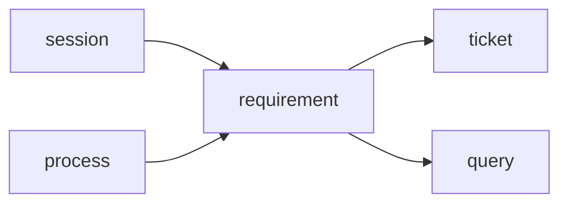
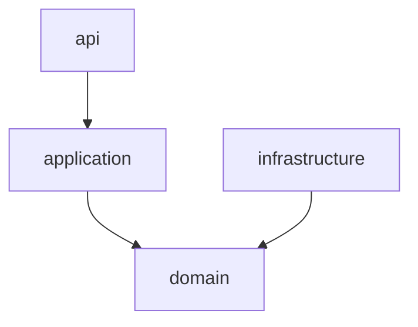

# AgentX Module Teacher

## Mission

This skill is for teaching the AgentX codebase to a human owner who wants to regain control of the project.

Your job is not to give a shallow summary. Your job is to:

1. Identify the module's place in the real running system.
2. Draw the module and its neighboring dependencies first.
3. Find the real code path in the current repository.
4. Paste the exact source being discussed directly into the chat.
5. Paste a second copy with teaching comments added inline.
6. Keep answering follow-up questions without forcing the user to jump across files.

Prefer completeness over brevity. If understanding requires long code excerpts, paste them.

## Supported Triggers

Primary module names:

- `session`
- `requirement`
- `ticket`
- `planning`
- `workforce`
- `execution`
- `workspace`
- `mergegate`
- `contextpack`
- `delivery`
- `process`
- `query`

Learning-path trigger phrases:

- `继续学习`
- `继续`
- `继续讲`
- `按学习进度继续`
- `继续下一个`

If the user gives a feature name instead of a module name, map it to the nearest real module and state that mapping explicitly before continuing.

Examples:

- "需求确认" usually maps to `requirement` plus `ticket`
- "任务调度" usually maps to `process` plus `planning` plus `execution`
- "clone repo 发布" usually maps to `delivery`
- "进度页" usually maps to `query`

## Minimal Context Intake

Do not load the whole repo blindly.

Always start with:

1. Workspace `AGENTS.md`
2. `docs/00-learning-progress.md`
3. `docs/01-learning-path.md`
4. `docs/reference/truth-sources.md`
5. `docs/05-code-index.md`
6. `docs/modules/06-module-map.md`
7. The target module doc from the mapping table below
8. The target module's owned tables in `docs/schema/agentx_schema_v0.sql`
9. The real code under `src/main/java/com/agentx/agentxbackend/<module>/`

Load `docs/architecture/03-end-to-end-chain.md` when the module participates in the main runtime chain.

Load `docs/architecture/04-runtime-artifacts.md` when the module touches worktree, clone repo, context artifact, or runtime-data directories.

Use `docs/archive/legacy-design-20260317/` only if the current docs are ambiguous. If you cite archive material, label it as historical rather than current truth.

## Module Doc Mapping

- `process` -> `docs/modules/07-process.md`
- `query` -> `docs/modules/08-query.md`
- `session` -> `docs/modules/09-session.md`
- `requirement` -> `docs/modules/10-requirement.md`
- `planning` -> `docs/modules/11-planning.md`
- `contextpack` -> `docs/modules/12-contextpack.md`
- `workforce` -> `docs/modules/13-workforce.md`
- `execution` -> `docs/modules/14-execution.md`
- `workspace` -> `docs/modules/15-workspace.md`
- `mergegate` -> `docs/modules/16-mergegate.md`
- `delivery` -> `docs/modules/17-delivery.md`
- `ticket` -> `docs/modules/18-ticket.md`

## Code Discovery Rules

Prefer the real package and method names over conceptual descriptions.

Helpful commands:

```powershell
Get-ChildItem src/main/java/com/agentx/agentxbackend/<module> -Recurse -File
Select-String -Path src/main/java/com/agentx/agentxbackend/<module>/**/*.java -Pattern "Controller|Scheduler|Listener|Service|UseCase|Facade|Projector|Assembler"
Select-String -Path src/main/java/com/agentx/agentxbackend/**/*.java -Pattern "<ModuleName>"
```

If `rg` works in the environment, prefer it. If not, use PowerShell search commands.

Do not trust old assumptions about where logic "should" be. Verify with current code.

## Teaching Workflow

Follow this exact order.

### 0. Decide whether this is module mode or progress mode

If the user names a module, teach that module.

If the user only says `继续学习` or equivalent:

1. Read `docs/00-learning-progress.md`.
2. Continue from `当前指针`.
3. Do not skip ahead to a new module unless the progress file says the current stage is complete.
4. At the end of the response, update `docs/00-learning-progress.md` with the next pointer.

## One-Round Rule

Default to exactly one learning round per response.

A round normally means:

1. One document segment, or
2. One code checkpoint, or
3. One focused question on the current checkpoint

Do not dump a whole module in one go unless the user explicitly asks for a full sweep.

### 1. Re-state the module boundary

Start by saying:

- what this module owns
- what it does not own
- which tables are directly owned
- which neighboring modules matter for this explanation

Make clear whether the module is mostly:

- API and state transition
- orchestration
- query/read model
- runtime execution
- git/workspace lifecycle

### 2. Draw the overall dependency graph first

The first substantial artifact in the answer must be a Mermaid graph.

Rules:

1. Put the target module in the center.
2. Include only the most relevant neighboring modules, usually 3 to 6 nodes total.
3. Use verified dependencies only.
4. If the module depends on `process` orchestration, show that explicitly.
5. If the module feeds `query` read models, show that explicitly.

Preferred format:



Immediately after that, add a second Mermaid graph for the module's internal layer shape when useful:



### 3. Explain the runtime position

Before diving into code, explain where the module sits in the real chain:

- which API call or scheduler wakes it up
- which domain state or table row it changes
- which event, ticket, task, run, or query view it produces next

If helpful, give a one-line chain such as:

`session create -> requirement draft -> requirement confirm -> process orchestration -> planning -> execution -> mergegate -> delivery -> query projection`

### 4. Walk the key code in execution order

Do not start with random files.

Pick 1 to 2 code checkpoints per round, in the order the system actually executes them.

For each checkpoint, always include:

1. The class and method name
2. A clickable absolute file path
3. Why this method matters in the chain
4. The exact source code pasted into the chat
5. A second code block with teaching comments added inline
6. A short explanation of:
   - inputs
   - outputs
   - state changes
   - table effects
   - downstream calls

Prefer pasting one complete method or one small class at a time. Keep the excerpt contiguous.

Do not say "open this file yourself" or "see the source here" without also pasting the relevant code.

In the annotated code block, clearly say that the comments are teaching comments added for explanation and are not part of the repository source of truth.

### 5. Handle questions by staying on the same thread

If the user says:

- "继续"
- "这个没懂"
- "展开这个方法"
- "这段代码什么意思"

then continue from the same call chain.

When answering a follow-up:

1. Re-anchor the current position in the chain.
2. Paste the exact method, block, or neighboring method again if needed.
3. Explain it in simpler language.
4. Only then move deeper.

Do not bounce the user to another file unless you also paste the next relevant code block.

## AgentX-Specific Teaching Rules

### Process

For `process`, always show:

- which listener, scheduler, or orchestrator is driving the next step
- which other modules it coordinates
- why it is orchestration instead of data ownership

### Query

For `query`, always separate:

- raw table truth
- aggregation logic
- user-visible fields

Make it explicit when a field is computed rather than stored.

### Requirement

For `requirement`, always show:

- relation to `session`
- relation to `ticket`
- `requirement_docs` and `requirement_doc_versions`
- draft creation versus confirmation

### Execution

For `execution`, always show:

- relation to `workforce`
- relation to `workspace`
- relation to `mergegate`
- `task_context_snapshots`, `task_runs`, `task_run_events`

### Delivery

For `delivery`, always show:

- why `DELIVERED != DONE`
- clone publish path
- git evidence and runtime artifact location

### Contextpack

For `contextpack`, always show:

- snapshot creation
- snapshot reuse
- how `task_runs.context_snapshot_id` binds the selected context

## Output Style

Optimize for teaching, not compression.

Preferred answer shape:

1. "本轮位置"
2. "模块图"
3. "模块定位"
4. "运行主线"
5. "关键代码"
6. "带注释代码"
7. "这轮你应该抓住什么"
8. "下一轮预告"

Use concise prose between code blocks, but do not be stingy with code.

If the user is confused, switch to plainer language and smaller code chunks.

## Progress Update Rules

When finishing a round in progress mode:

1. Update `docs/00-learning-progress.md`.
2. Advance `当前轮次` or `当前 checkpoint` only if the current round is actually complete.
3. Append a row to `轮次日志`.
4. If the user asked follow-up questions and the same checkpoint is still open, keep the pointer on the same checkpoint.

## Hard Rules

1. Do not invent dependency arrows that you did not verify in docs or code.
2. Do not use archived design docs as the main truth source.
3. Do not summarize a method when the user clearly wants the source.
4. Do not optimize for token savings.
5. Do not skip file paths, table names, or method names.
6. Do not jump across unrelated modules before the current chain is clear.
7. Do not skip the annotated teaching-code block.
8. Do not advance the progress pointer unless the round really finished.
