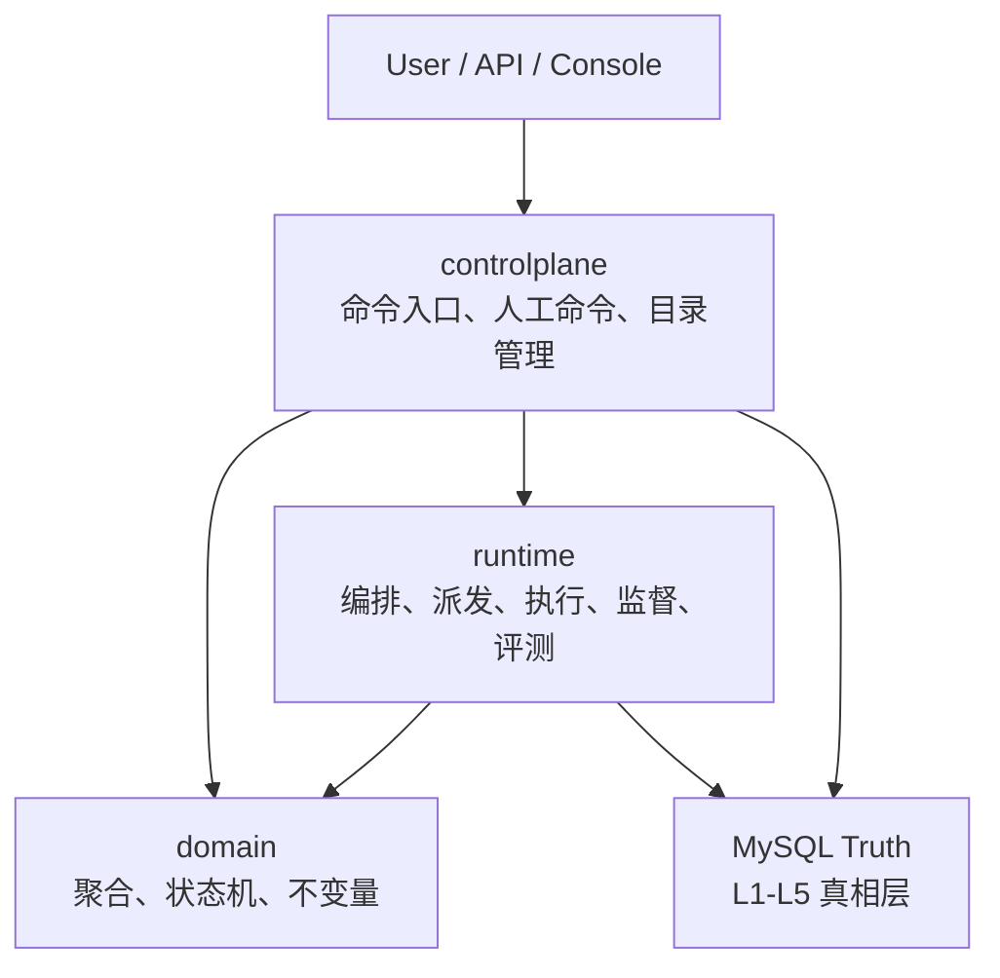
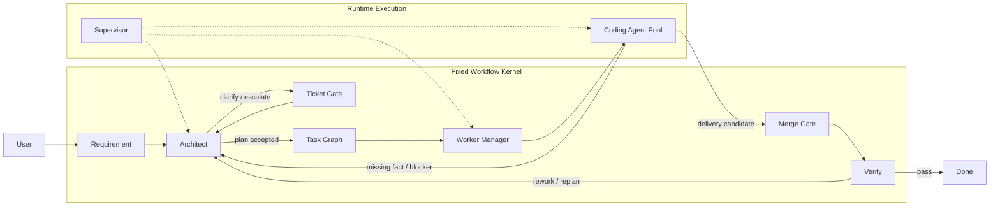
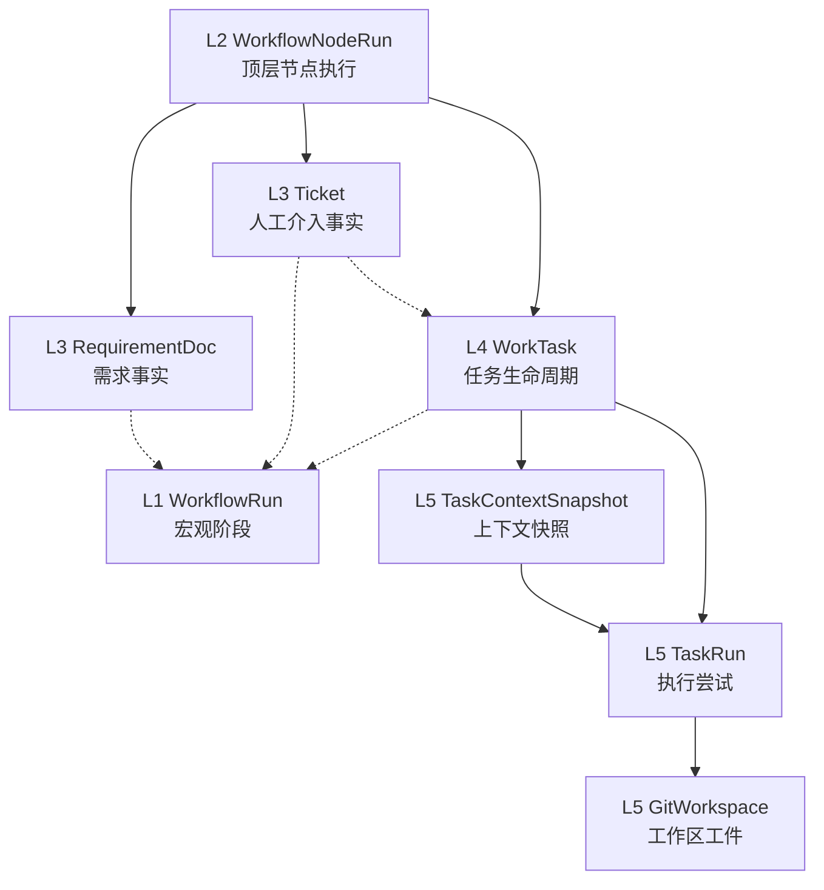
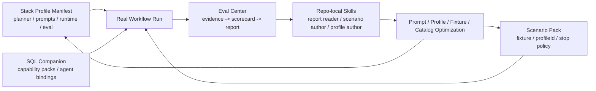

# AgentX

<p align="center">
  <strong>Opinionated Agent Engineering Kernel for Code Delivery</strong>
</p>

<p align="center">
  固定主链 · 真实执行基础设施 · Stack Profile 装配 · Evidence-first Eval
</p>

AgentX 不是一个“什么都能拼”的 workflow builder，也不是一个只靠 prompt 拼出来的 coding demo。

它更像一个为代码交付场景打造的 Agent 平台内核：把固定工作流、运行时真相、任务派发、工作区隔离、上下文编译、评测闭环这些真正会决定系统能不能长期演进的部分，先做成稳定底座。

## Why AgentX

这个项目是被一堆很具体的工程问题逼出来的：

- “自由编排”看起来灵活，最后常常把状态真相、恢复逻辑和责任边界搅乱
- worker 自抢任务看起来优雅，但一旦进入 lease、heartbeat、重试、升级，就很难做出稳定恢复
- `代码写完` 和 `任务完成` 不是一回事，很多系统把这两件事混在一起
- 只调 prompt、不做评测，优化会越来越主观，最后很难知道到底哪里真的变好了
- 每扩一个技术栈都改一堆硬编码模板，最后主链会逐渐腐化

所以 AgentX 一开始就做了几件“看起来不讨巧，但后面会越来越值”的选择：

| 选择 | 为什么这样做 |
| --- | --- |
| 固定主链，而不是自由工作流编辑器 | 先把代码交付这条链路做深、做稳、做可恢复 |
| 中心派发，而不是 worker 自抢 | 调度、监督、升级路径更清楚，恢复更可控 |
| `DELIVERED != DONE` | 代码产出、merge、verify、最终完成必须分层建模 |
| LangGraph 只做顶层 reconciliation | 图不是业务真相源，数据库和领域模型才是 |
| 技术栈差异走 `profileId` 装配 | 不让 Java / TS / 未来更多栈把主链写死 |
| 先做 Eval Center，再谈 UI | 先让系统变得可复盘、可比较、可优化 |

## What Makes It Different

AgentX 当前最核心的差异，不是“也能调用 LLM”，而是下面这套组合：

- Fixed kernel workflow
  - `requirement -> architect -> ticket-gate -> task-graph -> worker-manager -> coding -> merge-gate -> verify`
- Real runtime truth
  - Docker CLI runtime、Git worktree、dispatcher、supervisor、lease/heartbeat/recovery
- State-first design
  - `WorkflowRun / WorkflowNodeRun / RequirementDoc / Ticket / WorkTask / TaskRun / GitWorkspace`
- Profile-based stack assembly
  - 用 `profileId` 驱动 task template、prompt 补充、runtime 命令、verify 规则、eval 分类
- Evidence-first evaluation
  - workflow 跑完自动沉淀 `raw-evidence.json / scorecard.json / workflow-eval-report.md`

如果只看一句话，可以把它理解成：

> AgentX 想解决的不是“怎么让模型偶尔写出一段代码”，而是“怎么让代码交付型 Agent 变成一个可以持续扩展、持续评测、持续优化的工程系统”。

## Lessons Baked In

这部分不是口号，而是我们一路做下来反复确认过的经验。

### 1. 固定主链比可视化自由拼图更重要

如果 workflow 还没稳定，就过早追求“任意编排”，最后通常会把恢复、人工介入、任务真相、交付边界全部打散。  
AgentX 先把主链冻结，再把扩展点放在 agent、capability、runtime 和 profile 上。

### 2. 运行时真相一定要独立于图

LangGraph 很适合做顶层编排，但不应该承载业务真相。  
一旦把 task、workspace、heartbeat、retry 这些状态塞进图里，恢复逻辑会越来越难收敛。

### 3. Coding agent 的难点不是“会不会写代码”，而是“会不会遵守平台协议”

真实流程里，模型经常不是不会规划或不会调用工具，而是：

- `taskTemplateId` 不贴平台 catalog
- `capabilityPackId` 不贴 runtime 真相
- tool call 的路径、参数、幂等约束不贴协议

所以真正需要优化的，不只是 prompt 文案，而是：

- catalog 对齐
- tool protocol 对齐
- context compilation 质量
- eval rubric 和回归比较

### 4. 新增技术栈不能靠复制一套主链

我们已经把“技术栈差异”抽到 Stack Profile 装配层里。  
后续扩展能力，应该优先新增：

- profile manifest
- SQL companion seed
- fixture repo
- scenario pack
- eval/report/skill 迭代

而不是再长出一套新的 workflow 或者一堆 `if java ... else if ts ...`。

### 5. 评测中心不是锦上添花，而是基础设施的一部分

如果没有统一报告，你只能看到零散 smoke 结果；  
有了 Eval Center，workflow 的证据、问题归因、回归对比才会变成稳定资产。

## Current Capabilities

当前仓库已经落地的核心能力：

- 固定主链 Runtime V1
- 四类 agent kernel
  - requirement / architect / coding / verify
- 真实 Docker + Git worktree 执行链
- 中央 dispatcher + runtime supervisor
- 本地 RAG 基线
  - structured facts
  - repo index
  - workflow overlay index
  - lexical retrieval
  - Java symbol retrieval
- Eval Center V1
  - `raw-evidence.json`
  - `scorecard.json`
  - `workflow-eval-report.md`
- Repo-local skills
  - eval report reader
  - scenario pack author
  - capability profile author
- Stack Profile 装配层
  - `java-backend-maven`
  - `ts-fullstack-pnpm-monorepo`

当前明确还没做的部分：

- query-side controlplane 和前端展示面
- embedding / vector DB / rerank
- browser E2E 型 verify
- 更强的 benchmark / judge / online eval

## Architecture At A Glance

### 三层架构



### 固定主链



### L1-L5 状态真相



这里最重要的设计约束是：

- `DELIVERED != DONE`
- `TaskRun.SUCCEEDED != WorkTask.DONE`
- `GitWorkspace.MERGED != WorkTask.DONE`

### Stack Profile + Eval 闭环



## Project Status

截至目前，项目所处的位置可以概括成三句话：

1. 主链基础设施已经站稳
2. 效果优化现在主要依赖 profile、prompt、retrieval 和 eval 迭代
3. 前端 UI 不是当前瓶颈，评测闭环和能力扩展才是

换句话说，AgentX 当前已经从“基础设施还不可信”的阶段，进入到“可以围绕真实 workflow 报告持续做效果优化”的阶段。

## Repository Layout

```text
src/main/java/com/agentx/platform/
├─ domain/          聚合、值对象、状态机、不变量
├─ controlplane/    命令入口、控制面 API、应用服务
└─ runtime/         agent kernel、workflow、RAG、workspace、tooling、evaluation

src/main/resources/stack-profiles/
├─ java-backend-maven.json
└─ ts-fullstack-pnpm-monorepo.json

db/
├─ schema/          MySQL 真相表
└─ seeds/profiles/  profile 对应的 capability / agent seed

docs/
├─ architecture/
├─ runtime/
├─ evaluation/
├─ controlplane/
└─ database/
```

## Quick Start

### Prerequisites

- JDK 21
- Maven Wrapper
- Docker
- MySQL
- Git

### Configuration

本仓库不提交任何 provider 密钥。模型配置统一通过环境变量注入，例如：

```powershell
$env:AGENTX_DEEPSEEK_API_KEY="your-key"
```

`application.yml` 只保留环境变量占位，不存真实 token。

### Verify The Baseline

```powershell
.\mvnw.cmd -q test
.\mvnw.cmd -q verify
```

如果要跑真实评测，再准备 provider key 并执行对应的 integration test 或 scenario runner。

## Docs

建议按这个顺序阅读：

1. `docs/architecture/01-three-layer-architecture.md`
2. `docs/architecture/02-fixed-coding-workflow.md`
3. `docs/architecture/04-state-machine-layers.md`
4. `docs/runtime/01-runtime-v1-implementation.md`
5. `docs/runtime/03-context-compilation-center.md`
6. `docs/runtime/04-local-rag-and-code-indexing.md`
7. `docs/evaluation/01-eval-center-overview.md`
8. `docs/evaluation/06-real-workflow-scenario-pack.md`
9. `docs/controlplane/01-controlplane-v1-command-api.md`
10. `progress.md`

完整索引见 `docs/README.md`。

## What AgentX Is Not

为了避免误解，这个项目当前明确不是：

- 一个通用 no-code workflow 平台
- 一个把所有状态都塞进 graph 的 agent demo
- 一个只靠 prompt 堆起来、没有执行真相的 coding assistant
- 一个已经做完 UI、观测台、治理台的完整产品

## Roadmap

下一阶段更值得投入的方向：

- query-side controlplane / UI
- 更强的 profile 扩展能力
- 更稳定的 real workflow eval regression
- retrieval 质量升级
- prompt / schema / catalog 对齐优化

## Final Note

如果你关心的是“如何让 coding agent 从一次性 demo 变成可以长期演进的工程系统”，那么 AgentX 想回答的问题也许正好和你一样。
