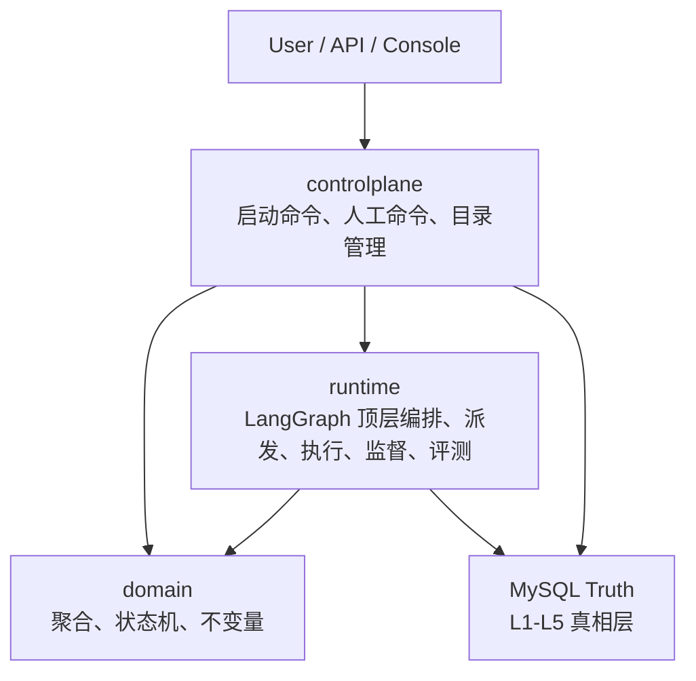
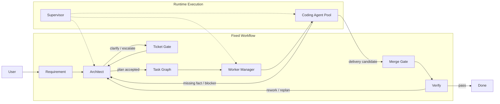
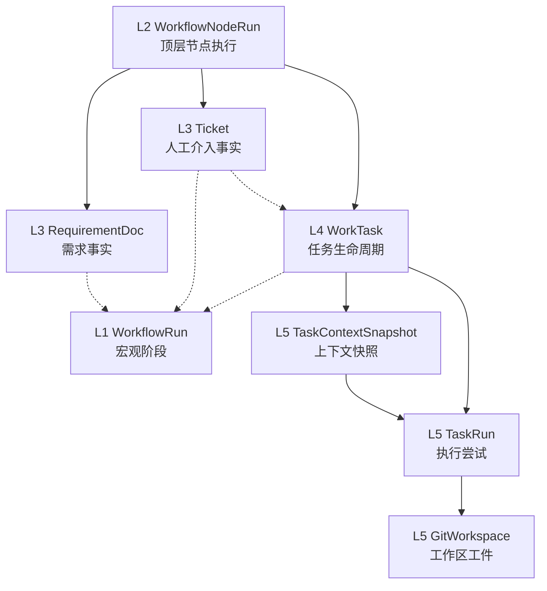
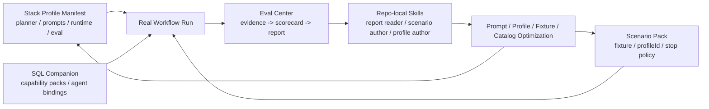

# AgentX

> 一个面向代码交付场景的 Agent 平台内核。
>
> 这个仓库不是在旧控制面上继续堆胶水逻辑，而是从零开始，把固定主链、运行时基础设施、技术栈装配层和评测闭环收口成一套可复用的平台骨架。

## 项目现在是什么

AgentX 当前聚焦一件事：

- 固定主链的 Coding Agent Workflow
- 中心派发而不是 worker 自抢任务
- 真实 Git worktree / merge / verify 执行链
- 统一上下文编译与本地代码检索
- 文件优先的 Eval Center 与报告解读 skill
- `profileId` 驱动的技术栈装配层，而不是把 Java/TS 逻辑硬编码进主链

当前已经完成的重点能力：

- 固定主链：`requirement -> architect -> ticket-gate -> task-graph -> worker-manager -> coding -> merge-gate -> verify`
- Runtime 基础设施：Docker CLI Runtime、Git worktree、dispatcher、supervisor、lease/heartbeat/recovery
- Agent Kernel：`requirement / architect / coding / verify` 四类 agent 的统一模型调用与结构化决策
- Local RAG：结构化事实检索、repo index、workflow overlay index、lexical retrieval、Java symbol retrieval
- Stack Profile 装配层：`java-backend-maven`、`ts-fullstack-pnpm-monorepo`
- Eval Center：`raw-evidence.json`、`scorecard.json`、`workflow-eval-report.md`
- 项目专属 skills：评测报告解读、scenario pack 编写、能力 profile 编写

当前明确还没做的事：

- 通用 query/UI 展示层
- 向量数据库 / embedding RAG
- 浏览器 E2E 型 verify
- 自由工作流编辑器

## 核心图一：三层架构



这张图固定了最重要的边界：

- `domain` 只保留业务真相和状态机
- `controlplane` 管命令入口，不吞 runtime 细节
- `runtime` 管执行、工具、工作区、监督和评测，不改写需求语义

## 核心图二：固定主链



固定内核不靠技术栈扩展。后续新增能力的方式不是改 workflow，而是给固定主链装配不同的 profile。

## 核心图三：L1-L5 状态真相



这里最关键的两个规则是：

- `DELIVERED != DONE`
- `TaskRun.SUCCEEDED != WorkTask.DONE`

也就是说，代码跑完和真正完成交付是两回事，必须经过 merge gate 和 verify。

## 核心图四：Stack Profile + Eval 闭环



这就是当前仓库最重要的新抽象：

- 固定主链不动
- 技术栈差异通过 `profileId` 装配
- 真实 workflow 证据进入 Eval Center
- 报告再反过来驱动 profile / prompt / fixture 的迭代

## 仓库地图

```text
src/main/java/com/agentx/platform/
├─ domain/          聚合、值对象、状态机、不变量
├─ controlplane/    命令入口、控制面 API、应用服务
└─ runtime/         agent kernel、工作流编排、RAG、workspace、tooling、evaluation

src/main/resources/stack-profiles/
├─ java-backend-maven.json
└─ ts-fullstack-pnpm-monorepo.json

db/
├─ schema/          MySQL 真相表
└─ seeds/profiles/  profile 对应的 capability / agent seed

docs/
├─ architecture/
├─ runtime/
├─ evaluation/
├─ controlplane/
└─ database/
```

## 当前技术栈

- Java 21
- Spring Boot 3
- MyBatis
- MySQL
- LangGraph4j
- Docker CLI
- Git worktree
- JUnit 5 / Testcontainers

## 快速开始

### 1. 基础环境

- JDK 21
- Maven Wrapper
- Docker
- MySQL
- Git

### 2. 配置方式

本仓库不提交任何 provider 密钥。模型配置统一通过环境变量注入，例如：

```powershell
$env:AGENTX_DEEPSEEK_API_KEY="your-key"
```

`application.yml` 中只保留环境变量占位，不存真实 token。

### 3. 本地验证

```powershell
.\mvnw.cmd -q test
.\mvnw.cmd -q verify
```

如果要跑严格真实评测，先准备好 provider key，再执行对应的集成测试或 scenario runner。

## 文档入口

建议按下面顺序读：

1. `docs/architecture/01-three-layer-architecture.md`
2. `docs/architecture/02-fixed-coding-workflow.md`
3. `docs/architecture/04-state-machine-layers.md`
4. `docs/runtime/01-runtime-v1-implementation.md`
5. `docs/runtime/03-context-compilation-center.md`
6. `docs/runtime/04-local-rag-and-code-indexing.md`
7. `docs/evaluation/01-eval-center-overview.md`
8. `docs/evaluation/06-real-workflow-scenario-pack.md`
9. `docs/controlplane/01-controlplane-v1-command-api.md`
10. `progress.md`

完整索引见 `docs/README.md`。

## 当前定位总结

AgentX 已经不是“一个能跑 demo 的脚本工程”，而是一套具备下面特征的 Agent 工程化内核：

- 固定工作流内核
- 真实执行基础设施
- 技术栈装配层
- 本地代码检索与上下文编译
- 文件优先的多维度评测中心
- 面向后续自动优化的 skill 化扩展路径

如果后续继续扩展到更多技术栈，主要新增的是 profile、catalog seed、fixture、scenario pack 和评测迭代，而不是重写整条主链。
