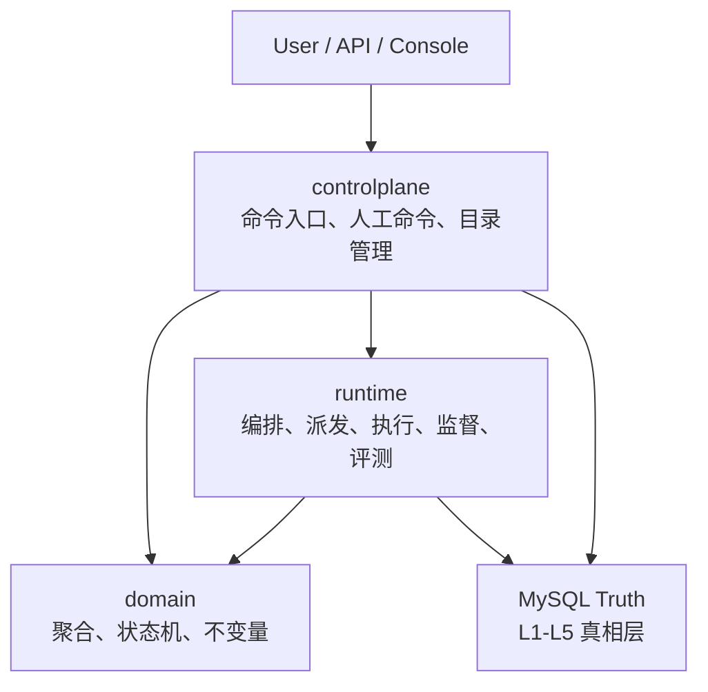
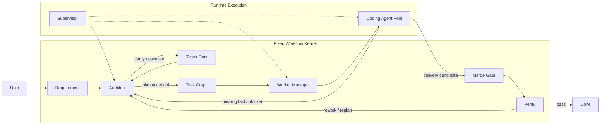
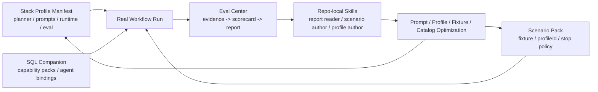

# AgentX

<p align="center">
  <strong>An opinionated agent engineering kernel for code delivery</strong>
</p>

<p align="center">
  固定主链 · Context Compilation Center · Eval Center · Stack Profiles
</p>

AgentX 是一个面向代码交付场景的 Agent 平台内核。  
它的目标不是做一个“看起来什么都能编排”的平台，而是先把真正决定系统能不能长期演进的几件事做扎实：

- 固定而清晰的 workflow kernel
- 真实可恢复的 runtime foundation
- 面向 coding agent 的 context compilation
- 能沉淀证据和回归结果的 evaluation center
- 可以继续横向扩展技术栈的 stack profile assembly

如果只用一句话概括这个仓库：

> AgentX 想解决的不是“怎么让模型偶尔写出一段代码”，而是“怎么把 code agent 做成一个能持续扩展、持续评测、持续优化的工程系统”。

## Value Proposition

很多 coding agent 项目都能演示“生成了一段代码”，但一旦进入真实工程场景，问题通常就会落在这些地方：

- workflow 能跑，但状态真相和恢复逻辑不清楚
- agent 能输出，但上下文质量不稳定
- task 能分出去，但不同技术栈一扩就开始长硬编码
- smoke 能通过，但没有统一评测结果，很难持续优化

AgentX 重点解决的就是这些更底层的问题。

### 1. 固定主链，而不是到处长工作流

AgentX 把代码交付主链固定为：

`requirement -> architect -> ticket-gate -> task-graph -> worker-manager -> coding -> merge-gate -> verify`

这意味着我们可以把精力集中在：

- 节点协议是否稳定
- 派发和恢复是否可靠
- 上下文是否足够好
- 评测是否能驱动迭代

而不是把复杂度消耗在“workflow 本身还能怎么拼”上。

### 2. Context Compilation Center 让上下文变成平台能力

对 coding agent 来说，真正重要的不只是模型本身，而是它拿到的上下文质量。

AgentX 现在已经把这部分独立成统一的 `Context Compilation Center`，负责把：

- 结构化 facts
- repo index
- workflow overlay index
- lexical retrieval
- symbol retrieval

汇总成一份可以被 requirement / architect / coding / verify 共用的上下文包。

这件事的意义在于：

- 上下文不再是散落在各节点里的 prompt 拼接逻辑
- retrieval 质量可以被单独观察、单独优化
- 评测中心可以真正回答 “这次失败是模型问题，还是上下文没带到”

### 3. Eval Center 让优化从感觉驱动变成证据驱动

如果没有统一评测，很多所谓“优化”最后都会停留在主观判断。

AgentX 现在已经把 workflow 运行后的证据统一收口到 `Eval Center`，输出固定三件套：

- `raw-evidence.json`
- `scorecard.json`
- `workflow-eval-report.md`

它不是一个只会给总分的 AI 裁判，而是一个 evidence-first 的评测中心，用来回答：

- 哪个节点出了问题
- 是 schema、catalog、tool protocol、RAG 还是 runtime robustness 的问题
- 同一个场景多轮优化后，到底哪里真的变好了

### 4. Stack Profile 让技术栈扩展不再污染主链

AgentX 没有把 Java、TS 之类的差异硬编码进 workflow 主链，而是抽成了 `Stack Profile` 装配层。

一个 profile 会显式定义：

- planner 允许的 task template
- prompt 补充规则
- capability runtime
- verify 命令与期望
- eval 文件分类和检查重点

这意味着后续扩展能力时，主要新增的是：

- profile manifest
- SQL companion seed
- fixture repo
- scenario pack
- eval/report/skill 迭代

而不是把整条主链复制一遍。

## Core Modules

这是当前仓库最值得关注的几个模块。

| 模块 | 作用 |
| --- | --- |
| Workflow Kernel | 固定 requirement 到 verify 的主链，保持整体协作边界稳定 |
| Runtime Foundation | 负责真实执行、派发、工作区隔离、merge/verify、heartbeat、lease、recovery |
| Context Compilation Center | 统一编译 facts、retrieval 和 workflow overlay，生成 agent 可消费的上下文包 |
| Eval Center | 收集真实执行证据，输出 scorecard 和完整 workflow report |
| Stack Profile Assembly | 按 `profileId` 注入技术栈相关的 planner / prompt / runtime / eval 规则 |
| Repo-local Skills | 让“新增场景”“解读报告”“扩展能力”形成可复用的项目内工作流 |

## Why This Shape Works

AgentX 当前的整体形状不是为了“看起来架构很完整”，而是为了让后续优化有稳定抓手。

这套设计最直接的收益是：

- 当 workflow 失败时，我们能分清是 runtime、context、tool protocol 还是 model output 的问题
- 当要支持新的技术栈时，我们可以优先改 profile，而不是侵入主链
- 当要做效果迭代时，我们可以围绕 scenario pack 和 eval report 做回归，而不是只看零散 smoke

换句话说，AgentX 现在最大的价值不是“已经把所有能力都做完了”，而是已经搭好了一个后续可以持续扩展和持续优化的底座。

## Architecture At A Glance

### 三层架构



### 固定主链



### Stack Profile + Eval 闭环



## Current Status

截至目前，AgentX 大致处在这个阶段：

- workflow 主链已经成形
- runtime 基础设施已经站稳
- context compilation 和本地 RAG 已经独立出来
- evaluation center 已经能生成稳定报告
- stack profile 装配层已经为后续横向扩展铺好路径

这也意味着当前更值得投入的事情是：

- 跑更多真实场景
- 根据报告持续优化 profile / prompt / retrieval
- 逐步补 query-side controlplane 和 UI

而不是重新发明主链。

## Repository Layout

```text
src/main/java/com/agentx/platform/
├─ domain/          聚合、值对象、状态机、不变量
├─ controlplane/    命令入口、控制面 API、应用服务
└─ runtime/         agent kernel、workflow、RAG、workspace、tooling、evaluation

src/main/resources/stack-profiles/
├─ java-backend-maven.json
└─ ts-fullstack-pnpm-monorepo.json

db/
├─ schema/          MySQL 真相表
└─ seeds/profiles/  profile 对应的 capability / agent seed

docs/
├─ architecture/
├─ runtime/
├─ evaluation/
├─ controlplane/
└─ database/
```

## Quick Start

### Prerequisites

- JDK 21
- Maven Wrapper
- Docker
- MySQL
- Git

### Configuration

本仓库不提交任何 provider 密钥。模型配置统一通过环境变量注入，例如：

```powershell
$env:AGENTX_DEEPSEEK_API_KEY="your-key"
```

`application.yml` 只保留环境变量占位，不存真实 token。

### Verify The Baseline

```powershell
.\mvnw.cmd -q test
.\mvnw.cmd -q verify
```

如果要跑真实评测，再准备 provider key 并执行对应的 integration test 或 scenario runner。

## Docs

建议按这个顺序阅读：

1. `docs/architecture/01-three-layer-architecture.md`
2. `docs/architecture/02-fixed-coding-workflow.md`
3. `docs/runtime/01-runtime-v1-implementation.md`
4. `docs/runtime/03-context-compilation-center.md`
5. `docs/runtime/04-local-rag-and-code-indexing.md`
6. `docs/evaluation/01-eval-center-overview.md`
7. `docs/evaluation/06-real-workflow-scenario-pack.md`
8. `docs/controlplane/01-controlplane-v1-command-api.md`
9. `progress.md`

完整索引见 `docs/README.md`。

## Final Note

如果你关心的是这些问题：

- 怎样把 coding agent 从 demo 推到工程系统
- 怎样让上下文质量和评测闭环真正可持续迭代
- 怎样在不污染主链的前提下扩展更多技术栈

那么 AgentX 想回答的，可能正好也是你在找的答案。
