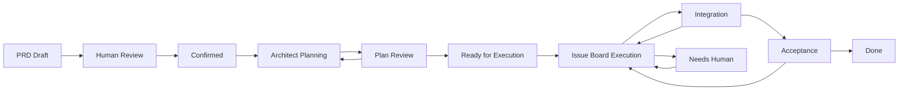
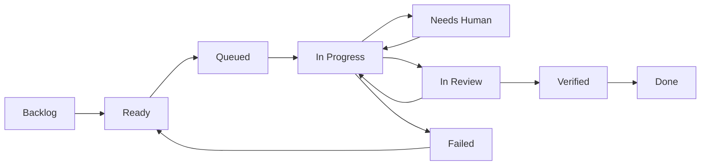

# PRD / Issue 双单位生产流程设计草案

日期：2026-04-27
背景来源：Multica、AgentX、Claude Managed Agents 调研结论
目标：设计一套可用于生产环境的 AI 自动化软件开发流程，兼顾 Multica 的 issue 交互体验和 AgentX 的 PRD 到交付流程深度。

## 1. 核心判断

可以大面积复用 AgentX 的流程设计，但需要加入 Multica 式的人类协作和产品交互切面，形成一套新的生产流程。

推荐方向是：

```text
Multica 式协作界面
  + AgentX 式 PRD -> 架构拆解 -> Task DAG -> Context Snapshot -> Run -> Merge Gate
  + 人工辅助切面：评论、审批、拖动、接管、澄清、阻塞处理、验收
```

也就是说：

> 人类用 issue/PRD 看板操作系统，agent 在背后按 AgentX 的严肃交付流程执行。

系统应该支持两种工作模式：

1. **Issue 轻量模式**
   - 适合 bug、小改动、局部任务。
   - 用户像 Multica 一样创建 issue、拖动状态、分配 agent、评论协作。
   - 底层仍然保留 run、context snapshot、verification 等生产能力。

2. **PRD 复杂模式**
   - 适合一次做多个 issue 的功能/项目。
   - 用户创建 PRD，确认需求后由 architect agent 拆分任务。
   - 系统生成 issue/task DAG，再由多个 worker agent 执行、验证、集成。

不要把所有内容设计成一个超大状态机，而应拆成五层：

- PRD 状态机。
- Issue 状态机。
- Run 状态机。
- HITL Ticket 状态机。
- Merge Gate 状态机。

## 2. 一等对象模型

| 对象 | 含义 | 借鉴来源 |
|---|---|---|
| Workspace | 团队和权限边界 | Multica |
| Project | 多个 PRD/Issue 的上层组织 | Multica |
| PRD | 一次较大的需求、功能或项目容器 | AgentX requirement/session |
| Requirement Version | PRD 的版本和确认版本 | AgentX |
| Issue | 可执行或可讨论的工作项 | Multica |
| Task DAG | PRD 被 architect agent 拆出来的任务依赖图 | AgentX |
| Agent | 可被分配工作的 AI 成员 | Multica / Managed Agents |
| Runtime | 本地 daemon 或云端 sandbox 执行入口 | Multica / Managed Agents |
| Context Snapshot | 某次执行前冻结的上下文 | AgentX |
| Run | 某个 issue/task 的一次执行尝试 | AgentX |
| Human Ticket | 澄清、审批、阻塞、验收等人工介入点 | AgentX ticket + Multica comment |
| Merge Gate | 验证、集成、合并、发布关口 | AgentX |
| Delivery Artifact | PR、branch、commit、tag、测试报告、文件 | AgentX |
| Skill / Playbook | 沉淀出来的可复用经验 | Multica |

关键原则：

- **PRD 管目标和验收**。
- **Issue 管执行粒度和协作入口**。
- **Run 管不可变执行历史**。
- **Human Ticket 管不确定性和人工决策**。
- **Merge Gate 管真实交付，而不是让 agent 自述完成**。

## 3. PRD 级状态流转

PRD 适合承载“一次做多个 issue”的流程。

```text
Draft
  -> Human Review
  -> Confirmed
  -> Architect Planning
  -> Plan Review
  -> Ready for Execution
  -> In Execution
  -> Integration
  -> Acceptance
  -> Done
```

| PRD 状态 | 含义 | 主要推动者 |
|---|---|---|
| Draft | PRD 草稿阶段，需求还没稳定 | 人 / product agent |
| Human Review | 人类确认需求、补充约束、验收标准 | 人 |
| Confirmed | PRD 冻结一个确认版本 | 人 |
| Architect Planning | 架构师 agent 拆模块、拆 issue、生成依赖 | architect agent |
| Plan Review | 人类审查 agent 拆分是否合理 | 人 |
| Ready for Execution | issue/task DAG 已确认，可开始执行 | 系统 |
| In Execution | 多个 issue 正在并发/串行执行 | worker agents |
| Integration | 进入集成、冲突处理、整体验证 | merge/review agent |
| Acceptance | 人类或 evaluator 做最终验收 | 人 + evaluator |
| Done | PRD 完成交付，生成交付证据 | 系统 |

### 3.1 PRD 状态机图



## 4. Issue 级状态流转

Issue 可以被拖动到不同块里，交互参考 Multica。但拖动只是交互入口，底层仍要校验依赖、上下文、runtime 和权限。

```text
Backlog
  -> Ready
  -> Queued
  -> In Progress
  -> Needs Human
  -> In Review
  -> Verified
  -> Done
```

| Issue 状态 | 含义 | 拖动/自动行为 |
|---|---|---|
| Backlog | 停车场，不触发 agent | 人手动放入 |
| Ready | 已有足够上下文，可执行 | 人确认或 PRD plan 生成 |
| Queued | 已分配 agent，等待 runtime/session | 自动进入 |
| In Progress | agent 正在执行 | run start 后进入 |
| Needs Human | 需要澄清、审批、凭证、产品判断 | agent/tool 触发 |
| In Review | agent 认为完成，等待验证/审查 | run succeeded 后进入 |
| Verified | 测试/审查通过，等待合并或 PRD 集成 | verifier/merge gate 推动 |
| Done | issue 交付完成 | merge gate 或人类确认 |

### 4.1 Issue 状态机图



### 4.2 拖动交互语义

| 用户动作 | 系统语义 |
|---|---|
| 拖到 Backlog | 暂停执行，不自动触发 agent |
| 拖到 Ready | 标记可执行，但不一定立即入队 |
| 拖到 Queued | 尝试分配 agent/runtime，并创建 execution task |
| 拖到 Needs Human | 人类接管或要求澄清 |
| 拖到 In Review | 手动进入审查，通常需要说明原因 |
| 拖到 Done | 若没有 verification，应要求确认或走 lightweight acceptance |

生产环境里不建议允许“任意拖到 Done 就完成”。至少应记录人工确认事件，或触发轻量验证。

## 5. Run 级状态流转

Issue 状态不要直接等同于 agent 执行状态。底层应保留独立 Run。

```text
Created
  -> Preparing
  -> Running
  -> Succeeded
  -> Failed
  -> Cancelled
  -> Needs Human
```

一个 issue 可以有多次 run：

- 第一次 run 失败。
- 人类补充说明。
- 第二次 run 成功。
- verify run 失败。
- 第三次修复 run 成功。

Run 必须是不可变历史单元：

- 重试创建新 run。
- run 绑定 context snapshot。
- run 绑定 agent/runtime。
- run 绑定 branch/worktree/commit。
- run 写入 run events。
- run 结果不覆盖旧 run。

## 6. Human Ticket 状态流转

人工辅助不应只是评论，而应成为可追踪的一等切面。

```text
Open
  -> Claimed
  -> Answered
  -> Resolved
  -> Reopened
  -> Cancelled
```

Human Ticket 类型：

| 类型 | 用途 |
|---|---|
| Clarification | agent 不理解需求，需要人解释 |
| Approval | 高风险操作、外部 API、删除、迁移、发 PR |
| Plan Review | 审查 architect agent 拆出的 issue/task DAG |
| Blocker | runtime、权限、依赖、环境阻塞 |
| Acceptance | 最终验收 PRD 或 issue |

关键规则：

- agent 需要人工输入时，不应直接挂死 run，而应创建 Human Ticket。
- 人类回复后，相关 context snapshot 标记 stale。
- 系统重新编译 context snapshot。
- 新 run 基于新 snapshot 继续执行。
- 人类所有决策都进入审计日志。

## 7. Merge Gate 状态流转

Merge Gate 负责把“agent 做完了”变成“代码可进入主线”。

```text
Candidate
  -> Rebasing
  -> Verifying
  -> Accepted
  -> Merged
  -> Delivered
```

失败分支：

```text
Verifying -> Rejected -> Back to Issue In Progress
Rebasing -> Needs Human / Back to Issue In Progress
Accepted -> Needs Human if approval required
```

Merge Gate 最少应检查：

- branch 是否存在。
- commit diff 是否符合 issue 范围。
- tests 是否通过。
- lint/typecheck 是否通过。
- 是否有安全或迁移风险。
- PR 是否创建或更新。
- PRD 级依赖是否满足。

对于 PRD 模式，Merge Gate 还要做 integration verification：

- 多个 issue 之间是否冲突。
- 依赖 issue 是否全部 verified。
- E2E 测试是否通过。
- PRD acceptance criteria 是否满足。

## 8. PRD 模式的完整生产流程

```text
1. 创建 PRD
2. Product agent 辅助补全 PRD
3. 人类确认 PRD
4. Architect agent 拆分 issue/task DAG
5. 人类审查和调整 plan
6. 系统生成 issue board
7. 人类把 issue 拖到 Ready 或直接分配 agent
8. Worker agent 执行 issue
9. 遇到不确定性，创建 Human Ticket
10. 人类回复后，重新编译 context snapshot
11. Run 成功后进入 In Review
12. Verifier agent 跑测试/审查
13. Merge Gate 做集成
14. PRD 进入 Acceptance
15. 人类确认或 evaluator 满足 rubric
16. PRD Done，沉淀 skill/playbook
```

### 8.1 PRD 页面推荐布局

1. **PRD Header**
   - PRD 状态。
   - 确认版本。
   - owner。
   - agents。
   - 验收标准。
   - 交付进度。

2. **Requirement Panel**
   - PRD 当前版本。
   - 历史版本。
   - 人类确认记录。
   - agent 建议。

3. **Plan / DAG 区**
   - architect agent 拆出来的模块。
   - issue 依赖图。
   - 人类可拖动、合并、拆分、改优先级。

4. **Issue Board**
   - Backlog / Ready / Queued / In Progress / Needs Human / In Review / Verified / Done。
   - 每张卡展示 assignee、agent、run 状态、阻塞、测试状态。

5. **Human Ticket Inbox**
   - 需要人类回答、审批、验收的事项集中展示。

6. **Delivery / Merge Gate**
   - PR、branch、commit、test result、delivery tag。

## 9. Issue 轻量模式

不是所有事情都需要 PRD。生产系统应允许轻量模式：

```text
Create Issue
  -> Assign Agent
  -> Queued
  -> Run
  -> In Review
  -> Verified
  -> Done
```

轻量模式仍应保留：

- context snapshot。
- run history。
- comments。
- human ticket。
- verifier。
- delivery artifact。

这样小任务不重，大任务不乱。

## 10. 与三个参考项目的关系

| 设计点 | 借鉴来源 | 融合方式 |
|---|---|---|
| issue board / drag & drop | Multica | 作为人类入口和日常操作界面 |
| agent as teammate | Multica | agent 可被分配、评论、@、接管工作 |
| backlog 停车场 | Multica | 防止拖动或分配后误触发执行 |
| task queue / runtime readiness | Multica | 控制 issue 何时真正入队 |
| PRD confirmation | AgentX | 防止需求未确认就开工 |
| architect planning | AgentX | PRD 拆成 issue/task DAG |
| context snapshot | AgentX | 固化每次 run 的执行输入 |
| immutable run | AgentX | 保留失败、重试、执行证据 |
| Merge Gate | AgentX | 把候选交付变成主线事实 |
| session event log | Managed Agents | 作为长任务恢复和审计模型 |
| environment/sandbox | Managed Agents | 可作为云端 runtime 后端 |
| permission confirmation | Managed Agents | 高风险工具调用进入人工审批 |
| vaults | Managed Agents | 第三方凭证不进入 agent prompt |

## 11. 推荐数据表草案

可以先抽象成这些核心表或聚合：

```text
workspace
member
agent_profile
agent_version
runtime
project
prd
prd_version
issue
issue_dependency
human_ticket
execution_task
context_snapshot
run
run_event
tool_call
tool_confirmation
merge_gate
delivery_artifact
skill
activity_event
```

其中：

- `prd` 和 `issue` 是产品可见对象。
- `execution_task` 是队列对象。
- `run` 是执行历史对象。
- `context_snapshot` 是执行输入对象。
- `human_ticket` 是人工辅助对象。
- `delivery_artifact` 是交付证据对象。
- `activity_event` 是审计和实时流对象。

## 12. 推荐工程原则

1. **PRD 管目标，Issue 管执行，Run 管历史**
   不要让一个对象承担所有状态。

2. **拖动是交互，不是全部业务逻辑**
   拖到 Ready 可以触发入队意图，但能不能执行要看依赖、上下文、runtime、权限。

3. **Agent 可以建议，人类可以确认**
   PRD 确认、计划审查、危险工具、最终验收都要有人类切面。

4. **Context Snapshot 必须是一等对象**
   生产环境必须能回答“agent 当时到底看了什么”。

5. **Merge Gate 必须独立**
   实现 agent 不应直接宣布完成。至少要有 verifier/reviewer/merge gate。

6. **PRD 级别要允许批量进度**
   一个 PRD 不是简单 `in_progress/done`，而是多个 issue 的聚合进度。

7. **每次失败都要结构化**
   例如 `agent_error`、`test_failed`、`needs_clarification`、`runtime_offline`、`merge_conflict`。

8. **完成后沉淀 Skill/Playbook**
   把重复出现的部署、测试、迁移、代码规范等经验转成 skill。

## 13. MVP 建议

第一阶段不要一次做完整平台。建议 MVP：

1. PRD 对象和 PRD 状态机。
2. PRD confirmed 后调用 architect agent 生成 issue 列表和依赖。
3. Issue board 支持拖动状态。
4. Issue 可分配 agent 并生成 execution task。
5. Run 绑定 context snapshot。
6. Human Ticket 支持 clarification 和 approval 两类。
7. Verifier run 支持测试/审查。
8. Merge Gate 先做最小检查：test pass + PR link + human accept。
9. Delivery artifact 记录 PR/commit/test result。

第二阶段再补：

- 多 runtime 后端。
- 云端 sandbox。
- permission policy。
- vault。
- skill extraction。
- PRD outcome evaluator。
- 更复杂的 DAG 调度。

## 14. 最终结论

新的生产流程应采用“双单位”设计：

- **Issue 为日常执行单位**：轻量、可拖动、可分配、可评论、可快速闭环。
- **PRD 为复杂需求单位**：先确认需求，再拆分多个 issue，按 DAG 执行、验证、集成和验收。

这套设计大面积复用 AgentX 的严肃流程内核，同时加入 Multica 的人类协作界面和 agent teammate 体验。最终形态应当是：

> 产品层像 Multica，流程层像 AgentX，基础设施层预留 Claude Managed Agents 式 session/event/environment/tool 抽象。
