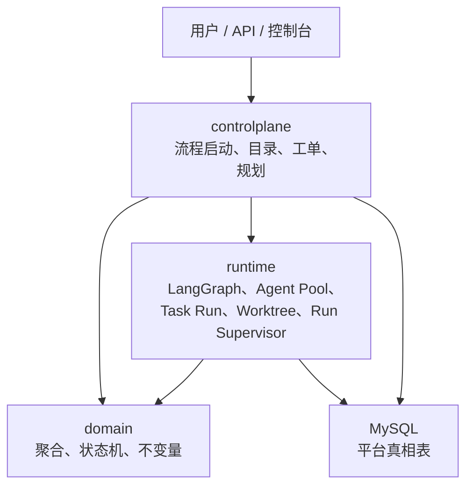

# 三层架构

这份文档只固定一件事：代码层永远只分 `domain / controlplane / runtime` 三层，数据库五层只是数据真相，不等于代码分层。

## 总图

## 三层职责

| 层 | 负责什么 | 明确不负责什么 |
| --- | --- | --- |
| `domain` | 聚合、值对象、状态迁移、不变量 | Web、MyBatis、Docker、LangGraph 细节 |
| `controlplane` | 固定工作流编排、Agent 管理、Requirement/Ticket/Task 控制面 | 容器生命周期、Git worktree 管理 |
| `runtime` | Agent 实例、任务执行、上下文快照、工具适配、运行证据回传、heartbeat/lease/recovery | Requirement 语义、人工决策逻辑 |

## 非谈判边界

1. `controlplane -> domain`
2. `runtime -> domain`
3. `controlplane` 和 `runtime` 之间只通过显式命令、端口或事件交互。
4. `task` 绑定 capability requirement，不直接绑定固定 agent。
5. `runtime` 不能直接改写 `RequirementDoc`、`Ticket` 的业务语义。
6. `domain` 不退化成“表结构直通 + service 拼装”。

## 当前冻结的运行模式

1. 顶层流程固定，LangGraph 只负责编排顶层节点。
2. 任务执行采用中心派发制：
   - `架构代理` 负责拆 task 和定义 capability requirement
   - `工作代理管理器` 负责选择 agent instance 并派发
   - worker 不自己抢任务
3. `运行监督器` 属于 runtime：
   - 负责 heartbeat
   - 负责 lease 超时判断
   - 负责 worker 失联后的恢复或升级
4. `架构代理` 负责重新规划，不负责运行态盯盘。

## 当前包落点

1. `src/main/java/com/agentx/platform/domain`
2. `src/main/java/com/agentx/platform/controlplane`
3. `src/main/java/com/agentx/platform/runtime`
