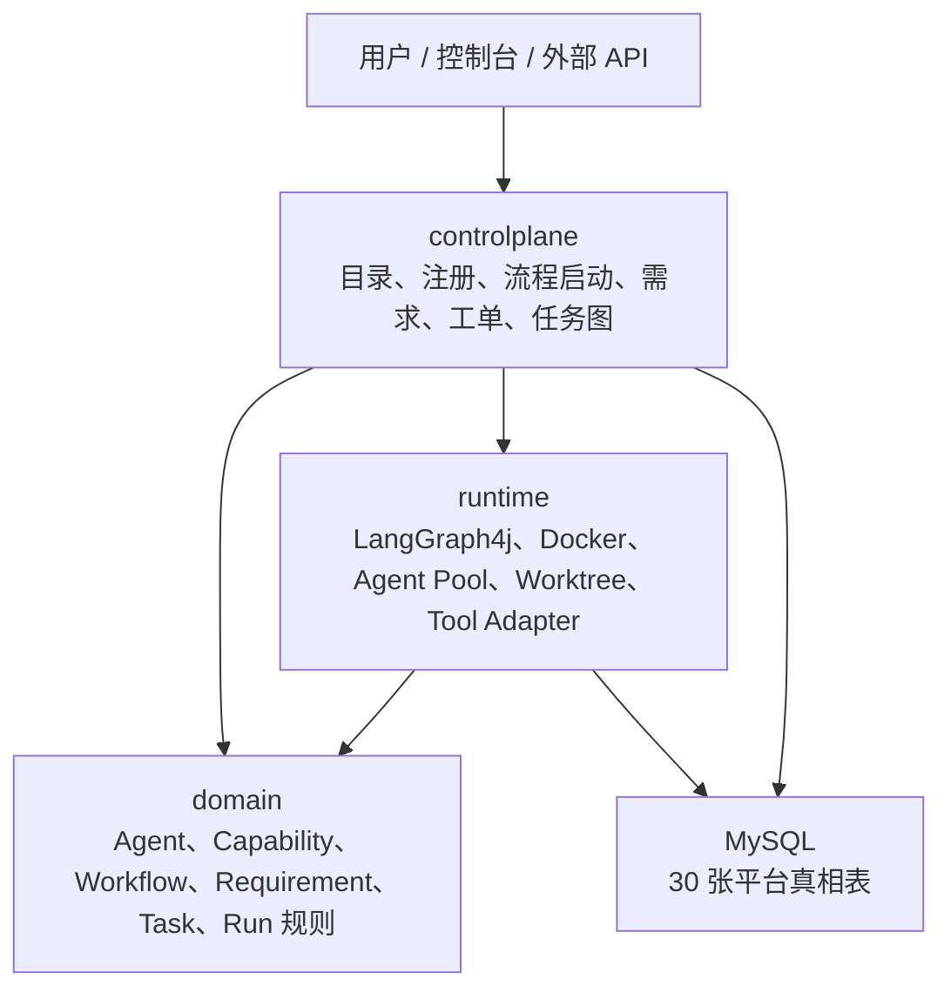
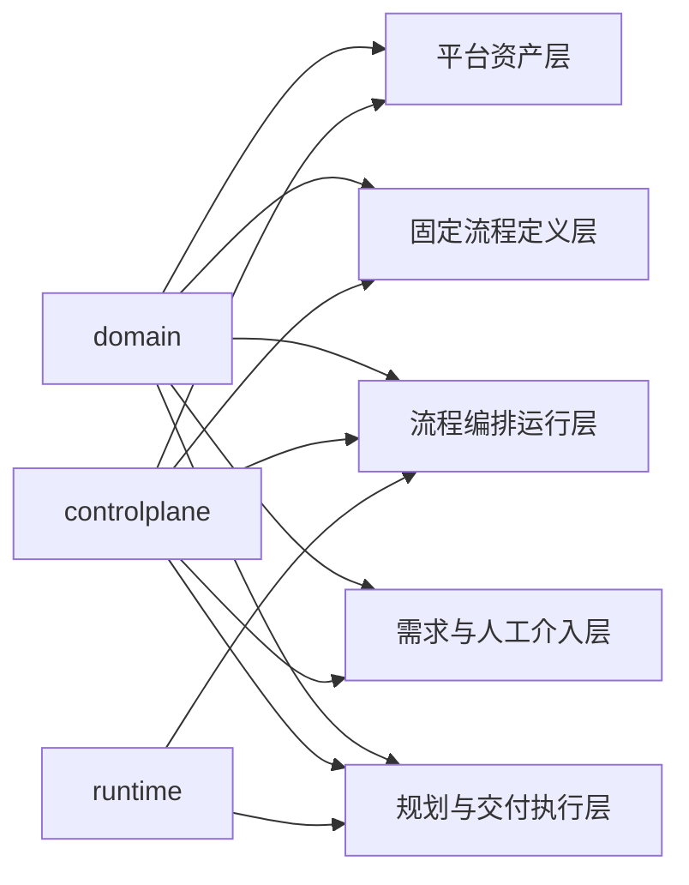

# 三层架构

## 目标

新平台不是把旧系统的胶水代码平移过来，而是先把三层职责定死：

1. `domain` 只管业务模型和约束。
2. `controlplane` 只管控制面、目录、流程启动、HITL、规划。
3. `runtime` 只管执行适配、Agent Pool、Task Run、Worktree、Tool 调用。

## 整体关系图

## 每层职责

| 代码层 | 作用 | 典型内容 | 不该放什么 |
| --- | --- | --- | --- |
| `domain` | 平台核心模型和不变量 | Agent、Capability Pack、Workflow Run、Ticket、Task、Task Run 的状态规则 | Controller、SQL、Docker、LangGraph4j 细节 |
| `controlplane` | 控制面与编排面 | Catalog API、Workflow Run、Requirement、Ticket、Task Planning、Agent Binding | 具体容器生命周期、Git worktree 细节 |
| `runtime` | 执行面 | Agent Pool、Task Run、Task Run Event、Git Workspace、Tool Adapter、容器调度 | 需求文档编辑、人工决策逻辑 |

## 三层和数据库五层的映射

### 解释

- `domain`
  - 不拥有表写入，但要定义所有核心对象和状态转换规则。
- `controlplane`
  - 主写：
    - 平台资产层
    - 固定流程定义层
    - 流程编排运行层
    - 需求与人工介入层
    - 规划侧的任务表
- `runtime`
  - 主写：
    - `agent_pool_instances`
    - `task_runs`
    - `task_run_events`
    - `git_workspaces`
  - 并向流程编排层回传节点执行结果和运行态证据。

## 稳定边界

1. `controlplane -> domain`
2. `runtime -> domain`
3. `controlplane <-> runtime` 只通过显式 port / event 交互
4. `controlplane` 不能直接依赖某个具体 Docker / LangGraph4j 实现
5. `runtime` 不能直接篡改 Requirement / Ticket 语义
6. `domain` 不能泄漏成数据库直通脚本集合

## 当前项目包结构

当前包结构已经按三层初始化：

- `src/main/java/com/agentx/platform/domain`
- `src/main/java/com/agentx/platform/controlplane`
- `src/main/java/com/agentx/platform/runtime`

后续细分时也要沿着这三层继续展开，而不是重新绕回“按技术框架乱切包”。

