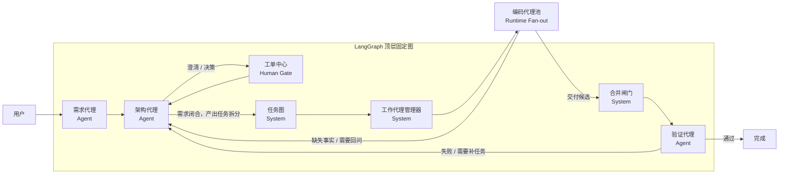

# 固定 Coding Workflow

这份文档回答两个问题：

1. 固定工作流里到底有哪些节点。
2. LangGraph 顶层图准备怎么挂这些节点。

## 顶层协作图

这张图里最重要的边界是：

1. `架构代理` 负责拆任务。
2. `任务图` 只是把拆分结果固化成 DAG，不负责思考。
3. `编码代理池` 不是一个顶层 LLM 节点，而是 `工作代理管理器` 之后的 runtime 扇出执行。
4. `合并闸门` 是系统规则节点，不是“管理验收 agent”。

## 节点清单

| 节点 | 类型 | 主要职责 |
| --- | --- | --- |
| 需求代理 | Agent | 维护需求对话，产出和修订需求文档 |
| 架构代理 | Agent | 审查需求、发起 ticket、拆任务、建议 agent |
| 工单中心 | Human Gate | 承载人类澄清和决策回复 |
| 任务图 | System | 将架构拆分结果固化为 DAG |
| 工作代理管理器 | System | 选择 capability、准备上下文、分配 agent 实例 |
| 编码代理池 | Runtime Pool | 执行具体 task run，产出交付候选 |
| 合并闸门 | System | 判断交付候选能否进入验证 |
| 验证代理 | Agent | 执行技术验证并决定是否完成 |

## LangGraph 使用边界

1. LangGraph 只编排顶层固定图，不承载业务真相。
2. 顶层节点执行真相写在 `workflow_node_runs`。
3. 子任务执行真相写在 `task_runs`，不混进顶层图。
4. `编码代理池` 由 runtime 扇出，不把每个 task 都建成一个 LangGraph 节点。

## 固定规则

1. Requirement 未闭合，不能进入任务图阶段。
2. 人类介入只能通过 `tickets`，worker 不能直接找人。
3. `DELIVERED != DONE`，编码完成不等于流程完成。
4. 验证失败回到架构代理，而不是把状态硬塞回某个 task run。
