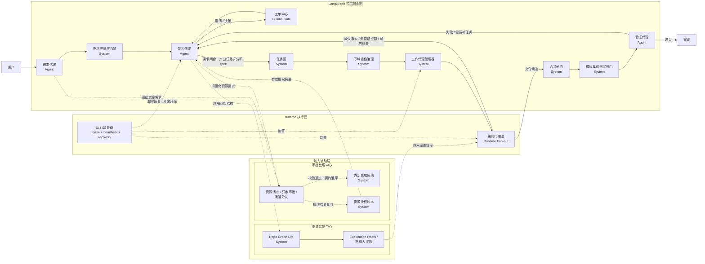

# 固定 Coding Workflow

这份文档回答两个问题：

1. 固定工作流里到底有哪些节点。
2. LangGraph 顶层图准备怎么挂这些节点。

## 顶层协作图

这张图里最重要的边界是：

1. `架构代理` 负责拆任务。
2. `需求完整度门禁` 属于 requirement 阶段的系统能力，不是新的顶层 agent。
3. `任务图` 只是把拆分结果固化成 DAG 和 task spec，不负责思考。
4. `Repo Graph Lite`、`高扇入/范围提示` 构成图谱智能中心；`外部集成契约`、`资源授权账本` 和异步审批编排构成审批处理中心；两者都属于辅助能力，不改变固定主链。
5. `编码代理池` 不是一个顶层 LLM 节点，而是 `工作代理管理器` 之后的 runtime 扇出执行。
6. `合并闸门` 只负责把 task 交付物并入模块集成候选，不直接启动 verify agent。
7. `模块集成测试闸门` 负责在模块达到可集成状态后执行确定性集成测试，verify agent 只在这一步之后启动。
8. `运行监督器` 是 runtime 组件，不是 agent。

## 节点清单

| 节点 | 类型 | 主要职责 |
| --- | --- | --- |
| 需求代理 | Agent | 维护需求对话，产出和修订需求文档 |
| 需求完整度门禁 | System | 检查 requirement 是否补齐关键缺口，再决定是否放行 architect |
| 架构代理 | Agent | 审查需求、发起 ticket、拆任务、建议 agent |
| 工单中心 | Human Gate | 承载人类澄清和决策回复 |
| 任务图 | System | 将架构拆分结果固化为 DAG 和 task spec |
| 写域重叠治理 | System | 在派发前发现潜在并发写域冲突和 workspace drift 风险 |
| 工作代理管理器 | System | 选择 capability、准备上下文、分配 agent 实例 |
| 编码代理池 | Runtime Pool | 执行具体 task run，产出交付候选 |
| 合并闸门 | System | 把 task 交付候选并入模块集成候选，暴露文本级 merge 冲突 |
| 模块集成测试闸门 | System | 在模块达到可集成状态后执行确定性集成测试并沉淀验证证据 |
| 运行监督器 | Runtime Supervisor | 维护心跳、租约、超时恢复、异常升级 |
| 验证代理 | Agent | 读取模块级集成测试证据并做语义裁决，决定是否真正完成 |

## 辅助能力

这些能力不是新的顶层流程节点，但会显著影响 requirement、architect、coding 的行为：

1. `图谱智能中心`
   - 由 `Repo Graph Lite`、高扇入分析和 exploration roots 组成
   - 给 architect 和 coding 提供模块地图、公共能力候选和范围提示
2. `审批处理中心`
   - 统一承接架构侧的规范化资源请求
   - 负责契约校验、异步审批适配、grant 沉淀和结果分发
   - `外部集成契约` 和 `资源授权账本` 都属于它内部沉淀的持久化事实

## LangGraph 使用边界

1. LangGraph 只编排顶层固定图，不承载业务真相。
2. 顶层节点执行真相写在 `workflow_node_runs`。
3. 子任务执行真相写在 `task_runs`，不混进顶层图。
4. `编码代理池` 由 runtime 扇出，不把每个 task 都建成一个 LangGraph 节点。

## 当前任务派发模式

1. 当前冻结为中心派发制，不采用 worker 自抢任务。
2. `架构代理` 负责拆 task、定义 capability requirement、决定是否重新规划。
3. `工作代理管理器` 负责：
   - 读取 `READY` task
   - 匹配 capability pack
   - 选择 agent instance
   - 创建 `task_runs`
4. worker 只执行已分配的 run，不直接扫描任务表抢单。

## 重新规划入口

下面三类情况都会回到 `架构代理`：

1. 增量需求或需求变化
2. 某个 task 持续失败
3. 模块集成测试或验证代理失败，且已经超出原 task 的简单返工范围
4. coding 发现需要突破当前写域
5. merge / drift / 审批处理中心返回的 grant / contract / 校验失败问题超出单 task 局部修补范围

## 固定规则

1. Requirement 未闭合，不能进入任务图阶段。
2. 人类介入只能通过 `tickets`，worker 不能直接找人。
3. `DELIVERED != DONE`，编码完成不等于流程完成。
4. task merge 成功也不等于完成，必须等模块集成测试和验证代理都通过。
5. 验证失败回到架构代理，而不是把状态硬塞回某个 task run。
6. 运行异常先由 `运行监督器` 处理，再决定是自动恢复还是升级给架构代理。
