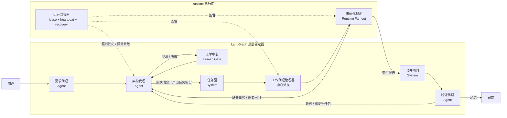

# 固定 Coding Workflow

这份文档回答两个问题：

1. 固定工作流里到底有哪些节点。
2. LangGraph 顶层图准备怎么挂这些节点。

## 顶层协作图

这张图里最重要的边界是：

1. `架构代理` 负责拆任务。
2. `任务图` 只是把拆分结果固化成 DAG，不负责思考。
3. `编码代理池` 不是一个顶层 LLM 节点，而是 `工作代理管理器` 之后的 runtime 扇出执行。
4. `合并闸门` 是系统规则节点，不是“管理验收 agent”。
5. `运行监督器` 是 runtime 组件，不是 agent。

## 节点清单

| 节点 | 类型 | 主要职责 |
| --- | --- | --- |
| 需求代理 | Agent | 维护需求对话，产出和修订需求文档 |
| 架构代理 | Agent | 审查需求、发起 ticket、拆任务、建议 agent |
| 工单中心 | Human Gate | 承载人类澄清和决策回复 |
| 任务图 | System | 将架构拆分结果固化为 DAG |
| 工作代理管理器 | System | 选择 capability、准备上下文、分配 agent 实例 |
| 编码代理池 | Runtime Pool | 执行具体 task run，产出交付候选 |
| 合并闸门 | System | 判断交付候选能否进入验证 |
| 运行监督器 | Runtime Supervisor | 维护心跳、租约、超时恢复、异常升级 |
| 验证代理 | Agent | 执行技术验证并决定是否完成 |

## LangGraph 使用边界

1. LangGraph 只编排顶层固定图，不承载业务真相。
2. 顶层节点执行真相写在 `workflow_node_runs`。
3. 子任务执行真相写在 `task_runs`，不混进顶层图。
4. `编码代理池` 由 runtime 扇出，不把每个 task 都建成一个 LangGraph 节点。

## 当前任务派发模式

1. 当前冻结为中心派发制，不采用 worker 自抢任务。
2. `架构代理` 负责拆 task、定义 capability requirement、决定是否重新规划。
3. `工作代理管理器` 负责：
   - 读取 `READY` task
   - 匹配 capability pack
   - 选择 agent instance
   - 创建 `task_runs`
4. worker 只执行已分配的 run，不直接扫描任务表抢单。

## 重新规划入口

下面三类情况都会回到 `架构代理`：

1. 增量需求或需求变化
2. 某个 task 持续失败
3. 验证失败且已经超出原 task 的简单返工范围

## 固定规则

1. Requirement 未闭合，不能进入任务图阶段。
2. 人类介入只能通过 `tickets`，worker 不能直接找人。
3. `DELIVERED != DONE`，编码完成不等于流程完成。
4. 验证失败回到架构代理，而不是把状态硬塞回某个 task run。
5. 运行异常先由 `运行监督器` 处理，再决定是自动恢复还是升级给架构代理。
