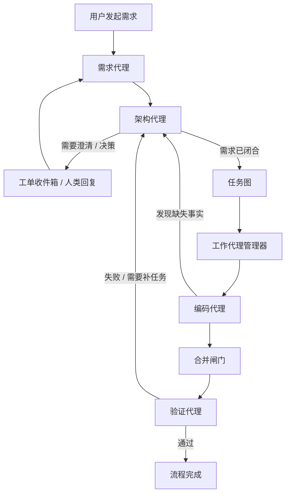

# 固定 Coding Workflow

## 目标

平台当前不做自由编排，而是把代码交付流程固定下来。允许变化的是：

1. 节点绑定哪个 Agent。
2. 节点的少量参数。
3. 是否启用自动代理模式。

不允许变化的是：

1. 主流程拓扑。
2. 人类介入方式。
3. Requirement -> Ticket -> Task -> Run -> Workspace 这条主链路。

## 当前固定节点

1. 需求代理
2. 架构代理
3. 工单收件箱
4. 任务图
5. 工作代理管理器
6. 编码代理
7. 合并闸门
8. 验证代理

## 流程图

## 节点职责与主要表

| 节点 | 主要职责 | 主要写入表 |
| --- | --- | --- |
| 需求代理 | 维护对话理解，生成和修订需求文档 | `workflow_node_runs`、`workflow_node_run_events`、`requirement_docs`、`requirement_doc_versions` |
| 架构代理 | 审查需求、发起澄清、拆任务、建议 Agent | `workflow_node_runs`、`workflow_node_run_events`、`tickets`、`ticket_events`、`work_modules`、`work_tasks`、`work_task_dependencies` |
| 工单收件箱 | 承载人类澄清和决策回复 | `tickets`、`ticket_events` |
| 任务图 | 将任务拆分结果稳定为 DAG | `work_modules`、`work_tasks`、`work_task_dependencies` |
| 工作代理管理器 | 按能力匹配 Agent，准备上下文，分配实例 | `work_task_capability_requirements`、`task_context_snapshots`、`agent_pool_instances` |
| 编码代理 | 在 worktree 中完成任务 | `task_runs`、`task_run_events`、`git_workspaces` |
| 合并闸门 | 判断交付候选是否满足进入验证的前置条件 | `workflow_run_events`、`git_workspaces` |
| 验证代理 | 执行顶层验证并决定是否可完成流程 | `workflow_node_runs`、`workflow_node_run_events`、`workflow_run_events` |

## 固定工作流的稳定规则

1. 需求未闭合时，不能进入任务图阶段。
2. 人类介入只能通过 `tickets`，worker 不能直接找人。
3. 顶层节点执行用 `workflow_node_runs` 表达，不混入 `task_runs`。
4. 子任务执行必须经过：
   - `work_tasks`
   - `work_task_capability_requirements`
   - `task_context_snapshots`
   - `task_runs`
   - `git_workspaces`
5. 验证失败时回到架构代理，而不是随便把状态塞回某个 task。

## 与平台化目标的关系

这条固定 workflow 让平台可以看起来像“Agent 平台”，但底层复杂度不会失控：

1. 用户看到的是可注册、可替换、可观察的 Agent 池。
2. 系统内部跑的是一条固定主流程。
3. 调度核心围绕 capability pack，而不是自由工作流节点拼接。

