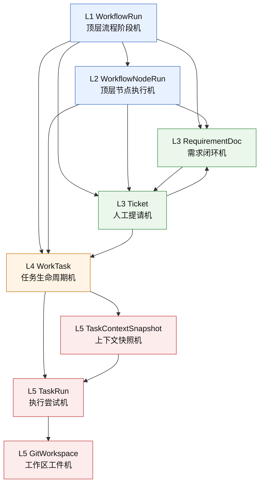

# 状态机分层图

这份文档只做一件事：

给出当前 AgentX Platform 的状态机分层总览，不在这里展开每层的具体状态迁移。

目的是先把“状态机应该挂在哪一层”说清楚，防止后面把所有状态揉成一张大图。

## 1. 总体原则

状态机采用自顶向下分层：

1. 顶层流程机只表达“整个 workflow 走到哪一阶段”。
2. 顶层节点执行机只表达“某个顶层节点的一次执行结果”。
3. Intake 层表达需求文档和人工提请闭环。
4. Planning 层表达 task DAG 的生命周期。
5. Execution 层表达 run、snapshot、workspace 等执行工件状态。

硬规则：

1. 上层状态机不能去镜像下层所有细节。
2. 下层状态变化可以影响上层投影，但不能直接篡改上层语义。
3. LangGraph 后面只负责编排节点，不成为业务状态的事实源。

## 2. 分层总览图

## 3. 每层的职责

### L1 `WorkflowRun`

只负责描述整个固定 workflow 的大阶段。

它回答的问题是：

1. 当前流程还在 intake、planning、execution 还是 verify。
2. 当前流程是否等待人工。
3. 当前流程是否已经完成、失败或取消。

它不应该回答的问题是：

1. 某张 ticket 是否已回答。
2. 某个 task 是否 delivered。
3. 某个 task run 是否失败重试。

### L2 `WorkflowNodeRun`

只记录顶层节点的一次执行。

当前主要对应：

1. 需求代理
2. 架构代理
3. 验证代理
4. 必要的系统节点

这层的价值是把“顶层节点执行轨迹”和“子任务执行轨迹”隔开，不让 `task_runs` 侵入顶层流程语义。

### L3 Intake 层

包含两个状态机：

1. `RequirementDoc`
2. `Ticket`

这层负责：

1. 需求文档是否闭合。
2. 哪些事实仍待澄清。
3. 哪些问题必须经过人工回答。

这里是人机协作边界，不允许 worker 直接跨过去找人。

### L4 Planning 层

由 `WorkTask` 作为核心状态机承载。

这层负责：

1. task 何时可进入执行。
2. task 是否被依赖阻塞。
3. task 是否只是交付候选，还是已真正完成。

后面讨论这层时要特别处理：

1. `DELIVERED != DONE`
2. DAG 依赖如何影响 task readiness

### L5 Execution 层

这里先保留三类状态机：

1. `TaskContextSnapshot`
2. `TaskRun`
3. `GitWorkspace`

这层负责的是真正的执行工件，不再直接表达业务需求语义。

这里回答的问题是：

1. 派发前的上下文是否 ready。
2. 某次执行尝试现在在跑、成功还是失败。
3. 工作区工件是否已经创建、合并、清理。

## 4. 层间影响规则

### 上推影响

下层状态会影响上层投影，例如：

1. `Ticket` 处于待回答，可能把 `WorkflowRun` 投影为等待人工。
2. `WorkTask` 全部完成，可能推动 `WorkflowRun` 进入 verify。
3. `TaskRun` 失败，可能把 `WorkTask` 重新拉回阻塞或失败。

### 禁止穿透

但下面这些是禁止的：

1. `TaskRun` 直接把 `WorkflowRun` 写成完成。
2. `GitWorkspace` 直接决定 requirement 是否闭合。
3. `Ticket` 跳过 `WorkTask` 直接驱动执行态。

中间必须经过所属聚合或流程编排层。

## 5. 后续讨论顺序

为了避免一次讨论太多，后续状态机按下面顺序逐层展开：

1. `WorkflowRun`
2. `WorkflowNodeRun`
3. `RequirementDoc`
4. `Ticket`
5. `WorkTask`
6. `TaskRun`
7. `TaskContextSnapshot`
8. `GitWorkspace`

每次只讨论一层，输出内容固定为：

1. 状态集合
2. 允许迁移
3. 触发命令
4. 关键约束

## 6. 和 LangGraph 的关系

后面接 LangGraph 时，这张分层图仍然成立：

1. LangGraph 编排的是顶层固定节点。
2. 数据库仍是状态真相来源。
3. LangGraph 节点执行的是“命令”，不是直接代替状态机。

也就是说：

1. 状态机先定。
2. 应用命令再定。
3. 最后才把命令挂到 LangGraph 节点上。
