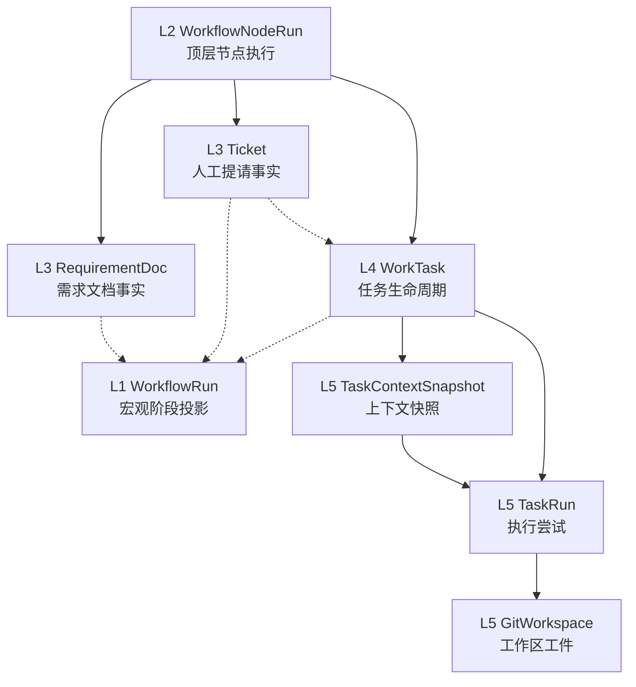
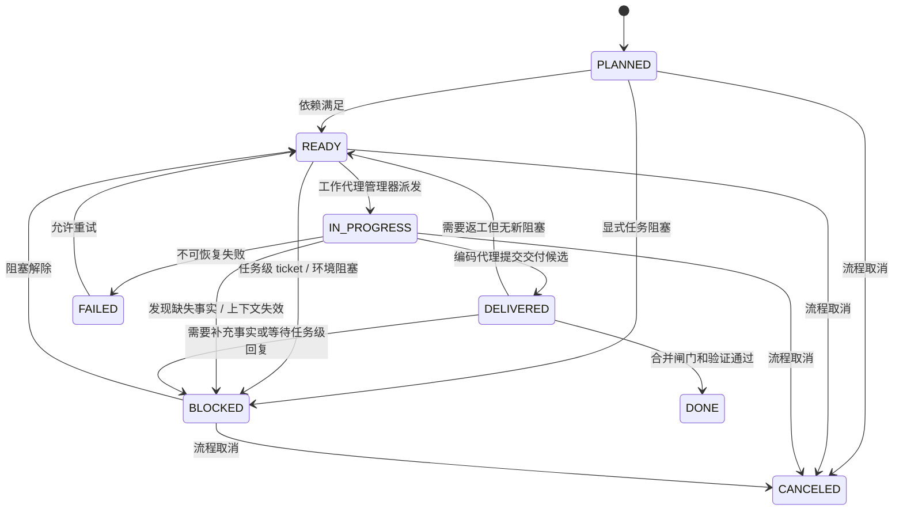

# 状态机设计（L1-L5）

这份文档只保留真正会影响实现的状态机信息。

先说术语：

“允许迁移表” 这个说法以后不用了，统一叫 **状态迁移矩阵**。
它不是数据库表，只是一组规则：

1. 当前状态
2. 触发命令
3. 守卫条件
4. 目标状态
5. 副作用

## 分层交互总图

这张图里有三个硬规则：

1. L1 是投影层，不拥有需求细节或 task 细节。
2. L2 记录顶层节点执行，但不直接代替业务真相。
3. L3/L4 是业务事实层，L5 是执行工件层。

## L1-L5 各层职责

| 层 | 当前对象 | 主要回答什么 |
| --- | --- | --- |
| L1 | `WorkflowRun` | 整条流程现在处于哪个宏观阶段 |
| L2 | `WorkflowNodeRun` | 某个顶层节点这次执行是运行中、等待人工、成功还是失败 |
| L3 | `RequirementDoc` / `Ticket` | 需求是否闭合，人工问题是否解决 |
| L4 | `WorkTask` | 某个任务是否可执行、执行中、已交付候选、已真正完成 |
| L5 | `TaskContextSnapshot` / `TaskRun` / `GitWorkspace` | 具体执行工件当前是否可用、在跑、成功、失败、已合并、已清理 |

## L1-L3 关键约束

1. `WorkflowRun = WAITING_ON_HUMAN` 的前提不是“有 ticket”，而是存在未解决的 `GLOBAL_BLOCKING` ticket 且当前没有合法自动下一步。
2. `Ticket = ANSWERED` 不等于 `RESOLVED`。
3. `RequirementDoc = CONFIRMED` 是进入 task graph 的前提，但后续仍可 reopen。
4. 节点等待人工只是信号，L1 最终看的是 L3 真相。

## L4 `WorkTask` 设计

这里要明确区分两件事：

1. **当前代码里的 `WorkTaskStatus` 仍然是粗粒度枚举**
2. **下面这套是目标状态机设计，用来指导后续实现**

目标状态建议收敛为：

1. `PLANNED`
2. `READY`
3. `IN_PROGRESS`
4. `BLOCKED`
5. `DELIVERED`
6. `DONE`
7. `FAILED`
8. `CANCELED`

其中最关键的规则是：

`DELIVERED != DONE`

也就是说：

1. 编码代理完成代码和证据上传，只能把任务推进到 `DELIVERED`
2. 只有经过 `合并闸门 + 验证代理`，任务才算 `DONE`

## L4 状态图

## L4 状态迁移矩阵

| 当前状态 | 触发命令 | 守卫条件 | 目标状态 | 副作用 |
| --- | --- | --- | --- | --- |
| `PLANNED` | `openTaskForDispatch` | DAG 依赖满足，且不存在 task blocker | `READY` | 标记可派发 |
| `READY` | `dispatchTask` | agent instance、上下文快照、写域齐备 | `IN_PROGRESS` | 创建 `task_runs` |
| `READY/IN_PROGRESS` | `blockTask` | 出现 `TASK_BLOCKING` ticket、环境缺失或依赖回退 | `BLOCKED` | 记录阻塞原因 |
| `BLOCKED` | `unblockTask` | blocker 清除 | `READY` | 允许重新派发 |
| `IN_PROGRESS` | `deliverTask` | task run 产出交付候选 | `DELIVERED` | 记录交付证据 |
| `DELIVERED` | `acceptDelivery` | 合并闸门通过且验证通过 | `DONE` | 任务真正完成 |
| `DELIVERED` | `requestRework` | 验证失败但仍在原任务范围内 | `READY` | 回到可返工状态 |
| `IN_PROGRESS/DELIVERED` | `failTask` | 不可恢复失败 | `FAILED` | 记录失败 |

## L4 和其他层怎么交互

| 来源 | 作用到 `WorkTask` 的方式 |
| --- | --- |
| `架构代理 + 任务图` | 创建任务，初始为 `PLANNED` |
| `Ticket` | `TASK_BLOCKING` 且未解决时，把任务投影为 `BLOCKED` |
| `工作代理管理器` | 把 `READY` 派发为 `IN_PROGRESS` |
| `编码代理池` | 让任务从 `IN_PROGRESS` 变成 `DELIVERED / BLOCKED / FAILED` |
| `合并闸门 + 验证代理` | 让任务从 `DELIVERED` 变成 `DONE / READY / BLOCKED` |
| `WorkflowRun` | 读取任务聚合结果，决定是否留在 `EXECUTING_TASKS` 或进入 `VERIFYING` |

## L5 `Execution` 设计

L5 只表达执行工件，不直接表达业务完成。

这一层目前保留四个状态维度：

1. `TaskContextSnapshotStatus`
2. `TaskRunStatus`
3. `GitWorkspaceStatus`
4. `CleanupStatus`

### 1. `TaskContextSnapshot`

当前代码枚举：

1. `BUILDING`
2. `READY`
3. `FAILED`
4. `EXPIRED`

它回答的问题是：

1. 当前 task 的上下文和 skill 包是否已经编译好。
2. 派发时引用的快照是否仍然有效。

核心迁移矩阵：

| 当前状态 | 触发命令 | 守卫条件 | 目标状态 | 副作用 |
| --- | --- | --- | --- | --- |
| `BUILDING` | `finishSnapshotBuild` | 上下文构建成功 | `READY` | 允许派发 task run |
| `BUILDING` | `failSnapshotBuild` | 构建失败 | `FAILED` | 记录错误 |
| `READY` | `expireSnapshot` | 指纹失效或保留期到期 | `EXPIRED` | 禁止继续派发 |

### 2. `TaskRun`

当前代码枚举：

1. `QUEUED`
2. `RUNNING`
3. `SUCCEEDED`
4. `FAILED`
5. `CANCELED`

它回答的问题是：

1. 这次执行尝试有没有真正开始。
2. 当前 agent instance 跑成了什么结果。

核心迁移矩阵：

| 当前状态 | 触发命令 | 守卫条件 | 目标状态 | 副作用 |
| --- | --- | --- | --- | --- |
| `QUEUED` | `startRun` | agent instance、快照、租约齐备 | `RUNNING` | 开始心跳 |
| `RUNNING` | `completeRun` | 产出候选和证据 | `SUCCEEDED` | 回传交付结果 |
| `RUNNING` | `failRun` | 执行不可恢复失败 | `FAILED` | 回传失败原因 |
| `QUEUED/RUNNING` | `cancelRun` | 被上层取消或替换 | `CANCELED` | 停止执行 |

关键规则：

1. `TaskRun.SUCCEEDED != WorkTask.DONE`
2. `TaskRun.SUCCEEDED` 最多只能支撑 L4 进入 `DELIVERED`

### 3. `GitWorkspace`

当前代码枚举：

1. `PROVISIONING`
2. `READY`
3. `MERGED`
4. `CLEANED`
5. `FAILED`

附属清理状态：

1. `PENDING`
2. `IN_PROGRESS`
3. `DONE`
4. `FAILED`

它回答的问题是：

1. 这个 task run 的 worktree 是否准备好。
2. 合并候选是否已经物化。
3. 清理是否完成。

核心迁移矩阵：

| 当前状态 | 触发命令 | 守卫条件 | 目标状态 | 副作用 |
| --- | --- | --- | --- | --- |
| `PROVISIONING` | `readyWorkspace` | worktree、branch、base commit 创建成功 | `READY` | 允许编码 |
| `READY` | `mergeWorkspace` | 合并候选构造成功 | `MERGED` | 记录 `head_commit / merge_commit` |
| `READY/MERGED` | `failWorkspace` | worktree 或 merge 失败 | `FAILED` | 记录失败 |
| `MERGED` | `cleanupWorkspace` | 清理动作完成 | `CLEANED` | 回收 worktree |

关键规则：

1. `GitWorkspace.MERGED != WorkTask.DONE`
2. `cleanupStatus` 是 `GitWorkspace` 的附属维度，不单独上升为业务主状态机

## 调度与运行监督

这一部分只固定当前运行方式，不展开控制面细节。

### 当前派发模式

1. 当前采用中心派发制，不采用 worker 自抢任务。
2. `WorkTask = READY` 只表示“可以进入派发准备”。
3. 真正的派发动作由 `工作代理管理器` 执行：
   - 选择 capability 匹配的 agent instance
   - 准备 `TaskContextSnapshot`
   - 创建 `TaskRun`

### 当前监督模式

`运行监督器` 负责 runtime 层的保活和恢复，不负责业务规划。

它关注两类租约：

1. 实例租约
   - 表：`agent_pool_instances`
   - 字段：`lease_until`、`last_heartbeat_at`
2. 运行租约
   - 表：`task_runs`
   - 字段：`lease_until`、`last_heartbeat_at`

监督器的最小职责：

1. 接收 heartbeat
2. 检查 lease 是否过期
3. 识别 worker 失联
4. 触发恢复动作
5. 必要时升级给架构代理重新规划

### 监督规则

1. worker 心跳正常时，只续租，不改业务状态。
2. `task_runs` 超时且无心跳时：
   - 优先走自动恢复
   - 自动恢复不成立时，再升级给架构代理
3. `agent_pool_instances` 超时且无心跳时：
   - 标记该实例不可再接新任务
4. `运行监督器` 不直接修改 `RequirementDoc`、`Ticket` 语义。

## L4 和 L5 的关系

| L4 状态 | 对 L5 的要求 |
| --- | --- |
| `READY` | 允许进入派发准备；真正派发前必须补齐 `READY` 的 `TaskContextSnapshot` |
| `IN_PROGRESS` | 至少存在一个 `RUNNING` 的 `TaskRun`，通常伴随 `READY` 的 `GitWorkspace` |
| `DELIVERED` | 至少存在一个 `SUCCEEDED` 的 `TaskRun`，并且交付候选已落到 workspace / 证据中 |
| `DONE` | 不要求保留执行中工件，但需要有可追溯证据；workspace 可以是 `MERGED` 或后续 `CLEANED` |

## 小场景：把 L4 放进主链

场景还是 `/healthz`。

1. L3 已经闭环：
   - `RequirementDoc = CONFIRMED`
   - 全局阻塞 ticket 已 `RESOLVED`
2. 架构代理拆出任务 `healthz-endpoint`
   - `WorkTask = PLANNED`
3. 任务图确认没有前置依赖
   - `PLANNED -> READY`
4. 工作代理管理器分配编码代理实例
   - `READY -> IN_PROGRESS`
5. 编码代理实现接口，但发现探活返回格式还差一个字段，需要补一个任务级澄清
   - 架构侧创建 `TASK_BLOCKING` ticket
   - `IN_PROGRESS -> BLOCKED`
   - 此时整个 `WorkflowRun` 仍可保持 `EXECUTING_TASKS`，不一定进入 `WAITING_ON_HUMAN`
6. 任务级 ticket 回复并解决
   - `BLOCKED -> READY -> IN_PROGRESS`
7. 编码代理完成代码并上传证据
   - `IN_PROGRESS -> DELIVERED`
8. 合并闸门检查通过，验证代理通过
   - `DELIVERED -> DONE`

这个场景的关键点是：

1. L3 的 `GLOBAL_BLOCKING` 影响整个流程。
2. L4 的 `TASK_BLOCKING` 只影响单个任务。
3. `DELIVERED` 是编码侧的完成，`DONE` 是流程侧的完成。

## 同一场景下的 L5 工件

继续上面的 `healthz-endpoint` 场景：

1. 工作代理管理器准备上下文快照
   - `TaskContextSnapshot: BUILDING -> READY`
2. 任务被派发后创建执行尝试
   - `TaskRun: QUEUED -> RUNNING`
3. 同时准备 worktree
   - `GitWorkspace: PROVISIONING -> READY`
4. 编码代理完成并回传证据
   - `TaskRun: RUNNING -> SUCCEEDED`
   - L4 `WorkTask: IN_PROGRESS -> DELIVERED`
5. 合并候选被物化
   - `GitWorkspace: READY -> MERGED`
6. 验证通过，任务被接受
   - L4 `WorkTask: DELIVERED -> DONE`
7. 收尾清理
   - `CleanupStatus: PENDING -> IN_PROGRESS -> DONE`
   - `GitWorkspace: MERGED -> CLEANED`

这里要注意：

1. `TaskRun.SUCCEEDED` 只说明这次尝试跑通了。
2. `GitWorkspace.MERGED` 只说明候选已物化。
3. 真正的业务完成仍然看 L4 `WorkTask.DONE`。

## 当前冻结结论

1. 顶层流程固定，LangGraph 只编排顶层节点。
2. task 执行采用中心派发制，不采用 worker 自抢。
3. `架构代理` 负责规划、重规划、提请分流。
4. `工作代理管理器` 负责派发。
5. `运行监督器` 负责 heartbeat、lease、超时恢复。
6. `WorkTask` 是业务任务，`TaskRun` 是执行尝试。
7. `DELIVERED != DONE`
8. `TaskRun.SUCCEEDED != WorkTask.DONE`
9. `GitWorkspace.MERGED != WorkTask.DONE`

## 和 LangGraph 的关系

1. LangGraph 只编排顶层固定节点。
2. `WorkTask` 不是 LangGraph 的业务真相源。
3. L4/L5 的迁移命令会由顶层节点或 runtime 执行结果触发，但状态真相仍然落在聚合和数据库。
