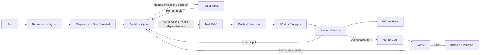
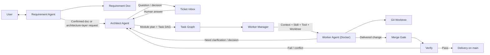

# AgentX 核心流程重构图

这页只回答三件事：

1. 你现在理解的主链路，和项目当前真实实现是否大致一致。
2. 代码膨胀主要发生在核心流程，还是发生在编排胶水层。
3. 如果现在开始重构，应该先保留哪条最小闭环。

## 结论先说

结论是：你的理解和当前系统已经实现出来的主链路，大体一致。

当前真实系统已经具备下面这条闭环：

1. `requirement_agent` 和用户交互，维护 discovery 对话历史，并生成或修订 requirement doc。
2. requirement 确认后，系统自动创建 `ARCH_REVIEW` ticket，交给 `architect_agent`。
3. `architect_agent` 会先判断是否需要继续澄清或让用户做决策。
4. 如果不需要继续阻塞，就生成模块、任务、依赖，也就是任务 DAG。
5. 任务会绑定最新 `READY` 的 context snapshot，再进入 worker 执行。
6. worker 执行失败、需要澄清、需要决策时，不直接问用户，而是回到 architect ticket 流。
7. 任务成功后进入 merge gate，触发 verify，verify 通过后任务从 `DELIVERED` 进入 `DONE`。

所以主线不是问题。主线是通的。

真正膨胀的地方，主要不是“需求 -> 架构 -> 拆任务 -> 执行 -> 合并”这条核心业务链，而是围绕这条链附着出来的编排层、调度层、运行时适配层和大量自动恢复/兜底逻辑。

## 当前系统和你的理解的对齐点

### 已经对齐的部分

1. 需求 agent 不是一次性 draft 按钮，而是有持续对话状态的。
   - `RequirementAgentDraftService`
   - `RedisRequirementConversationHistoryRepository`
2. requirement 确认后，确实会进入 architect 处理，不是直接开始执行。
   - `RequirementConfirmedProcessManager`
   - `ArchitectTicketAutoProcessorService`
3. architect 处理里，确实既有“需要用户继续澄清”的分支，也有“直接拆任务/DAG”的分支。
4. 子任务执行前，系统会先编译 context snapshot，而不是把 session 原文直接塞给 worker。
5. worker 做完后，系统会进入 merge gate 和 verify，而不是直接把 task 改成 `DONE`。
6. worker 如果发现缺失事实，会回到 ticket 流，再由 architect 决定是否转成人类决策。

### 还没有完全对齐的部分

1. 当前的 worker 还不是“主 agent 动态拉起的独立子 agent 容器”。
   - 现在更接近 `worker + toolpack + runtime environment + local executor` 模型。
   - Docker 目前主要用于 backend 运行面和 runtime/toolpack 准备，不是强隔离的 worker agent runtime。
2. 当前 architect agent 的职责散落在多个类里。
   - ticket 自动处理
   - proposal 生成
   - task breakdown 生成
   - planning 持久化
   - need-input 回流
3. 当前系统推进主线依赖三种触发机制混合在一起。
   - API
   - Spring event listener
   - scheduler 轮询

这也是“感觉架构有了，但代码越来越碎”的主要原因。

## 代码膨胀在哪里

按源码目录粗看，主模块行数大致是：

| 模块 | 文件数 | 代码行数 |
| --- | ---: | ---: |
| `process` | 48 | 11251 |
| `contextpack` | 30 | 4548 |
| `execution` | 44 | 2834 |
| `requirement` | 32 | 2694 |
| `planning` | 30 | 1690 |
| `ticket` | 22 | 1228 |
| `mergegate` | 20 | 755 |
| `workspace` | 10 | 653 |

最胖的几个文件也非常说明问题：

| 文件 | 代码行数 | 角色 |
| --- | ---: | --- |
| `LocalWorkerTaskExecutor.java` | 2705 | worker 执行器，混合了 LLM 规划、文件改动、verify、repo 上下文拼装 |
| `LocalRuntimeEnvironmentAdapter.java` | 1337 | runtime/toolpack/database 账户/docker 环境准备 |
| `ArchitectTicketAutoProcessorService.java` | 823 | architect ticket 编排 |
| `RunNeedsInputProcessManager.java` | 719 | worker need-input 回流 ticket 编排 |
| `BailianArchitectTicketProposalGenerator.java` | 678 | architect 提案生成适配 |
| `BailianArchitectTaskBreakdownGenerator.java` | 672 | architect 拆任务生成适配 |

这组数字说明两件事：

1. 代码膨胀主要在 `process` 和 runtime adapter，不在 `planning / ticket / mergegate / workspace` 这些相对稳定的核心域对象上。
2. 膨胀来源更像“胶水和补丁越来越多”，不是“核心状态机本身过度复杂”。

## 现状核心流程图

这张图是对当前真实实现的压缩版，不展开 scheduler、listener、controller 细节，只保留主链。

## 建议保留的最小闭环

如果现在开始重构，不要先重构全部模块，而是先把核心流程收缩成下面 7 个稳定节点：

1. `Requirement Agent`
   - 只负责用户对话、需求澄清、生成和修订 requirement doc。
2. `Architect Agent`
   - 只负责架构审查、任务拆分、DAG 输出、澄清分流。
3. `Ticket Inbox`
   - 唯一的人类介入入口。
   - 所有 `DECISION / CLARIFICATION` 都走这里。
4. `Task Graph`
   - 只保存模块、任务、依赖、写域边界。
5. `Worker Manager`
   - 只负责给 task 绑定 context、skill、tool、worktree，并拉起 worker。
6. `Worker Agent`
   - 只负责在隔离环境里执行任务，并返回 `SUCCEEDED / FAILED / NEED_*`。
7. `Merge Gate`
   - 只负责 rebase candidate、verify、落主干和 delivery 证据。

## 建议的重构架构图

这张图不是“未来所有细节”，而是建议先冻结下来的核心模型。

## 这次重构建议先做什么，不做什么

### 先做

1. 先把“核心 7 节点”定成一等概念，统一命名。
2. 把 `process` 里真正属于 architect、worker manager、merge gate 的职责切出来。
3. 把“API + listener + scheduler 混合推进”的流程视图，收敛成一份统一状态机。
4. 把 worker 抽象从“数据库记录 + 本地执行器”提升成“可以替换为 docker child agent”的稳定接口。

### 暂时不要做

1. 不要先拆微服务。
2. 不要先重做 query/read model。
3. 不要先增加更多状态。
4. 不要先设计复杂的多层 ticket 类型。
5. 不要先做更复杂的 runtime env 和 toolpack 自动化。

## 我对当前项目的判断

当前项目的问题不是“没有核心流程”，而是“核心流程已经存在，但被过多运行时细节包住了”。

所以重构方向不应该是重新发明一套更复杂的系统，而应该是：

1. 先把 Requirement Agent、Architect Agent、Worker Manager、Worker Agent、Merge Gate 这几个一等角色重新立起来。
2. 再把 scheduler、listener、runtime adapter、自动恢复策略看成二级实现细节。
3. 先把核心链路画清楚，再决定哪些胶水保留，哪些下沉，哪些删除。

如果按这个方向推进，下一步最合理的工作不是继续加功能，而是先出一版：

- `核心状态机`
- `核心模块边界`
- `process` 拆分方案

也就是先把“怎么流转”定死，再动代码。
