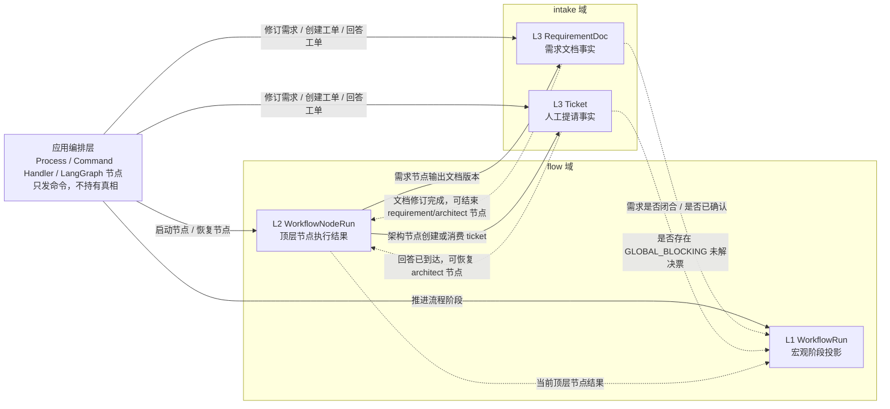
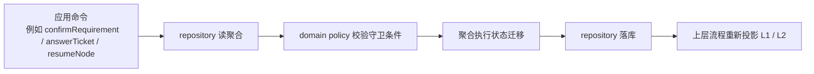
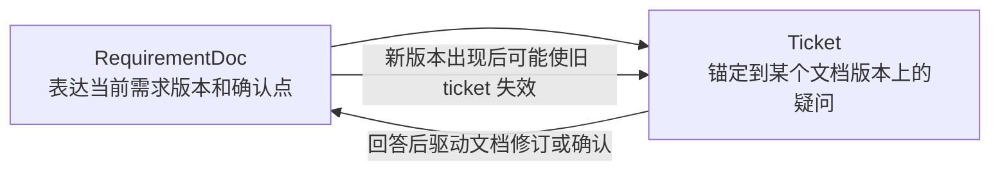

# L1-L3 状态机交互设计

这份文档只回答四个问题：

1. 什么叫“允许迁移表”。
2. L1 `WorkflowRun`、L2 `WorkflowNodeRun`、L3 `RequirementDoc / Ticket` 之间如何交互。
3. L3 两个状态机各自怎么设计。
4. 用一个小场景把三层联动走一遍。

## 1. 术语更正

前面提到的“允许迁移表”，更准确的叫法应该是：

1. 状态迁移矩阵
2. 状态迁移规则表

它不是数据库表，也不是要额外建一张配置表。

它只是把某个状态机的核心规则列清楚：

1. 当前状态是什么。
2. 允许接受什么命令。
3. 需要满足什么守卫条件。
4. 会迁移到什么目标状态。
5. 迁移时会写出什么领域事实或事件。

最小形式一般长这样：

| 当前状态 | 触发命令 | 守卫条件 | 目标状态 | 副作用 |
| --- | --- | --- | --- | --- |
| `OPEN` | `answerTicket` | 回复人合法 | `ANSWERED` | 写 `ticket_events` |

所以后面我会统一说“状态迁移矩阵”，不再用“允许迁移表”这个容易误解的说法。

## 2. 三层交互总图

这张图的关键意思是：

1. L1 不直接拥有需求细节，它读取 L2/L3 的事实来投影宏观阶段。
2. L2 不直接拥有业务闭环，它只是记录一次顶层节点执行结果。
3. L3 才是 intake 事实本身，也就是“需求文档现在到底是什么”“人类提请现在到底解决没解决”。

## 3. 状态机和 Domain 的关系

这里要说清楚一个经常混的点：

状态机不是悬在 domain 外面的一个独立系统。

在当前设计里：

1. `WorkflowRun` 状态机挂在 `domain.flow.model.WorkflowRun`
2. `WorkflowNodeRun` 状态机挂在 `domain.flow.model.WorkflowNodeRun`
3. `RequirementDoc` 状态机挂在 `domain.intake.model.RequirementDoc`
4. `Ticket` 状态机挂在 `domain.intake.model.Ticket`

也就是说，状态机本身就是 domain 规则的一部分。

外界和它们交互的方式不是“直接改状态字段”，而是：

所以“状态机如何与 domain 交互”这个问题，在当前方案里更准确地说是：

1. 状态机就是 domain 聚合内部规则。
2. 应用层只负责发命令和组织多个聚合之间的顺序。
3. repository 负责把迁移后的聚合持久化。

## 4. L3 设计总览

L3 当前先展开两个状态机：

1. `RequirementDoc`
2. `Ticket`

它们都属于 intake 领域，但语义不同：

1. `RequirementDoc` 解决“需求内容是否闭合”。
2. `Ticket` 解决“缺失事实或待决策项是否已被处理”。

二者关系如下：

## 5. `RequirementDoc` 状态机

代码枚举见 [`RequirementStatus.java`](/D:/DeskTop/agentx-platform/src/main/java/com/agentx/platform/domain/intake/model/RequirementStatus.java)：

1. `DRAFT`
2. `IN_REVIEW`
3. `CONFIRMED`
4. `SUPERSEDED`
5. `CANCELED`

### 5.1 语义定义

1. `DRAFT`
   - 刚创建或刚开始整理。
   - 允许继续追加内容，但还没有进入对外审查语义。
2. `IN_REVIEW`
   - 当前版本已形成一个可审查草案。
   - 架构代理可以基于它识别缺失事实、创建 ticket、决定是否确认。
3. `CONFIRMED`
   - 当前版本被认为足以进入 planning。
   - 不是“永远不改”，而是“在当前时点已经闭合”。
4. `SUPERSEDED`
   - 当前文档被新的文档实例替代。
   - v1 暂时保留语义，不作为主链路常态。
5. `CANCELED`
   - 当前 workflow 被取消，文档不再推进。

### 5.2 状态迁移矩阵

| 当前状态 | 触发命令 | 守卫条件 | 目标状态 | 副作用 |
| --- | --- | --- | --- | --- |
| `DRAFT` | `submitForReview` | 至少存在一个版本 | `IN_REVIEW` | 更新 `current_version` |
| `IN_REVIEW` | `reviseRequirement` | 修订内容有效 | `IN_REVIEW` | 新增 `requirement_doc_versions` |
| `IN_REVIEW` | `confirmRequirement` | 不存在未解决的 `GLOBAL_BLOCKING` ticket | `CONFIRMED` | 记录 `confirmed_version` |
| `CONFIRMED` | `reopenRequirement` | 后续发现事实缺失或范围变化 | `IN_REVIEW` | 新增文档版本，回到审查 |
| `DRAFT/IN_REVIEW/CONFIRMED` | `cancelRequirement` | workflow 已取消 | `CANCELED` | 停止后续推进 |
| `CONFIRMED` | `supersedeRequirement` | 有新文档实例接管 | `SUPERSEDED` | 旧文档退出主链 |

### 5.3 关键规则

1. `RequirementDoc` 能否 `CONFIRMED`，不能只看文档本身，还要看 ticket。
2. `CONFIRMED` 只是 planning 的准入条件，不代表后面永远不会 reopen。
3. 文档版本增长是事实，状态只是对“当前版本闭合程度”的判断。

## 6. `Ticket` 状态机

代码枚举见 [`TicketStatus.java`](/D:/DeskTop/agentx-platform/src/main/java/com/agentx/platform/domain/intake/model/TicketStatus.java)：

1. `OPEN`
2. `CLAIMED`
3. `ANSWERED`
4. `RESOLVED`
5. `CANCELED`

阻塞范围由 [`TicketBlockingScope.java`](/D:/DeskTop/agentx-platform/src/main/java/com/agentx/platform/domain/intake/model/TicketBlockingScope.java) 表达：

1. `GLOBAL_BLOCKING`
2. `TASK_BLOCKING`
3. `INFORMATIONAL`

### 6.1 语义定义

1. `OPEN`
   - ticket 已创建，等待被人类或处理者接住。
2. `CLAIMED`
   - 某个处理方已经占用，避免重复处理。
3. `ANSWERED`
   - 人类已经给出答复，但架构侧还没有确认它足够闭环。
4. `RESOLVED`
   - 该 ticket 对应的问题已经在业务上闭环。
5. `CANCELED`
   - 问题已失效，不再处理。

### 6.2 状态迁移矩阵

| 当前状态 | 触发命令 | 守卫条件 | 目标状态 | 副作用 |
| --- | --- | --- | --- | --- |
| `OPEN` | `claimTicket` | 处理者合法且未被占用 | `CLAIMED` | 写 claim 信息 |
| `CLAIMED` | `releaseTicket` | claim 超时或主动释放 | `OPEN` | 清除 claim |
| `OPEN/CLAIMED` | `answerTicket` | 回复内容有效 | `ANSWERED` | 写 `ticket_events` |
| `ANSWERED` | `resolveTicket` | 架构代理确认答案足够闭环 | `RESOLVED` | 写 resolve 事件 |
| `ANSWERED` | `reopenTicket` | 答案不足以闭环 | `OPEN` | 更新提问内容或继续追问 |
| `OPEN/CLAIMED/ANSWERED` | `cancelTicket` | 问题失效 | `CANCELED` | 停止等待 |

### 6.3 关键规则

1. `ANSWERED != RESOLVED` 是硬规则。
2. 是否阻塞 L1，看的是 `blocking_scope + ticket status`，不是只看状态。
3. `GLOBAL_BLOCKING + OPEN/CLAIMED` 会阻塞 `WorkflowRun`。
4. `TASK_BLOCKING` 后面只应该投影到 task 级，不应该把整个 workflow 打进等待人工。

## 7. 三层之间如何相互驱动

### 7.1 L2 -> L3

1. `requirement` 节点运行时，会产出或修订 `RequirementDoc`。
2. `architect` 节点运行时，会读取 `RequirementDoc` 并决定是否创建 `Ticket`。
3. `architect` 节点恢复后，会消费 `Ticket` 的答案，决定把它 `RESOLVED` 还是重新 `OPEN`。

### 7.2 L3 -> L2

1. `Ticket = ANSWERED` 说明等待的外部输入已经到达，`architect` 节点可以被恢复。
2. `RequirementDoc = CONFIRMED` 说明架构节点如果没有别的阻塞，就可以 `SUCCEEDED`。

### 7.3 L3 -> L1

1. `RequirementDoc = CONFIRMED` 且不存在未解决的全局阻塞 ticket 时，L1 才能从 intake 继续前进。
2. 只要存在 `GLOBAL_BLOCKING + OPEN/CLAIMED`，L1 就应该投影为 `WAITING_ON_HUMAN`。

### 7.4 L2 -> L1

1. 节点 `FAILED` 可能让 `WorkflowRun` 投影为 `FAILED`。
2. 节点 `SUCCEEDED` 只是提供推进信号，不自动决定 L1 到哪一步。
3. 节点 `WAITING_ON_HUMAN` 是提示，不是最终依据；最终还要看 ticket 真相。

## 8. 三层联动场景

场景：用户要新增 `/healthz` 接口，但没有说明是否要探测数据库。

### 8.1 初始启动

1. 创建 `WorkflowRun`
   - `DRAFT -> ACTIVE`
2. 创建 `requirement` 节点运行
   - `PENDING -> RUNNING`
3. 创建 `RequirementDoc`
   - `DRAFT`

### 8.2 需求代理整理草案

1. 需求代理产出第一版文档。
2. `RequirementDoc`
   - `DRAFT -> IN_REVIEW`
3. `requirement` 节点运行完成
   - `RUNNING -> SUCCEEDED`
4. `WorkflowRun`
   - 仍为 `ACTIVE`

原因：

1. 已有可审查草案。
2. 但需求是否闭合，仍要交给架构侧审查。

### 8.3 架构代理发现缺失事实

1. 创建 `architect` 节点运行
   - `PENDING -> RUNNING`
2. 架构代理读取 `RequirementDoc(IN_REVIEW)`。
3. 发现“是否探测数据库”未定义，于是创建 ticket：
   - `Ticket = OPEN`
   - `blocking_scope = GLOBAL_BLOCKING`
4. `architect` 节点切到
   - `RUNNING -> WAITING_ON_HUMAN`
5. `WorkflowRun` 重新投影为
   - `ACTIVE -> WAITING_ON_HUMAN`

这里的交互顺序是：

1. L2 先写出 L3 的 `Ticket` 事实。
2. L1 再根据 L3 事实投影自己进入等待人工。

不是反过来直接由节点把 L1 改成等待人工。

### 8.4 人类回复 ticket

1. 用户回答：“需要探测数据库，数据库不可用时 healthz 失败。”
2. `Ticket`
   - `OPEN -> ANSWERED`
3. 应用编排层据此恢复 `architect` 节点：
   - `WAITING_ON_HUMAN -> RUNNING`
4. 此时 `WorkflowRun` 可以先回到
   - `WAITING_ON_HUMAN -> ACTIVE`

原因：

1. 全局阻塞的外部输入已经到达。
2. 但架构节点还没有消化答案并闭合需求，所以不能直接进入执行。

### 8.5 架构代理消化答案并闭合需求

1. 架构代理消费 `Ticket(ANSWERED)`。
2. 认为答案足够闭环，于是：
   - `Ticket: ANSWERED -> RESOLVED`
   - `RequirementDoc: IN_REVIEW -> CONFIRMED`
3. `architect` 节点运行完成：
   - `RUNNING -> SUCCEEDED`
4. `WorkflowRun` 前进到：
   - `WAITING_ON_HUMAN -> ACTIVE`

原因：

1. 文档已经确认。
2. 全局阻塞 ticket 已解决。
3. 流程可以离开等待人工，重新进入可自动推进状态。

### 8.6 进入 task graph 和 worker manager

这一段已经超出 L3 本身，但为了把 L1 说完整，补一句当前粗粒度投影：

1. `RequirementDoc = CONFIRMED`
2. `Ticket` 不再存在未解决的 `GLOBAL_BLOCKING`
3. task graph / worker manager 继续推进
4. 真正开始派发任务执行时，`WorkflowRun` 才进入：
   - `ACTIVE -> EXECUTING_TASKS`

## 9. 当前设计结论

1. L1 是宏观阶段投影机。
2. L2 是顶层节点执行壳。
3. L3 是 intake 事实真相层。
4. `ANSWERED != RESOLVED`
5. `节点等待人工 != 流程等待人工`
6. 流程是否等待人工最终看 `GLOBAL_BLOCKING` ticket，而不是看节点自己怎么说。
7. 当前代码枚举没有单独的 `PLANNING`，所以 planning 阶段暂时折叠在 `ACTIVE` 中表达。
