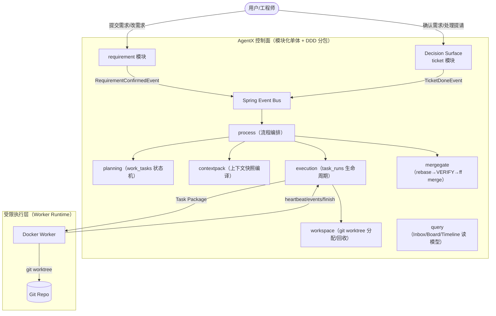

# AgentX - 项目总述与关键架构问题（面试总纲）

这份文档建议作为面试的“破冰 + 定调”素材：先用 30 秒讲清价值，再用 2–3 分钟讲清为什么这套机制能落地（可控、可审计、可交付）。

## 0.1 当前真实实现补充（2026-03）

这份总纲最需要和真实代码对齐的地方，是不要把 AgentX 说成“纯概念设计”或者“已经是超大规模分布式平台”。

目前更准确的表述是：
1. **架构范式已经比较成熟**：代码里已经有模块化单体 + DDD 分包、`work_tasks / task_runs / tickets` 三条状态机、Spring Event + process managers、Git worktree、Merge Gate、HITL、上下文快照门禁。
2. **控制面闭环已经落地**：不是只有文档。像 `RunCommandService`、`ContextCompileService`、`RunNeedsInputProcessManager`、`ContextRefreshProcessManager`、`WorkerRuntimeAutoRunService`、`ArchitectTicketAutoProcessorService` 都已经把主链路串起来了。
3. **实现上仍然是 v1 工程化阶段**：还没有走到“重型工业平台”的程度，比如没有 outbox/MQ、没有完整策略引擎、没有真正的语义向量检索、没有更强的多租户执行沙箱和全链路 tracing。

面试时建议这样说：
1. 这套系统已经用了工业界主流的控制面思路，而不是 prompt 堆砌。
2. 当前实现是“模块化单体 + 受控执行层 + 可审计上下文”的工程版本。
3. 后续增强点主要在分布式可靠性、检索质量、执行隔离和可观测性，不在核心范式本身。

## 0. 30 秒版本（电梯陈述）

AgentX 是一个面向“长流程软件交付”的控制面系统：**用模块化单体 + 明确状态机 + Git worktree 沙箱 + 合并门禁（VERIFY）+ 工单化 HITL**，把 LLM 从“会写代码的助手”变成“可被约束、可被验证、可被追责的工程执行单元”。它解决的是长流程场景里最难的三件事：**幻觉/遗忘/越权**。

---

## 1. 项目背景与核心痛点（Q1–Q2）

### Q1（业务价值）：AgentX 解决了研发团队什么问题？
- **背景**：
  - 传统 “Copilot 型” AI 更像单点能力：写一段代码可以，但一旦进入“需求变更、多任务并行、验证与合并门禁”这种长流程，就容易发生：
    - 幻觉：缺事实时用默认值推进；
    - 遗忘：长会话上下文漂移；
    - 越权：执行命令/写入范围失控；
    - 不可审计：出了问题不知道当时依据是什么。
- **解决方案**：
  - 把交付做成控制面系统，而不是 prompt 工程：
    - 需求/工单/运行事件链形成事实账本（可回放）；
    - 上下文快照编译（Context Processor）把“唯一事实”绑定到每次 run；
    - Worker 在 Docker + Git worktree 的任务级沙箱里执行；
    - 合并门禁用“rebase→VERIFY merge candidate→ff merge”确保验证与合入一致。
- **效果**：
  - **工业化交付**：能从需求到合并形成闭环，而不是靠人盯着 AI 输出。
  - **可控可审计**：关键取舍与证据链可追溯，降低团队风险成本。
- **追问（面试官可能继续问）**：
  - 你说“可审计”，审计链具体落在哪里？（ticket_events / task_run_events / git tag）
    - 简答：决策与人类输入落在 `ticket_events`；执行过程与证据摘要落在 `task_run_events`（尤其 `RUN_FINISHED.data_json`）；最终交付锚点用 `delivery/<timestamp>` git tag 指向 `main` 上的可验证 commit，三者串起来即可回放“为什么这么做 + 做了什么 + 验证过什么”。
  - 你怎么防止 Agent 在缺信息时继续写？（stop rules + NEED_* + WAITING_FOREMAN）
    - 简答：规则层用 `stop_rules` 约束“缺字段/缺依赖/冲突必须停”，运行层一旦发出 `NEED_DECISION/NEED_CLARIFICATION` 就把 `task_runs.status` 切到 `WAITING_FOREMAN` 并阻断续跑；只有 Ticket 回写并重新编译出 `READY` 快照后才允许恢复/新建 run。

### Q2（产品定位）：为什么不直接用 Devin/AutoCode 之类产品？
- **背景**：
  - 通用 Agent 产品通常更关注“端到端能力展示”，但企业内部更关心：合规、可控、可嵌入现有工程体系。
- **解决方案**：
  - 自研控制面带来的可定制点：
    - 私有化部署与数据边界（会话级隔离）；
    - 工单化决策面（HITL）与强审计；
    - Toolpack/权限/DoD 门槛与企业流程对齐；
    - 与内部技术栈（Git/CI/制品库）深度集成。
- **效果**：
  - **“能用”比“能演示”更重要**：把风险与责任链收口到企业可接受的形态。

---

## 2. 总体架构（概览图）

---

## 3. 核心必问（Q3–Q8）

### Q3（架构演进）：为什么用 DDD/模块化单体，而不是脚本或传统 MVC？
- **背景**：
  - 本质复杂度在“长流程状态机 + 并发 + 可恢复”，不是 CRUD。
- **解决方案**：
  - 用 DDD 模块化把状态迁移权写死：`work_tasks/task_runs/tickets` 三条状态机各归属明确模块；
  - 跨模块只允许 `port.in` 或事件 + process 编排，禁止跨模块 mapper/SQL。
- **效果**：
  - **边界清晰、定位快**：问题落在哪个状态机、哪个聚合根可快速收敛。
- **追问（面试官可能继续问）**：
  - 你怎么防止 `process` 变成新的上帝模块？
    - 简答：`process` 只做“编排”，不拥有业务状态：它只能订阅事件并调用各模块 `application.port.in`；禁止直接依赖任何模块的 `infrastructure`/mapper，也不在 process 内引入自己的“全局状态表”。一旦逻辑变复杂，优先把规则下沉回对应 domain 聚合根，process 保持薄协调层。

### Q4（中间件取舍）：为什么模块间用 Spring Event，而不是一开始 Kafka/RabbitMQ？
- **背景**：
  - v0 阶段目标是最小闭环，不想过早引入分布式消息的运维与一致性成本。
- **解决方案**：
  - 进程内事件做“逻辑解耦 + 事务后触发”；
  - 事件丢失风险通过“数据库状态机扫描/补偿推进”兜底；
  - 预留升级路径：未来可替换 publisher 为 MQ/outbox。
- **效果**：
  - **MVP 快、成本低**，同时不锁死演进方向。

### Q5（工程隔离）：为什么选择 Git Worktree，而不是 `git clone`？
- **背景**：
  - 并发 run 多、仓库可能很大；clone 是时间与磁盘双杀。
- **解决方案**：
  - worktree 共享对象库，每个 run 独立目录/分支，创建与回收成本低。
- **效果**：
  - **毫秒级准备** + **任务级物理隔离**，更像 CI Runner 的工程形态。

### Q6（幻觉治理）：既然有 RAG，为什么还要“上下文编译中心”？
- **背景**：
  - 工程风险来自“矛盾事实同时入窗”，而不是“找不到相关片段”。
- **解决方案**：
  - 上下文编译以确认需求 + 工单事件链 + run 证据生成快照，并用 `source_fingerprint` 判定新鲜度；
  - run 创建必须绑定最新 `READY` 快照，旧快照 `STALE` 不能用。
- **效果**：
  - **唯一事实来源（SSOT）**：减少幻觉与返工。

### Q7（一致性挑战）：数据库状态与 Git 物理事实如何一致？
- **背景**：
  - DB 记录状态，Git 才是最终交付物；两者不一致会造成“系统以为完成了但代码没合进去”。
- **解决方案**：
  - 把“最终一致点”写死在 Merge Gate：
    - IMPL 成功 → 任务到 `DELIVERED`（交付候选）；
    - 门禁 rebase→VERIFY merge candidate→ff merge 成功后才 `DONE`；
    - 运行报告与 `delivery_commit` 等证据通过 `task_run_events(RUN_FINISHED).data_json` 持久化。
- **效果**：
  - **DELIVERED != DONE** 成为硬规则，避免“带病 DONE”。

### Q8（隔离性）：怎么确保不同 session 不会互相读到敏感代码/上下文？
- **背景**：
  - 企业场景下隔离要求高：不同项目/会话的数据必须严格分域。
- **解决方案**：
  - 以 `session_id` 为隔离边界：
    - worktree 路径隔离：`worktrees/<session>/<run>/...`；
    - 上下文快照与工单都绑定 session；
    - 下发 Task Package 时强校验 `context_snapshot_id` 与 `run_id/session_id` 一致。
- **效果**：
  - **最小泄露面**：执行与上下文都不会跨 session “串味”。
