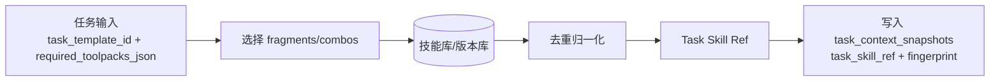
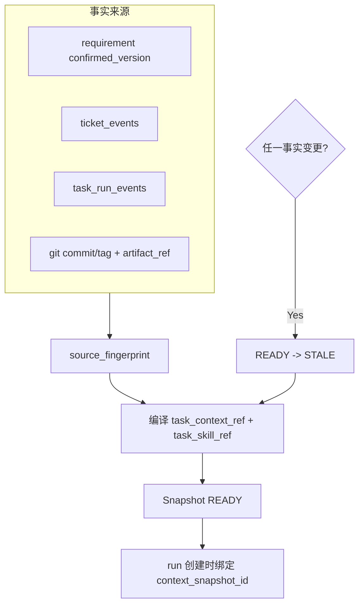

# AgentX - 上下文编译中心（Context Processor）（简历亮点 3）

> **简历原文**：上下文编译中心（Context Processor）：针对长会话 LLM “上下文遗忘与幻觉”痛点，自研上下文处理 Agent。以确认的需求文档与工单事件链作为事实来源，编译生成精简的 Context Pack 与 Task Skill，并以快照（Snapshot）形式强绑定到每次 run，杜绝 Agent 脑补背景与事实漂移。

这篇文档面试里建议抓住一句话：**RAG 解决“找得到”，上下文编译解决“只给唯一事实 + 版本一致 + 可审计可恢复”。**

> **建议更新版简历写法**：上下文编译中心（Context Processor）：以确认版需求、工单事件链、运行证据和 Git 基线为事实来源，编译 `task_context/task_skill` 快照并强绑定到每次 run；同时接入 LangChain4j 语义检索，为 worker 在执行前提供当前代码与历史阻塞点的精简上下文，降低长会话遗忘、重复提问与事实漂移。

## 当前真实实现补充（2026-03）

这篇文档现在需要和真实代码同步的重点，是上下文系统已经不只是“快照概念”，而是已经进入工程化 v1。

当前代码里已经落地的关键点：
1. `ContextCompileService` 会真实编译 `task_context_pack`、`task_skill`，落 artifact，并驱动 `task_context_snapshots` 的 `PENDING -> COMPILING -> READY / FAILED / STALE`。
2. 仓库上下文检索已经接入 `RepoContextQueryPort + WorkspaceRepoContextQueryAdapter`，当前采用 **LangChain4j 语义检索优先 + lexical fallback**：
   - 在发任务前，由 `ContextCompileService` 先为会话仓库构建 Repo Context
   - 对候选文本文件做 chunking 和 embedding，优先返回 semantic relevant files + excerpts
   - 若 embedding 配置缺失、检索失败或未命中，再自动退回 lexical scoring
   - 全过程受文件数、excerpt 数、单文件字符数、总字符数预算限制
   - 检索范围优先锁定在 `sessions/<sessionId>/repo/`，避免把控制面仓库噪声带给 worker
3. worker 侧已经不是只拿 refs：
   - `TaskPackage` 新增 `task_context_ref`
   - worker prompt 会读取 compact 的 `task_context_pack`
   - 执行器还会额外构建 `task_evidence_snapshot`，压缩已确认澄清、决策与最近失败证据
   - 执行器还会构建 `workspace_snapshot`，并优先复用统一 Repo Context 检索结果来表达当前 worktree 现实
4. architect 侧也已经开始吃结构化上下文：
   - `ArchitectTicketAutoProcessorService` 会把 `role_context_pack` 注入 ticket proposal payload，减少架构师 prompt 漂移。
5. 因此，当前更准确的实现表述是：
   - **结构化事实层 + LangChain4j 语义检索 + lexical 兜底 + 快照门禁 + worker 执行事实摘要**

需要诚实说明的边界：
1. 当前已经有真实的 **embedding indexing + RAG 检索**，但仍然是进程内索引，还不是外部持久化向量库。
2. LangChain4j 在这里承担的是“repo semantic retrieval 工具层”，不是控制面本身；事实裁决、快照状态机、run 门禁仍由 AgentX 自己掌控。
3. 当前还没做完的重点不再是“让 worker 也接入统一检索”，因为这一步已经完成；真正的后续重点是 `.agentx` 运行证据的独立 semantic index、持久化索引和多源分层预算。

## Worker 真正拿到什么（建议这样解释，不要背字段名）

如果面试官追问“你们到底把什么上下文发给 worker”，建议不要回答成一串 JSON 字段，而是按下面这套工程语言来讲：

1. worker 先拿到的是**任务边界**，也就是这次到底是在做实现、验证还是修 bug，它允许动哪些目录、预期交付什么结果、什么情况下必须停下来提请，而不是自己扩 scope。
2. 接着它拿到的是**当前唯一生效的需求基线**。这里给的不是整段聊天，而是已经确认过的需求版本、和这个任务直接相关的模块边界、以及当前代码应该对齐到哪个 Git 基线。
3. 然后它会拿到**已经解决过的问题**。也就是前面用户已经回答过的澄清、已经做过的架构取舍、已经被接受的决策结论，这样 worker 就不会在下一轮又把同一个问题重新问一遍。
4. 再往下是一层**最近运行证据**。如果上一次 VERIFY 已经告诉你测试为什么失败、上一次实现 run 已经写明阻塞点是什么、甚至已经产生过 delivery commit，这些信息会先被压缩成执行事实摘要，让 worker 优先修最新、最确定的 blocker。
5. 在代码现实这一层，worker 不是盲读整个仓库，而是拿到一份**当前 worktree 的精简快照**：哪些文件最相关、哪些代码片段最值得先看。现在这份快照优先来自 LangChain4j 语义检索，检索失败时再退回 lexical 召回。
6. 最后它还会拿到**怎么工作的项目内指导**。这不是业务事实，而是结合任务模板、工具包和工程约束生成的 task skill，例如推荐命令、常见坑、验证方式、停止规则。

一句话概括就是：**worker 拿到的不是“历史聊天”，而是“可执行任务边界 + 当前唯一有效事实 + 最近失败证据 + 当前代码现实 + 本任务做法指导”这五层上下文。**

## 对齐项目原始设计的关键约束（建议先说清楚，显得你不是“编故事”）

1. **事实来源（Fact Source）写死**：确认版需求、`tickets + ticket_events`、`task_run_events`、Git commit/tag；聊天记录不是事实来源。
2. **上下文必须快照化**：`task_context_snapshots` 负责编译进度与新鲜度，状态最小集：`PENDING | COMPILING | READY | FAILED | STALE`。
3. **run 必须绑定最新 READY 快照**：创建/恢复 run 时若快照不是 `READY` 或已 `STALE`，必须拒绝（否则就是“带病下发”）。
4. **`task_context` 与 `task_skill` 必须分离**：
   - `task_context` = 事实与引用（refs）
   - `task_skill` = 针对本任务“怎么做”的可执行指导（可复用、可去重、可版本化）
5. **Context Processor 不做业务决策**：检测到冲突/缺口只能输出 `NEED_DECISION/NEED_CLARIFICATION`，把取舍交给决策面（Ticket）。

---

## 1. 上下文治理哲学与事实源（Q1–Q5）

### Q1. 为什么在 Agent 系统中必须要有专门的“上下文处理 Agent”？
- **背景**：
  - 长生命周期项目会话里混杂：过时讨论、误解、临时结论、未确认草稿；把全部聊天塞给 Worker 会导致 token 爆炸 + 事实漂移。
  - 多 Agent 并发时，如果每个 Agent “各看各的历史”，最终一定会出现上下文分叉。
- **解决方案**：
  - 采用“编译器式”角色：Context Processor 只负责**提取/归并/去重/引用**，不参与实现与决策。
  - 产物快照化：把“当前可执行事实 + 任务技能”编译为 `task_context_snapshots`，作为下发 run 的唯一输入来源。
- **效果**：
  - **读写分离**：Worker 专注执行；Context Processor 专注治理事实。
  - **一致性**：同一任务的不同 Worker/不同重试 run 看见的事实是同一份快照，不靠聊天记忆。
- **追问（面试官可能继续问）**：
  - 如果上下文编译出错（FAILED），系统是停工还是降级？
    - 简答：对“这个 task”的 run 创建是硬阻断（没有 `READY` 快照就不下发，避免带病执行）；但对“整个系统”不必停工——依赖 DAG 允许其它无关任务继续跑。FAILED 若是暂态（LLM/IO）就重试编译；若是缺口/冲突就转 `CLARIFICATION/DECISION` 工单，补齐后再编译出新的 `READY`。
  - 你如何证明 Worker 没有“绕过上下文快照”去自行读聊天？
    - 简答：从能力上拿掉“读聊天”的通道：Worker 任务包只下发快照 refs（不下发历史聊天），Worker runtime 也不提供“聊天历史 API/存储”作为工具；再用审计/门禁兜底：工作报告与改动必须能引用到 `req/ticket/run/git` 等 ref，没有依据的改动会触发 `NEED_*` 或被门禁拒绝。

### Q2. “事实来源（Fact Source）”包含哪些内容？
- **背景**：
  - LLM 的输出不可当作事实；系统必须有可追溯、可回放的事实账本。
- **解决方案**：
  - 事实来源限定为四类：
    1. **需求基线**：`requirement_docs.confirmed_version` 对应的确认版需求文档；
    2. **决策链**：`tickets + ticket_events`（用户响应与架构取舍）；
    3. **运行证据**：`task_run_events`（尤其 `RUN_FINISHED.data_json`）+ `ARTIFACT_LINKED` 引用；
    4. **代码事实**：Git commit/tag（`base_commit/delivery_commit/merge_candidate_commit` 等）。
- **效果**：
  - **SSOT（单一事实来源）**：任何关键结论都能指向来源（ref），可审计、可回放。

### Q3. 为什么不直接用向量检索（RAG）全量检索，而要“上下文编译”？
- **背景**：
  - 软件工程的关键风险不是“找不到”，而是“找到了两份互相矛盾的东西并且不知道该信谁”。
  - 需求版本、决策变更、验证结论这些都强依赖时间/版本；纯语义相似度不等于“当前有效”。
- **解决方案**：
  - 上下文编译不是“检索”，而是**版本化裁决**：
    - 以 `confirmed_version + ticket_events + run_events` 为权威输入；
    - 生成 `source_fingerprint`，一旦任何输入变更就让旧快照进入 `STALE`；
    - 输出的 Context Pack 是“可执行的唯一事实集合”，而不是若干相似片段。
- **效果**：
  - **杜绝矛盾事实同时入窗**：Worker 不会在 prompt 里看到两份互斥要求，从源头减少幻觉。
- **追问（面试官可能继续问）**：
  - RAG 还能用吗？在你这套架构里它应该放在哪一层？
    - 简答：能用，但只能当“候选 ref 召回器”，不当事实裁判：RAG 放在 Context Processor 的编译阶段用于检索可能相关的证据片段/文件 refs；最终仍由“确认版版本 + 事件链 + 指纹”裁决出唯一输入，并固化成 `task_context_snapshots`。
  - `source_fingerprint` 具体怎么算？哪些输入会纳入指纹？
    - 简答：把“会影响执行事实/做法”的输入 refs 做规范化后排序聚合 hash：确认需求（`doc_id+confirmed_version`）、相关 `ticket_events` 的最新序列标识、关键 `RUN_FINISHED` 事件标识、以及引用的 `git:<commit>:<path>` 等 artifact refs；任何一项变化都会导致指纹变化并触发旧快照 `READY -> STALE`。

### Q4. 既然不依赖聊天记录，如何保留 Agent 之间的协作过程？
- **背景**：
  - “协作过程”如果只存在聊天里，就不可审计、不可复盘，也无法稳定传递给下一次 run。
- **解决方案**：
  - 把协作对象化为可持久化对象：
    - 取舍与补信息 → Ticket + Ticket Events；
    - 执行结果 → Run Events（`RUN_FINISHED`）+ Artifact Refs；
    - 架构关键结论 → ADR/规格文件（作为 artifact_ref）。
- **效果**：
  - **流数据 → 存量证据**：协作过程可复用、可检索、可回放，不丢失关键结论。

### Q5. 什么是“上下文漂移”？AgentX 如何解决？
- **背景**：
  - 多 Agent、多 run 的系统里，最常见失败模式是“每个人都觉得自己理解对了，但彼此不一致”。
- **解决方案**：
  - 强制快照绑定：
    - 每次 run 创建时必须绑定一个 `status=READY` 的 `context_snapshot_id`（审计锚点）。
    - 当事实源发生变化（需求确认/工单完成/run 完成等），触发生成新快照，并把旧快照标为 `STALE`。
    - `STALE` 快照不能用于新 run；需要重新编译出新的 `READY`。
- **效果**：
  - **把漂移变成显式失败**：宁可阻断下发，也不允许“拿旧事实继续跑”。
- **追问（面试官可能继续问）**：
  - 用户回复后是“恢复同一个 run”还是“新建 run”？你怎么决定？
    - 简答：看“事实指纹是否变化”：如果用户回复只是补充不改变快照指纹（且 run 未被回收），可以 `WAITING_FOREMAN -> RUNNING` 恢复同一个 run；如果回复引入新事实导致旧快照变 `STALE`，必须新编译出 `READY` 并创建新 run（新 `run_id` + 新 `context_snapshot_id`），保证审计一致与可回放。
  - 如何保证在高并发下不出现“旧快照被错误绑定”的竞态？
    - 简答：把“选择快照 + 创建 run”放进同一事务做原子校验：run 创建时必须校验快照 `status=READY` 且未 `STALE`（schema guard）；若发现更“新”的 READY 指纹或当前快照已过期，直接拒绝创建并触发重新编译。简单说：宁可失败重试，也不允许绑定不合法快照。

---

## 2. Context Pack 与 Task Skill 的组装逻辑（Q6–Q10）

### Q6. Context Pack 和 Task Skill 有什么区别？
- **背景**：
  - 把事实（是什么）和方法（怎么做）混在一起，会导致不可复用、不可审计、也很难治理 token。
- **解决方案**：
  - 明确拆分：
    - **Context Pack**：回答“现状/约束/引用是什么”（refs 为主）。
    - **Task Skill**：回答“在本项目里这类任务怎么做”（组合技能碎片生成，可去重归一化）。
- **效果**：
  - **复用性**：同一个技术栈的做法片段可以跨任务复用。
  - **可控性**：事实变化只影响 Context Pack；方法变化只影响 Skill 片段版本。

### Q7. 面对 10 万行代码库，Context Pack 如何做到“精简但够用”？
- **背景**：
  - 把全量代码塞进 prompt 不现实；即使能塞也会让模型在噪声里迷路。
- **解决方案**：
  - 引用（Ref）优先、内容按需拉取：
    - Context Pack 只下发“看哪里”的 refs（例如 `git:<commit>:<path>`、`req:<doc>@vN`、`ticket:<id>`）。
    - Worker 通过受控工具按 ref 拉取必要片段（而不是自由检索整仓库）。
  - 分层裁剪：按 `run_kind` 裁剪（VERIFY 更偏向命令与验证证据，IMPL 更偏向实现约束与接口契约）。
- **效果**：
  - **token 成本可控**：上下文窗口始终是“短、硬、可追溯”。
  - **减少误读**：Worker 不会因为看到无关代码片段而做错误联想。
- **追问（面试官可能继续问）**：
  - ref 的格式如何统一？如何避免 ref 指向的文件在后续变更后语义漂移？
    - 简答：统一用“带不可变版本锚点”的 ref：例如 `git:<commit>:<path>`、`req:<doc>@vN`、`ticket:<id>`、`run:<id>`。因为 ref 绑定 commit/version，所以即使文件后续变了，ref 仍指向旧版本内容，不会漂移；需要定位局部片段时也优先“commit+path+语义锚点”，而不是只靠行号。

### Q8. “技能碎片（Skill Fragment）”如何动态拼接成 Task Skill？
- **背景**：
  - 不同任务、不同模板、不同工具包组合会导致“怎么做”的细节不同；全靠人写 prompt 不可持续。
- **解决方案**：
  - 以三类输入驱动拼接：
    1. `task_template_id`（任务交付/停机/证据规则）
    2. `required_toolpacks_json`（能做什么、用什么做）
    3. 项目级约束（来自确认需求/ADR/决策事件链）
  - 组合过程：
    - 先选取匹配的原子 fragment；
    - 再做去重归一化（可由 LLM 辅助，但必须通过 schema/规则校验）；
    - 产物记录来源（fragment id/version）以便审计。
- **效果**：
  - **做法一致**：同类任务输出的执行指导风格一致、命令一致、证据一致。

### Q9. 两个技能片段冲突（A 要求命名规范 1，B 要求规范 2）怎么办？
- **背景**：
  - 冲突不是“模型能选一个就完了”，冲突本质是“系统规范未对齐”，必须显式化。
- **解决方案**：
  - Context Processor 只做检测不做裁决：
    - 发现冲突 → 编译失败（`task_context_snapshots.status=FAILED`）并输出 `NEED_DECISION/NEED_CLARIFICATION`。
    - 通过 Ticket 让人类决定“以哪个规范为准”，决策落事件链后再重新编译得到 `READY`。
- **效果**：
  - **避免隐式漂移**：不会出现某次 run 选 A、下次 run 选 B 的随机行为。
- **追问（面试官可能继续问）**：
  - 你怎么做“冲突检测”？靠 schema 还是靠规则集？
    - 简答：两层叠加：schema 校验解决“形状正确”（字段齐不齐、类型对不对）；规则集解决“语义不矛盾”（同一约束是否出现互斥值、toolpack/模板约束是否冲突、引用是否指向同一 confirmed_version 等）。发现语义冲突就让快照 FAILED 并转 Ticket，让人类裁决。

### Q10. 什么是“组合切片（Combo）”，为什么需要？
- **背景**：
  - 某些常见组合（如 Java21 + Spring Boot + MyBatis）有“组合后特有坑位”，只拼原子片段容易漏。
- **解决方案**：
  - 对高频技术栈组合沉淀 combo fragment（仍然是“经验片段”，不改变事实语义）：
    - 命中组合时优先用 combo，再用原子片段补齐缺口。
  - combo 也需要版本化与来源记录，避免变成“黑盒经验”。
- **效果**：
  - **编译效率更高**：生成 Task Skill 更稳定、更贴近真实工程实践。

---

## 3. 杜绝幻觉与长会话优化（Q11–Q15）

### Q11. 如何在架构上“杜绝 Agent 脑补背景”？
- **背景**：
  - 脑补通常发生在：缺字段、缺约束、缺依赖时，模型用默认值补齐。
- **解决方案**：
  - “事实边界 + 停止规则”双保险：
    - Context Pack 明确声明“除 refs 外无其它事实”；
    - Task Skill 必须包含 stop rules：遇到缺口/冲突必须发 `NEED_*`，禁止继续推进；
    - run 侧用 `WAITING_FOREMAN` 作为硬阻断状态。
- **效果**：
  - **从流程上禁止脑补**：系统不允许靠“说服自己”继续跑下去。

### Q12. 长会话导致 LLM “遗忘细节”怎么处理？
- **背景**：
  - 遗忘不是模型坏，而是“把聊天当记忆”的方式本来就不可控。
- **解决方案**：
  - 采用“短会话、多 run”：
    - 每个 run 只拿到当前任务最小必要的 Context Pack；
    - 历史细节以 refs + 事件链形式存在，需要时按 ref 精确拉取。
- **效果**：
  - **稳定窗口**：不依赖模型把几十轮聊天记住。

### Q13. LangChain4j 在这套上下文里扮演什么角色？
- **背景**：
  - 上下文编译需要结构化输出、工具调用、可切换模型供应商等工程能力。
- **解决方案**：
  - 把 LangChain4j（或同类框架）定位为“工具箱”，而不是控制面：
    - 结构化输出：保证编译产物可被 schema 校验；
    - 工具调用：按 refs 拉取内容、写入产物引用；
    - 统一 LLM 接入：便于切换与 AB。
- **效果**：
  - **降低实现成本**：把“怎么调用模型”标准化，核心语义仍由控制面规则决定。
- **追问（面试官可能继续问）**：
  - 你怎么防止框架把行为做成黑盒（比如自动记忆/自动检索）导致事实边界被破坏？
    - 简答：把框架当“显式工具调用库”而不是自治 Agent：禁用/不使用自动记忆，把所有检索都显式产出为 refs 并写入快照；同时限制 Context Processor 可用的工具集合（allowlist），并把“输入源清单/输出 ref 清单/指纹”落库可审计，这样即使底层用了检索能力，也不会绕过事实边界。

### Q14. 为什么说上下文处理器不负责“业务决策”？
- **背景**：
  - 如果上下文处理器能做取舍，它就会变成新的“黑盒权力中心”，风险更大。
- **解决方案**：
  - 定义边界：只允许非损压缩、归并、引用、格式对齐；不允许引入新事实、不允许替人类做取舍。
  - 冲突/缺口永远转成 Ticket（DECISION/CLARIFICATION）。
- **效果**：
  - **责任链清晰**：决策责任在人类，执行责任在 Worker，编译责任在 Context Processor。

### Q15. 如何判定一份上下文包是否“足够好”？
- **背景**：
  - 上下文不“够用”时，Worker 要么停，要么脑补；两者都影响效率。
- **解决方案**：
  - 预检（Pre-run Verification）：
    - refs 齐全（确认需求/相关 ticket/run/artifact refs）；
    - stop rules 完整；
    - 与 `required_toolpacks_json`、`run_kind` 的权限约束一致（VERIFY 必须只读，包含 verify_commands）。
  - 通过后快照进入 `READY`，否则 `FAILED` 并产生提请。
- **效果**：
  - **把质量门槛前移**：不让“半成品上下文”进入执行层污染代码库。

---

## 4. 状态流转与可观测性（Q16–Q20）

### Q16. 解释上下文快照的状态机：`PENDING -> COMPILING -> READY`（以及 FAILED/STALE）
- **背景**：
  - 快照不是一次性文本，而是可观测的编译产物；必须能看到“在排队/在编译/可用/失败/过期”。
- **解决方案**：
  - 最小状态机：
    - `PENDING`：触发了编译请求（例如 `TICKET_DONE`、`REQUIREMENT_CONFIRMED`），等待处理；
    - `COMPILING`：Context Processor 正在编译（可能调用 LLM/工具）；
    - `READY`：产物已落地（ref 可用）并通过校验，可绑定到 run；
    - `FAILED`：编译失败（冲突/缺失/格式不合规），必须阻断 run 创建；
    - `STALE`：事实源变更导致过期，不可用于新 run。
- **效果**：
  - **可观测可治理**：快照问题不会隐藏在 prompt 里，而是显式状态。

### Q17. 如果快照编译失败（FAILED）会导致什么后果？
- **背景**：
  - “带错的上下文继续跑”比停下来更危险。
- **解决方案**：
  - 运行层硬门禁：run 创建必须校验 `context_snapshot_id` 指向 `READY`。
  - FAILED 时：
    - 任务不会进入可分配（或分配动作被拒绝）；
    - 系统发起 `CLARIFICATION/DECISION` 修复缺口或冲突。
- **效果**：
  - **宁可慢，不可错**：避免错上下文导致大范围返工。

### Q18. “事实指纹（source_fingerprint）”怎么生成？
- **背景**：
  - 需要一个确定方式判定“快照是否还是最新事实”，不能靠时间戳猜。
- **解决方案**：
  - 指纹对输入 refs 做聚合 hash（语义上）：
    - 需求文档：`doc_id + confirmed_version`
    - 工单事件：关键 `ticket_id` + 最新 event_id（或 event 序列 hash）
    - 运行证据：相关 `run_id` 的 `RUN_FINISHED` 事件标识
    - 关键 artifact refs（`git:<commit>:<path>`）
- **效果**：
  - **毫秒级判定过期**：任何输入变更都能触发 `READY -> STALE`。

### Q19. 用户中途修改需求文档，系统如何链式反应？
- **背景**：
  - 需求变了但执行还在跑，是“必然出事故”的组合。
- **解决方案**：
  - 需求确认版本变化触发事件：
    - 标记相关快照为 `STALE`；
    - 触发重新编译生成新的 `READY`；
    - 运行恢复策略：若事实指纹变化，不能恢复旧 run，必须新建 run 绑定新快照（保证审计一致）。
- **效果**：
  - **强制对齐**：系统不会让 Agent 在旧需求上继续写代码。

### Q20. 这套架构如何支持多语言（Java/Python/Go）扩展？
- **背景**：
  - 如果每扩一种语言都要改编排代码，系统会很快失控。
- **解决方案**：
  - 通过“工具包 + 技能碎片”扩展：
    - 新语言增加 toolpack（能力边界）；
    - 增加对应 fragment/combo（做法沉淀）；
    - 上下文编译与 run 生命周期不变。
- **效果**：
  - **扩展成本低**：新增语言主要是内容/配置，不是改控制面逻辑。

---

## 5. 组装流程示意图（Q21–Q22）

### Q21. Task Skill 的组装逻辑图

### Q22. Context Pack 如何实现 SSOT（单一事实来源）

