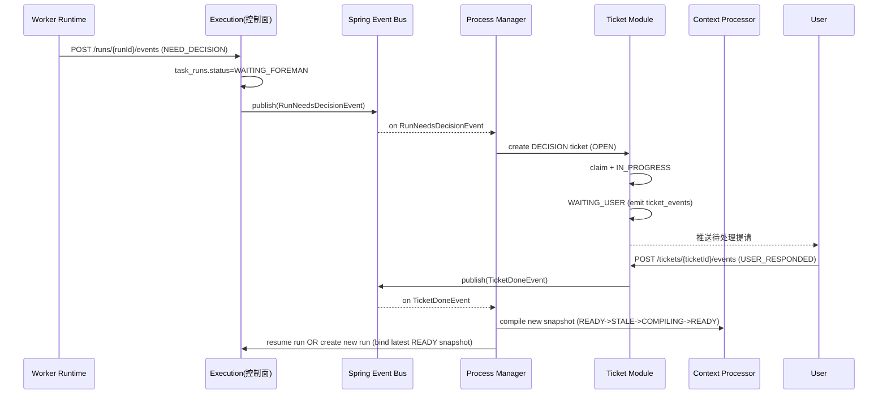
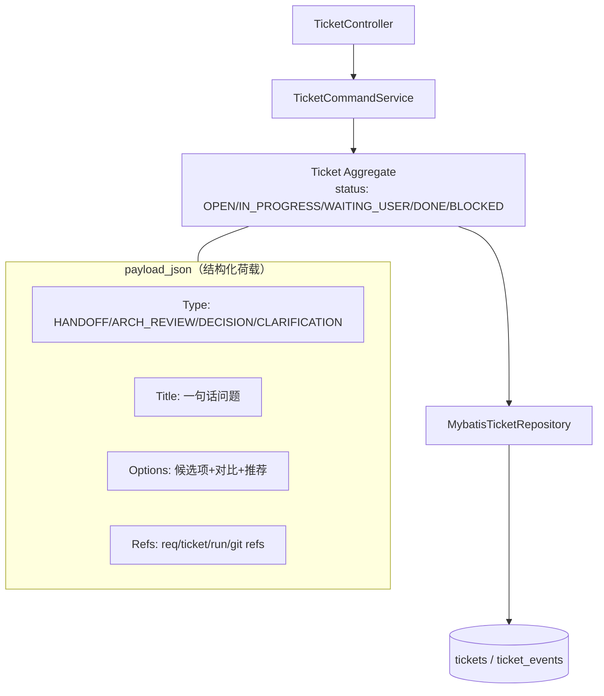

# AgentX - 决策面工单化 HITL 机制（简历亮点 4）

> **简历原文**：决策面（Decision Surface）工单化的 Human-in-the-loop 机制：当自动规划/执行遇到关键信息缺失或存在技术取舍时，Agent 不会“脑补推进”，而是生成结构化工单等待用户异步确认；用户反馈写入事件链作为事实回写，保证全过程可追溯、可审计。

这篇文档在面试里主要回答一个问题：**当 LLM 在边界处不确定时，系统怎么“把猜测变成流程”，并且做到可恢复、可审计、可交付**。

## 当前真实实现补充（2026-03）

这篇文档对应的主链路现在已经在代码里闭环，不是只停留在“理论上的 HITL”。

当前真实实现里，关键闭环包括：
1. `RunNeedsInputProcessManager` 会把执行层发出的 `NEED_DECISION / NEED_CLARIFICATION` 转成 ticket。
2. 同类 run-level 工单会做去重与 supersede：
   - 同 task、同类型、旧 run 的票会被标记为 superseded
   - 同 run 的重复提请会被合并，避免一轮错误触发多张重复工单
3. 对“planner 连续两次没有产生真实 edits”的情况，系统已经有动态保护：
   - 把该类 CLARIFICATION 标记为 planner no-op guard
   - 超过阈值后自动升级为 `ARCH_REVIEW`
   - 进入重新梳理已完成/未完成任务和重新拆解的链路
4. `ContextRefreshProcessManager` 在 `USER_RESPONDED` 后会：
   - 触发相关 task 的上下文重编译
   - 让旧 waiting run 失效
   - 关闭旧 need-input ticket
   - 让后续重新 dispatch 绑定新的 READY 快照

所以面试里可以非常明确地说：
1. HITL 不是“聊天框提问”，而是结构化 ticket + append-only event chain。
2. 用户回应不会直接让旧 run 盲目恢复，而是优先保证上下文刷新和审计一致性。
3. 系统已经开始处理“任务过宽 / 反复空转”这类真实工程问题，而不只是处理字段缺失这种简单澄清。

## 对齐项目原始设计的关键约束（建议在回答里顺口带出）

1. **外部输入只走决策面**：用户不直接改数据库/不直接干预 Worker 运行态；所有反馈通过 API 写入 `ticket_events` 形成审计链（append-only）。
2. **“等待用户”只属于 Ticket**：`tickets.status=WAITING_USER`；执行层等待属于 `task_runs.status=WAITING_FOREMAN`，`work_tasks` 不新增 “WAITING_USER” 状态。
3. **工单类型固定最小集**：`HANDOFF | ARCH_REVIEW | DECISION | CLARIFICATION`（避免状态爆炸）。
4. **决策回写必须影响后续执行事实**：Ticket 完成后会触发上下文刷新（`task_context_snapshots` 走 `READY -> STALE -> COMPILING -> READY`），新 run 必须绑定最新 `READY` 快照（审计锚点）。

---

## 1. 决策面设计初衷与人机协同（Q1–Q5）

### Q1. 为什么在 Agent 系统里要引入“决策面（Decision Surface）”？
- **背景**：
  - LLM 在信息缺口/取舍点上天然会“补齐一个合理故事”，工程上等价于把风险偷偷写进代码。
  - 研发交付里，很多节点不是“技术怎么做”，而是“价值/范围/风险怎么选”——这类问题必须由人类负责。
- **解决方案**：
  - 把所有“必须由人类确认的节点”收敛成一个统一入口：Decision Surface（落地为 `ticket` 模块）。
  - 执行层只允许抛出结构化的 `NEED_DECISION/NEED_CLARIFICATION` 事件，并把 run 切到 `WAITING_FOREMAN` 等待。
  - 人类反馈通过 `ticket_events` 回写，成为下一轮上下文编译/后续 run 的事实来源。
- **效果**：
  - **控制权清晰**：人类控方向和风险；Agent 只做“执行与产出”。
  - **可恢复**：卡点可暂停、可回放，不靠聊天记忆续命。
  - **可审计**：每次关键取舍都有事件链记录，后续复盘能定位“为什么这么做”。
- **追问（面试官可能继续问）**：
  - 你怎么定义“必须提请”的边界？哪些是 DECISION，哪些是 CLARIFICATION？
    - 简答：CLARIFICATION 是“缺事实”（字段/验收/约束未给，补齐后就能唯一推进）；DECISION 是“有多方案且涉及取舍/授权”（一致性 vs 性能、是否引入中间件、是否扩大 write_scope 等），必须由人类确认风险与方向。简单说：补信息用澄清，做选择用决策。
  - 如果人一直不回复，系统怎么避免一直挂着？会不会把队列堵死？
    - 简答：卡点只会挂在该 ticket（`WAITING_USER`）与对应 run（`WAITING_FOREMAN`），不会把其它无依赖任务堵死；并且可以配置超时/提醒/升级策略：长期不回复就把 ticket 标记为 `BLOCKED`（或触发人工介入），必要时取消该 run 并把 task 回收到可重新调度状态，确保系统吞吐不被单点输入拖死。
  - 你怎么证明“没有决策就不会继续推进”？靠约定还是硬门禁？
    - 简答：靠硬门禁：run 触发 `NEED_*` 后必须停在 `WAITING_FOREMAN`；只有 ticket 完成并触发上下文快照重新编译得到 `READY`，控制面才允许恢复/新建 run（run 创建也会校验 snapshot=READY）。没有这些前置，系统不会下发执行，也不会让任务进入 `DONE`。

### Q2. 为什么选择“工单化”而不是简单的在线 Chat 提问？
- **背景**：
  - Chat 是非结构化流数据：不好排队、不好分配、不好复盘；更难把“输入”固化成事实。
  - 多 Agent 并发时，如果靠聊天提问，容易出现“重复问、抢答、漏答、答复丢失”。
- **解决方案**：
  - 用工单（Ticket）把协作变成“通信契约”：有 `type/status/payload_json`，并且所有关键变化必须落 `ticket_events`。
  - 引入 `claimed_by + lease_until`，让同一张工单在一个时间窗内只有一个处理主体（避免并发处理竞态）。
  - 对用户侧提供统一的 inbox：`GET /api/v0/sessions/{sessionId}/tickets?status=WAITING_USER` 拉取待处理提请。
- **效果**：
  - **并发可控**：不会出现多个 Agent 同时处理同一问题。
  - **审计友好**：事件链天然可回放，后续可用于复盘/合规/训练数据。
  - **工程化自动化**：能做超时策略、批处理、路由到不同角色（架构师/需求/用户）。
- **追问（面试官可能继续问）**：
  - `payload_json` 和 `ticket_events` 怎么分工？为什么两者都需要？
    - 简答：`payload_json` 是“当前版本的工单内容”（给 UI 展示/给处理者工作用，允许在 `IN_PROGRESS` 期间补充选项）；`ticket_events` 是“不可变审计链”（记录每次关键变更与原因）。项目约束是：`payload_json` 不是审计链，任何重要改动必须追加到 `ticket_events`，两者配合才能同时做到“好用 + 可回放”。
  - 工单怎么和 run/commit 关联起来，避免“决策和代码脱节”？
    - 简答：用统一 ref 串起来：ticket payload/event 里带 `session_id`，并可引用 `task_id/run_id`；产物层用 `ARTIFACT_LINKED` 把 `git:<commit>:<path>` 等证据挂到 `ticket_events` 或 `task_run_events`。这样能从 commit 追到 run，再追到相关 ticket（以及用户当时的选择），形成闭环链路。

### Q3. 如何理解“不阻塞开发进度”的异步确认机制？
- **背景**：
  - 工程里很多工作可以并行：一个模块卡住不代表全局都要停。
  - 但如果没有明确的依赖边界，异步确认会变成“到处等人”。
- **解决方案**：
  - 用 `work_modules + work_tasks + work_task_dependencies(DAG)` 把任务依赖显式化。
  - 卡点发生时，**阻塞的是 run**：`task_runs.status=WAITING_FOREMAN`；任务仍可保持 `ASSIGNED`（active run 不可继续推进）。
  - 调度器只会阻塞依赖链上的下游任务；无依赖的其它模块任务仍可进入 `READY_FOR_ASSIGN` 并被 Worker 继续执行。
- **效果**：
  - **局部挂起，全局并行**：吞吐量不被单点决策拖死。
  - **依赖透明**：面试时可以一句话讲清“为什么不乱套”：因为 DAG 明确了谁等谁。

### Q4. 决策面在架构图中处于什么位置？
- **背景**：
  - 任何“人类输入”都是高风险入口：绕过控制面会破坏审计与一致性。
- **解决方案**：
  - Decision Surface 落在控制面后端的 `ticket` 模块，并通过 API 统一接收用户输入。
  - 执行层（Worker）只写 `task_run_events`，不直连用户；跨模块流转由 `process`（流程编排）监听事件后调用各模块 `application.port.in` 完成。
- **效果**：
  - **入口单一**：外部输入不可能“偷偷改状态”。
  - **模块边界清晰**：ticket 不改 planning/execution 的表；process 负责跨模块编排。

### Q5. HITL 在 AgentX 中是一直开启的吗？
- **背景**：
  - “全自动”在工程里最大的风险不是效率，而是**失控**（越权、漂移、不可审计）。
- **解决方案**：
  - HITL 作为底座能力始终存在：一旦触发 stop rules 或 `NEED_*`，run 必须停在 `WAITING_FOREMAN`。
  - 可以引入“自动通过策略”（Policy）做减负，但必须满足两个前提：
    1. 有明确的风险分级与白名单（哪些类型允许自动通过）；
    2. 自动通过也必须写入 `ticket_events`，让事实链闭环（不是静默跳过）。
- **效果**：
  - **安全默认**：宁可停下来问，也不让 Agent 猜。
  - **可渐进优化**：随着规则与 evidence 成熟，可以逐步降低人工干预频次，但不会丢审计。

---

## 2. 工单类型与处理流程（Q6–Q10）

### Q6. 系统里的主要工单类型（Ticket Type）有哪些？
- **背景**：
  - 工单类型太多会导致流程不可控；太少又无法表达协作语义。
- **解决方案**：
  - 只保留 v0 最小集合：
    - `HANDOFF`：需求/价值问题移交架构师（或阶段性交接）。
    - `ARCH_REVIEW`：需求确认版本变化后，触发架构评估与产物同步。
    - `DECISION`：需要用户做“取舍/确认”的选择题。
    - `CLARIFICATION`：缺少事实输入，需要用户补齐信息。
- **效果**：
  - **语义稳定**：面试时能讲清楚每种类型的触发条件，不会“票种爆炸”。

### Q7. “脑补推进”与“发起提请”的分界点在哪里？
- **背景**：
  - LLM 最常见的工程事故：在缺少事实时用默认值“合理推进”，短期看起来顺滑，长期埋坑。
- **解决方案**：
  - 用 Task Package 的 `stop_rules` + 上下文快照的“事实边界”做硬约束：
    - 缺事实（例如字段名/验收标准/技术栈版本未定）→ `NEED_CLARIFICATION`。
    - 有多方案且涉及取舍（例如一致性 vs 性能、是否引入中间件）→ `NEED_DECISION`。
  - run 一旦发出 `NEED_*` 事件：必须把 `task_runs.status` 切到 `WAITING_FOREMAN` 并停止执行。
- **效果**：
  - **把不确定性显式化**：系统不会“带病推进”。
  - **降低返工**：提前暴露取舍点，避免后面发现方向错了再重做。
- **追问（面试官可能继续问）**：
  - stop rules 是写死模板，还是能按任务动态生成？它怎么和 `task_template_id` 关联？
    - 简答：两者结合：`task_template_id` 提供“基础模板”（例如 VERIFY 必须只读、必须有 verify_commands；IMPL 遇到缺口必须提请），Context Processor 再按任务上下文/工具包/权限范围动态补充 stop rules（例如“扩大 write_scope 必须 DECISION”“缺字段名必须 CLARIFICATION”），最终随 Task Package/Task Skill 一起下发。
  - 如果 Agent 频繁提请导致效率下降，你怎么调参/治理？
    - 简答：治理思路是“减少无谓提请”，而不是放开脑补：1）把高频缺口前移成需求文档/模板必填字段；2）提升 Context Pack/Task Skill 质量（fragment/combo 更完整）；3）总工 triage 先内部闭环能闭的；4）对低风险、可逆的提请引入自动通过策略（仍写事件链、可回滚）。

### Q8. Ticket 的生命周期是怎样的？
- **背景**：
  - 没有清晰状态机的工单会变成聊天记录，无法形成“系统可恢复”的卡点。
- **解决方案**：
  - `tickets.status` 使用最小状态机：
    - `OPEN` → `IN_PROGRESS`：受理方（Agent 实例）claim，写入 `claimed_by/lease_until`。
    - `IN_PROGRESS` → `WAITING_USER`：需要用户输入时进入等待。
    - `WAITING_USER` → `IN_PROGRESS`：用户响应后继续处理（可续租）。
    - `IN_PROGRESS` → `DONE`：目标完成，输出已通过 `ticket_events` 链接/记录。
    - `*` → `BLOCKED`：长期无法推进或冲突不可解（“异常终态”）。
- **效果**：
  - **可排队、可恢复、可统计**：系统知道卡点在哪里、卡多久、谁负责。

### Q9. 什么是“工单租约（Lease）”？
- **背景**：
  - 多 Agent 并发时，同一张工单如果被重复处理，会产生互相冲突的结论与重复沟通。
- **解决方案**：
  - `claimed_by + lease_until` 把“处理权”变成有时效的锁：
    - lease 过期后允许被重新 claim（避免某个实例挂死导致永远卡住）。
    - 处理过程可续租（避免长处理被误回收）。
- **效果**：
  - **消除竞态**：同一时刻只有一个处理者对工单负责。
  - **防止永卡**：处理者失联不会把系统拖死。

### Q10. 这种模式如何“原子级”减少幻觉？
- **背景**：
  - 幻觉本质是“把未确认的假设当事实写入代码或状态机”。
- **解决方案**：
  - 把“事实”固化为三类可追溯锚点：
    1. `ticket_events`（人类确认/补充的信息）；
    2. `task_context_snapshots`（编译后的事实快照 + 指纹）；
    3. `task_run_events(RUN_FINISHED)`（工作报告与证据引用）。
  - 合并门禁（Merge Gate）要求：最终进入 `DONE` 之前，必须对 merge candidate 做只读 VERIFY（避免“验证过的不是最终合入的”）。
- **效果**：
  - **从流程上堵死脑补**：没有“事实锚点”的推进无法完成 `DONE`。

---

## 3. 追溯、审计与反馈链（Q11–Q15）

### Q11. 为什么强调用户反馈要“写入事件链”？
- **背景**：
  - 只改一行字段（例如把某个开关从 false 改 true）无法回答“为什么改、谁改、当时上下文是什么”。
- **解决方案**：
  - 任何状态变化与关键内容变化都追加到 `ticket_events`（而不是覆盖 `tickets.payload_json`）。
  - 事件链携带 `actor_role/body/data_json`，能还原当时的意图与输入。
  - Context Processor 在编译快照时只信任事件链与确认版文档/产物引用，不信任聊天记录。
- **效果**：
  - **可回放**：可以把某个决策点的来龙去脉重放出来。
  - **可对齐**：换一个 Agent 实例接手也不会丢关键事实。
- **追问（面试官可能继续问）**：
  - 事件链会不会无限长？怎么做保留/归档，不影响查询？
    - 简答：事件链 append-only 是设计目的，但不等于“永远热存全量正文”：查询侧用 `query` 读模型做摘要视图；存储侧对已完成 session 做归档/分区，把大体量正文用 artifact_ref 外置（repo 的 `.agentx/` 或冷存储），DB 保留关键元数据与索引即可，既能审计回放也不拖慢日常查询。
  - 如何保证事件幂等（重复提交 USER_RESPONDED 怎么办）？
    - 简答：用“状态条件 + 幂等键”双保险：只允许在 `WAITING_USER` 时接受一次有效响应并推进状态；重复提交要么被拒绝（409/已处理），要么记录为 COMMENT 但不重复应用决策。落库时可用 `event_id`/request_id 去重，确保业务推进只发生一次。

### Q12. 全过程“可追溯、可审计”对企业的实际价值是什么？
- **背景**：
  - 企业关心的不只是交付速度，还关心“责任链、合规、可回滚”。
- **解决方案**：
  - 用 `ticket_events + task_run_events + git commit/tag` 组成从“决策→执行→验证→合并”的证据链。
- **效果**：
  - **合规**：金融/医疗等强监管场景可以解释“为什么引入某个依赖、为什么改这个行为”。
  - **复盘**：出了问题能定位是需求缺口、决策错误还是执行缺陷。
  - **回滚**：因为所有关键节点都锚到 commit/tag，回退是确定动作。

### Q13. 如果用户在决策时给出了错误信息，系统怎么处理？
- **背景**：
  - HITL 的前提是“人类是最高事实来源”，但人也可能给错。
- **解决方案**：
  - 系统不“偷偷修正”用户输入，而是用确定性门禁暴露问题：
    - 上下文编译冲突 → `task_context_snapshots.status=FAILED`，并创建新的 `CLARIFICATION/DECISION` 让用户修正；
    - VERIFY 失败 → 走失败分流（基础设施重试 vs 业务失败回退），必要时再发起提请。
- **效果**：
  - **高质量失败**：错得可见、可解释、可修复，不会沉默污染主线。

### Q14. 基于事件链的反馈，能否用于 Agent 的微调（SFT）？
- **背景**：
  - 真实工程里最宝贵的数据是“纠偏数据”：Agent 的候选方案 vs 用户最终选择。
- **解决方案**：
  - 从 `DECISION/CLARIFICATION` 的事件对中抽取结构化样本（提请→响应→最终产物/验证结果）。
  - 训练目标不是让模型“更会写代码”，而是让它**更会在边界处停下来问对问题**。
- **效果**：
  - **越用越稳**：系统随着历史积累，提请质量提高、无效提请降低。

### Q15. 如何查阅一个项目的所有决策历史？
- **背景**：
  - 面试官常追问“你说可审计，那怎么查？”。
- **解决方案**：
  - 读模型（`query` 模块）提供 inbox/时间线视图，例如 `TicketInboxView`；
  - 或直接按 `ticket_id` 重放 `ticket_events`（按 `created_at,event_id` 排序）。
- **效果**：
  - **一键复盘**：能回答“为什么今天代码长这样”。

---

## 4. DDD 与决策面的深层关联（Q16–Q20）

### Q16. Ticket 模块如何与其他模块解耦？它知道任务的存在吗？
- **背景**：
  - 工单系统很容易演化成“万能胶水”，越写越像上帝模块。
- **解决方案**：
  - Ticket 只负责：工单实体状态机 + 事件链；不直接改 `planning/execution` 的表。
  - 跨模块动作由 `process`（流程编排）订阅事件并调用各模块 `application.port.in` 完成。
  - Ticket 与任务/需求只保持弱关联（例如 `session_id`、可选的 `requirement_doc_id + ver`）。
- **效果**：
  - **边界清晰**：Ticket 不会侵蚀业务域。
  - **可演进**：未来拆服务时，Ticket 可以独立而不打碎主链路。

### Q17. “移交（Handoff）”工单在多 Agent 协作中起什么作用？
- **背景**：
  - 多角色协作最怕“口头说我写完了”，但下游接手发现缺关键约束。
- **解决方案**：
  - 用 `HANDOFF` 把“上下文 + 责任”对象化：
    - 必含：需求确认版本引用、变更点、未决项、建议下一步。
    - 由接收方 claim 后进入 `IN_PROGRESS`，直到产物与事件链补齐才 `DONE`。
- **效果**：
  - **交接可控**：不会因为人/Agent 换班导致信息丢失。

### Q18. 工单太多，人类处理不过来，怎么减负？
- **背景**：
  - HITL 如果变成“人类给每个细节背锅”，系统就不可用。
- **解决方案**：
  - 强制“建议-确认”格式：提请必须包含候选项、对比、推荐默认、风险提示。
  - 先 triage 再升级：能内部闭环的由总工/架构师收口；只有需要用户输入才进入 `WAITING_USER`。
  - 允许策略化自动通过低风险项，但必须落事件链并可回滚。
- **效果**：
  - **把用户工作变成选择题**：决策成本降到最低。

### Q19. “审计锚点（Audit Anchor）”是什么？
- **背景**：
  - 你要能证明：某次代码变更是在“哪些事实”下产生的，否则审计就是摆设。
- **解决方案**：
  - 每个 `task_run` 强制绑定一个 `context_snapshot_id`（且该快照在启动时必须是 `READY`）。
  - 配合 `base_commit`（代码事实锚点）与 `ticket_events`（人类决策锚点），形成可回放的三元组。
- **效果**：
  - **可定位**：三天后发现 bug 也能还原当时的事实与决策。
- **追问（面试官可能继续问）**：
  - 为什么“上下文锚点”不是聊天历史？你怎么保证快照不漂移？
    - 简答：聊天是非结构化且可能自相矛盾，无法作为审计锚点；快照是结构化产物，绑定确认版版本与事件链 refs，并用 `source_fingerprint` 判定新鲜度。事实一变就 `READY -> STALE`，run 创建/恢复又强校验 snapshot=READY，从机制上保证“不会拿旧事实继续跑”。
  - 用户回应后是恢复同一个 run，还是新建 run？判定标准是什么？
    - 简答：看“事实是否变化 + run 是否仍有效”：如果用户回应不改变指纹且 run 未被回收，可把 run 从 `WAITING_FOREMAN` 恢复到 `RUNNING`；如果回应引入新事实导致旧快照 `STALE`，或 run 已过租约/被回收，则必须新编译快照并新建 run（新 `run_id` + 新 `context_snapshot_id`）以保证证据链清晰。

### Q20. 总结：决策面为 AgentX 带来的核心确定性是什么？
- **背景**：
  - 没有决策面，LLM 系统最终会变成“速度很快但不可控”的黑盒。
- **解决方案**：
  - 把取舍点与缺口点统一收敛到 Ticket，并以事件链/快照/门禁把推进硬约束住。
- **效果**：
  - **责任链确定**：谁拍板、谁输入、谁执行、谁验证一清二楚。
  - **交付确定**：`DELIVERED != DONE`，只有门禁与 VERIFY 通过才可进入主线。

---

## 5. 流程示意图（Q21–Q22）

### Q21. 画一个 NEED_DECISION/CLARIFICATION 到工单完成的事件流转图

### Q22. 描述工单结构在 DDD 中的分层映射

