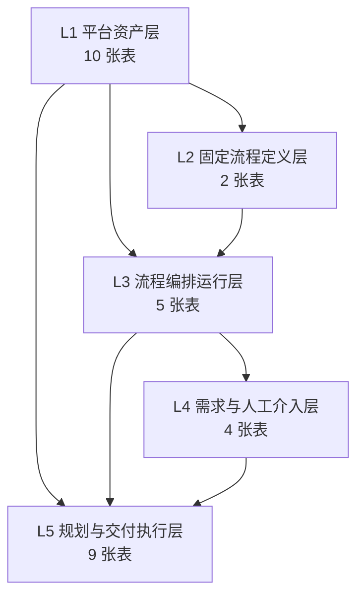
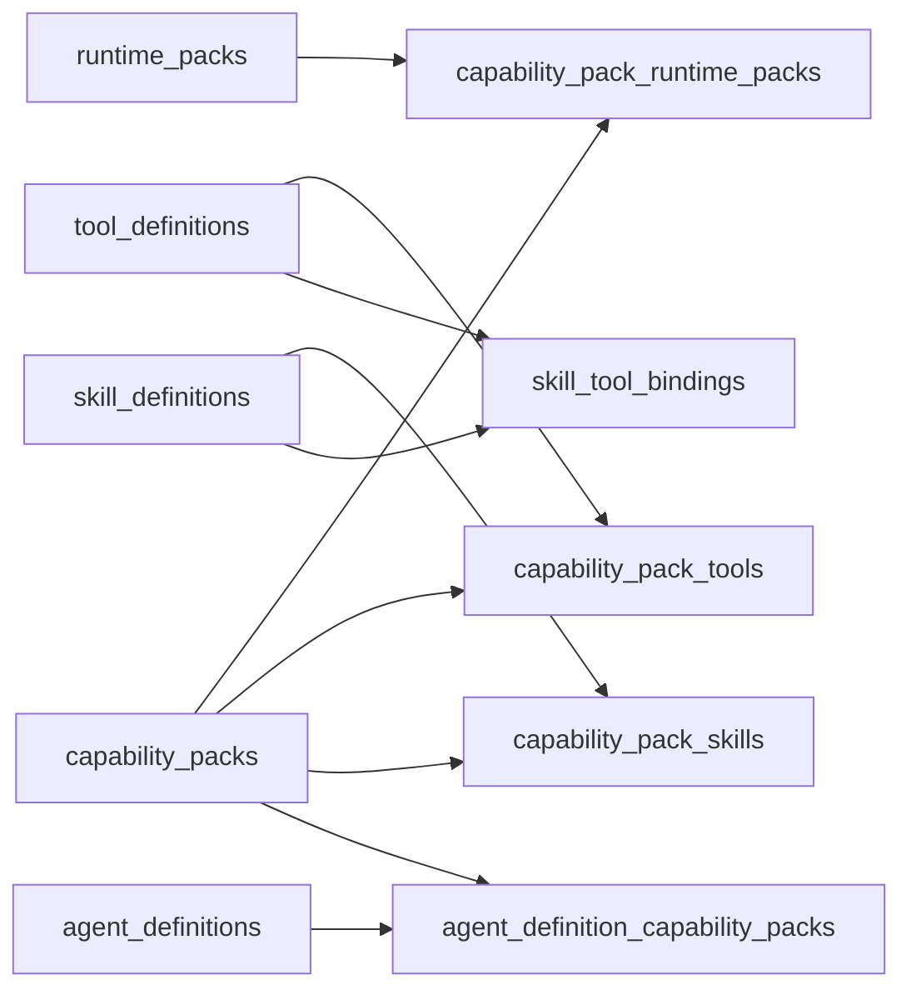
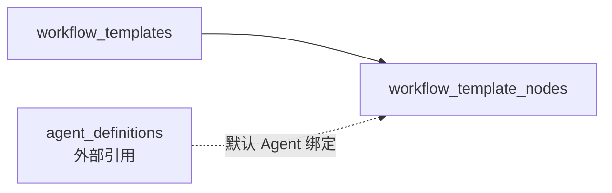
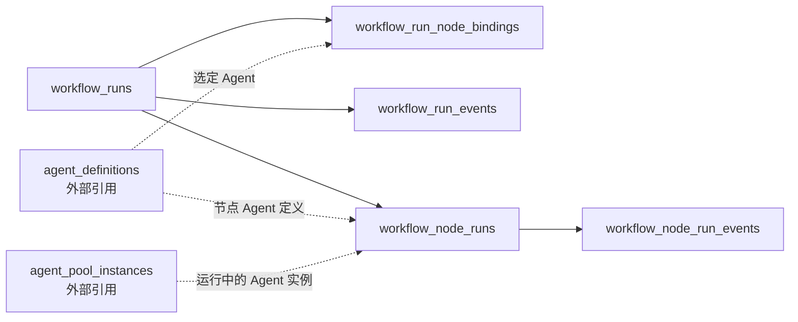
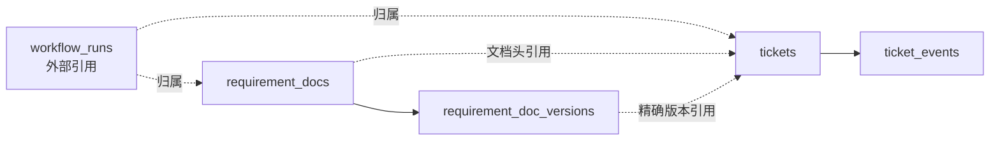
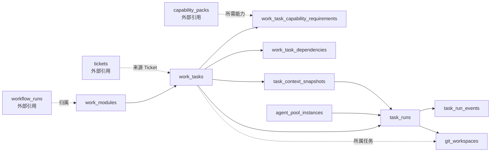

# 数据库 30 张表分层关系图

## 目标

当前 `agentx_platform` schema 共有 30 张表。为了避免后续代码又围着表乱长，先把它们固定成 5 层真相：

1. 平台资产层
2. 固定流程定义层
3. 流程编排运行层
4. 需求与人工介入层
5. 规划与交付执行层

## 整体层次图

## 层次说明

| 层次 | 作用 | 表数量 |
| --- | --- | --- |
| L1 平台资产层 | 定义平台拥有哪些 Agent、Capability、Skill、Tool、Runtime | 10 |
| L2 固定流程定义层 | 定义系统内置的工作流模板和节点 | 2 |
| L3 流程编排运行层 | 定义一次 workflow run 及顶层节点执行 | 5 |
| L4 需求与人工介入层 | 定义 requirement 文档与 ticket 交互 | 4 |
| L5 规划与交付执行层 | 定义任务、DAG、context、agent pool、task run、workspace | 9 |

---

## L1 平台资产层

### 表清单

- `runtime_packs`
- `tool_definitions`
- `skill_definitions`
- `skill_tool_bindings`
- `capability_packs`
- `capability_pack_runtime_packs`
- `capability_pack_tools`
- `capability_pack_skills`
- `agent_definitions`
- `agent_definition_capability_packs`

### 内部关系图

### 这一层回答的问题

1. 平台环境里有哪些 runtime。
2. 平台暴露了哪些 tool。
3. 平台定义了哪些 skill。
4. 一个 capability pack 由哪些 runtime / tool / skill 组成。
5. 一个 agent 定义绑定了哪些 capability pack。

---

## L2 固定流程定义层

### 表清单

- `workflow_templates`
- `workflow_template_nodes`

### 内部关系图

### 这一层回答的问题

1. 系统当前内置了哪些 workflow template。
2. 每个模板有哪些固定节点。
3. 哪些节点允许替换 Agent。
4. 哪些节点有默认 Agent 绑定。

---

## L3 流程编排运行层

### 表清单

- `workflow_runs`
- `workflow_run_node_bindings`
- `workflow_run_events`
- `workflow_node_runs`
- `workflow_node_run_events`

### 内部关系图

### 这一层回答的问题

1. 某次 workflow run 是什么。
2. 这次 run 的节点绑定了哪些 Agent。
3. 顶层节点各自执行了几次。
4. 节点执行结果和 workflow 级事件是什么。

---

## L4 需求与人工介入层

### 表清单

- `requirement_docs`
- `requirement_doc_versions`
- `tickets`
- `ticket_events`

### 内部关系图

### 这一层回答的问题

1. 当前 requirement 文档是什么，确认到哪一版。
2. 历史版本有哪些。
3. 哪些问题被抛给了人类。
4. ticket 具体锚定的是哪一版 requirement 文档。

---

## L5 规划与交付执行层

### 表清单

- `work_modules`
- `work_tasks`
- `work_task_capability_requirements`
- `work_task_dependencies`
- `task_context_snapshots`
- `agent_pool_instances`
- `task_runs`
- `task_run_events`
- `git_workspaces`

### 内部关系图

### 这一层回答的问题

1. 一个 workflow run 被拆成了哪些模块和任务。
2. 任务 DAG 是什么。
3. 每个任务需要什么 capability pack。
4. 上下文快照是什么。
5. 哪个 agent instance 执行了哪个 task run。
6. task run 产出了哪些事件和哪个 git worktree。

---

## 分层使用规则

1. 新代码不要跨层跳表写入。
2. `task` 只声明 capability requirement，不直接指定 agent。
3. `agent` 只声明 capability pack，不直接散绑 raw skill/tool。
4. 顶层节点执行与子任务执行分开建模：
   - `workflow_node_runs`
   - `task_runs`
5. 人类介入面固定走 `tickets`，不要把问题偷偷塞进 run payload。

