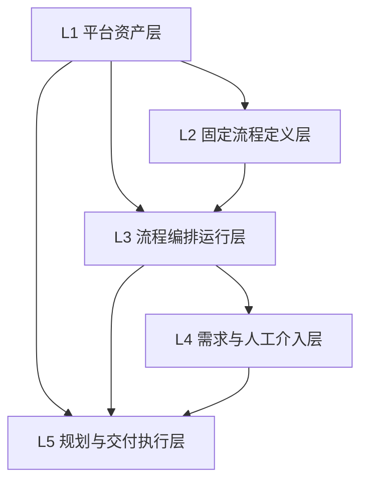

# 数据库分层真相

当前 `agentx_platform` schema 共有 30 张表。这里不再展开每层内部小图，只保留真正有用的一张总图和一张总表。

## 五层总图

## 五层说明

| 层 | 关键表 | 主要回答什么 | 主要写入方 |
| --- | --- | --- | --- |
| L1 平台资产层 | `agent_definitions`、`capability_packs`、`tool_definitions`、`skill_definitions` | 平台有哪些 agent、能力包、tool、skill、runtime | controlplane |
| L2 固定流程定义层 | `workflow_templates`、`workflow_template_nodes` | 系统内置了哪条固定工作流，节点结构是什么 | controlplane |
| L3 流程编排运行层 | `workflow_runs`、`workflow_node_runs`、`workflow_run_events` | 一次 workflow run 走到哪里，顶层节点执行了什么 | controlplane，runtime 回传证据 |
| L4 需求与人工介入层 | `requirement_docs`、`requirement_doc_versions`、`tickets`、`ticket_events` | 需求文档当前是什么，哪些问题在等人，阻塞范围是什么 | controlplane |
| L5 规划与交付执行层 | `work_tasks`、`work_task_dependencies`、`task_context_snapshots`、`agent_pool_instances`、`task_runs`、`git_workspaces` | task DAG、派发、执行、交付候选、worktree 工件、lease/heartbeat 运行真相 | controlplane + runtime |

## 使用规则

1. 不跨层跳表写业务语义。
2. 顶层节点执行真相在 `workflow_node_runs`。
3. 子任务执行真相在 `task_runs`。
4. 人类介入只走 `tickets`。
5. `task` 声明 capability requirement，不直接指定固定 agent。
6. lease / heartbeat 真相在 `agent_pool_instances` 与 `task_runs`，不是控制面内存态。
