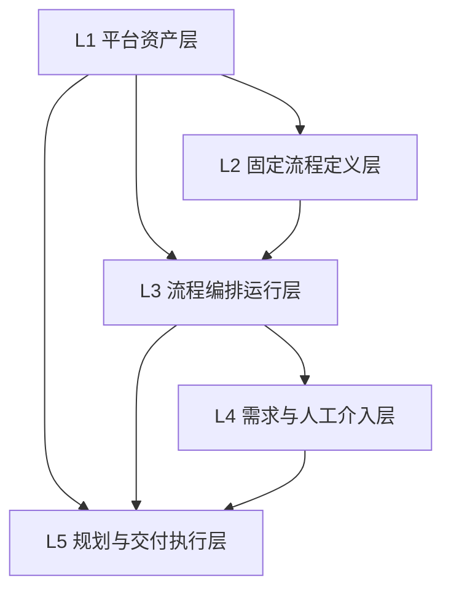

# 数据库分层真相

当前 `agentx_platform` schema 共有 30 张表。这里保留最重要的一张层级图、一张总表，以及 runtime 异步内核最常用的高频读取面。

## 五层总图

## 五层说明

| 层 | 关键表 | 主要回答什么 | 主要写入方 |
| --- | --- | --- | --- |
| L1 平台资产层 | `agent_definitions`、`capability_packs`、`tool_definitions`、`skill_definitions`、`runtime_packs` | 平台有哪些 agent、能力包、tool、skill、runtime pack | controlplane |
| L2 固定流程定义层 | `workflow_templates`、`workflow_template_nodes` | 系统内置了哪条固定工作流，节点结构是什么 | controlplane |
| L3 流程编排运行层 | `workflow_runs`、`workflow_node_runs`、`workflow_run_events`、`workflow_node_run_events` | 一次 workflow run 走到哪里，顶层节点执行了什么 | runtime |
| L4 需求与人工介入层 | `requirement_docs`、`requirement_doc_versions`、`tickets`、`ticket_events` | 需求文档当前是什么，哪些问题在等人，阻塞范围是什么 | runtime / controlplane |
| L5 规划与交付执行层 | `work_tasks`、`work_task_dependencies`、`task_context_snapshots`、`agent_pool_instances`、`task_runs`、`git_workspaces` | task DAG、派发、执行、交付候选、worktree 工件、lease/heartbeat 运行真相 | runtime |

## 异步内核下的 L4 / L5 关系

当前 runtime 是异步内核，所以要明确：

1. L4 负责“要不要等人、谁来处理阻塞”。
2. L5 负责“task 有没有被派发、run 有没有结束、workspace 有没有 merge/cleanup、lease 是否过期”。
3. 顶层 graph 只读 L4/L5 现状再做下一步，不直接把 L5 的局部状态冒充成新的 L4 业务语义。
4. `BLOCKED + ticket` 是 L4/L5 之间最关键的桥梁。
5. `GLOBAL_BLOCKING` ticket 可以没有 `task_id`，`TASK_BLOCKING` 则优先通过 `tickets.task_id` 绑定显式 task 真相。

## 高频读取面

### Dispatcher 高频读取

1. `work_tasks(status)`
2. `work_task_dependencies(task_id, depends_on_task_id)`
3. `work_task_capability_requirements(task_id, capability_pack_id)`
4. `tickets(blocking_scope, status, assignee_actor_type)`
5. `tickets(task_id, status)`
6. `task_runs(task_id, status)`

### Supervisor 高频读取

1. `task_runs(status, lease_until)`
2. `agent_pool_instances(status, lease_until)`
3. `git_workspaces(cleanup_status)`
4. `task_runs(run_id)`
5. `agent_pool_instances(agent_instance_id)`

## 当前索引约定

为了支撑异步 dispatcher / supervisor，本轮在 schema 中明确保留这些索引：

1. `idx_task_runs_status_lease`
2. `idx_agent_pool_status_lease`
3. `idx_tickets_blocking_status_assignee`
4. `idx_tickets_task_status`
5. `idx_work_tasks_status`

这些索引不是“未来可能会用”，而是当前真实中央派发和 lease 扫描的基础设施依赖。

## 使用规则

1. 不跨层跳表写业务语义。
2. 顶层节点执行真相在 `workflow_node_runs`。
3. 子任务执行真相在 `task_runs`。
4. 人类介入只走 `tickets`。
5. `task` 只声明 capability requirement，不直接绑定固定 agent。
6. lease / heartbeat 真相只放在 `agent_pool_instances` 与 `task_runs`，不放内存态。
7. `GitWorkspace` 只表达执行工件状态，不替代 `WorkTask` 业务状态。
8. `tickets.task_id` 是 `TASK_BLOCKING` 的正式查询字段，`payload_json.taskId` 只保留兼容证据。
