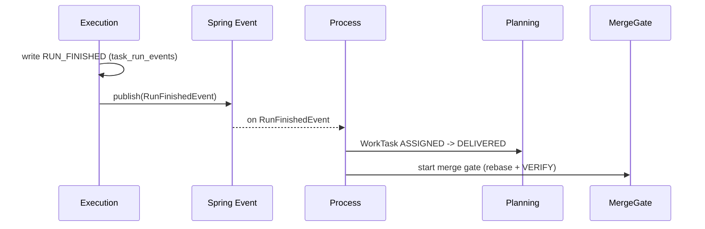

# AgentX - 基于事件驱动的模块化架构（简历亮点 1）

> **简历原文**：基于事件驱动的模块化架构：基于 DDD 思想划分多个核心模块，通过防腐接口与 Spring Event 解耦，统一管控复杂状态机触发。

面试里这篇建议用一句话打底：**“AgentX 不是写脚本，而是管长流程状态机；所以我们用模块化单体 + DDD 分包把‘谁能改什么状态’写死，再用事件与流程编排把跨域链路切片，可恢复、可审计、可演进。”**

## 对齐项目原始设计的关键约束（可作为“我不是瞎设计”的证据）

1. **模块化单体 + DDD 分包**：按业务边界拆模块；模块内统一四层：`api -> application -> domain <- infrastructure`。
2. **跨模块只走两条路**：
   - 调用对方 `application.port.in`（用例接口）
   - 发布领域事件，由 `process`（流程编排）订阅并编排
3. **禁止跨模块访问基础设施**：不允许 A 直接用 B 的 mapper/repository，不允许跨模块写 SQL 查对方表。
4. **状态机三分**：`work_tasks`（计划态）/ `task_runs`（执行态）/ `tickets`（人机协同态）各自最小状态机，避免“状态爆炸”。
5. **`DELIVERED != DONE`**：交付候选与最终集成是两件事；最终必须以门禁验证与 fast-forward 合并为准。

---

## 1. 模块化架构概览与设计取舍（Q1–Q5）

### Q1. AgentX 里 DDD 模块为什么这么分？
- **背景**：
  - 这是一个长流程系统：需求确认 → 任务拆分 → 执行 → 验证 → 合并 → 交付；每一步都有状态机与边界。
  - 如果用扁平脚本或 MVC，很容易出现“一个万能 Service 串所有表”的上帝类，导致越权写状态、并发不可控。
- **解决方案**：
  - 按核心对象生命周期与职责边界拆模块（限界上下文）：
    - `session`：会话生命周期与完成判定；
    - `requirement`：需求文档版本化与确认；
    - `ticket`：工单与决策面（HITL）；
    - `workforce`：Worker/Toolpack 能力边界；
    - `planning`：模块与任务计划态（`work_modules/work_tasks`）；
    - `contextpack`：上下文快照编译（`task_context_snapshots`）；
    - `execution`：run 生命周期（`task_runs/task_run_events`）；
    - `workspace`：Git worktree 工作区分配与回收；
    - `mergegate`：合并门禁（rebase→VERIFY→ff merge）；
    - `process`：跨模块流程编排（Saga 雏形）；
    - `query`：读模型视图（Inbox/Board/Timeline）。
- **效果**：
  - **边界清晰**：谁能改哪张表/哪个状态机一眼能看出来。
  - **易演进**：未来要拆服务时，模块边界就是天然拆分点。
- **追问（面试官可能继续问）**：
  - 你怎么防止模块之间慢慢又耦合回去？靠代码规范还是硬检查？
    - 简答：两层一起做：1）规则写进包结构与 `port.in` 入口，跨模块只允许调用用例接口/事件；2）用 ArchUnit（或构建期依赖检查）把“禁止依赖 infrastructure/禁止跨模块 mapper/禁止 domain 依赖框架”等规则做成自动化测试，避免只靠 code review 走样。
  - `process` 会不会变成新的“上帝模块”？你怎么限制它？
    - 简答：把 `process` 定位为“薄协调层”：只订阅事件、调用各模块 `application.port.in`，不拥有业务状态机、不直接读写别的表/mapper、不引入自己的“全局万能表”。流程复杂度优先下沉回对应 domain 聚合根，process 只保留必要的 Saga 编排与补偿触发。

### Q2. 模块内部为什么要严格分四层（api/application/domain/infrastructure）？
- **背景**：
  - 如果 domain 依赖框架（Spring/MyBatis），核心业务规则会被技术细节污染，难测试、难替换。
- **解决方案**：
  - 写死依赖方向：
    - `api`：只做输入输出与鉴权，只依赖本模块 `application.port.in`；
    - `application`：编排用例，调用 domain，走 `port.out` 访问外部；
    - `domain`：实体 + 状态迁移 + 不变量（不依赖框架）；
    - `infrastructure`：实现 `port.out`（DB/Git/文件系统/外部客户端）。
- **效果**：
  - **可测试**：domain 规则可以纯内存测试。
  - **可替换**：替换 MyBatis/Git 客户端不会动 domain。

### Q3. 模块之间如何通信？如何避免跨模块越权？
- **背景**：
  - 真实工程里“跨模块直接查表”是最快的捷径，也是最快的架构腐化路径。
- **解决方案**：
  - 强约束两种协作方式：
    1. **用例调用**：`A.application -> B.application.port.in`；
    2. **领域事件 + process 编排**：A 发布事件，process 订阅后调用 B 的用例推进状态。
  - 明确禁止：
    - A 直接访问 B 的 `infrastructure`；
    - A 直接操作 B 的 mapper/repository；
    - A 写 SQL 查 B 的表（跨边界读写都禁）。
- **效果**：
  - **防越权**：状态迁移权收敛，Agent/模块无法“顺手改一下别人状态”。
- **追问（面试官可能继续问）**：
  - 如果必须跨模块做读查询怎么办？（提示：用 `query` 读模型或 port.out 聚合）
    - 简答：写模型之间不互查表；需要跨域读时走两条安全路径：1）用 `query` 模块做读模型（聚合 SQL 只在 query），给 UI/流程提供视图；2）若是强一致的小查询，用对方 `application.port.in` 暴露一个“只读用例”返回必要字段（仍然不暴露 mapper）。

### Q4. 为什么选择模块化单体，而不是一开始就微服务？
- **背景**：
  - 微服务的主要成本是运维与分布式一致性：服务发现、链路追踪、消息幂等、分布式事务……
  - v0 的重点是把流程机制跑通（租约/心跳/门禁/证据链），不是扩展到多集群。
- **解决方案**：
  - 先用单 JVM 跑通闭环，同时用“模块边界 + port + 事件”预留拆分点：
    - 需要横向扩展时，再把热点模块（如 execution/mergegate）替换为外部队列与独立进程。
- **效果**：
  - **降复杂度**：避免早期被分布式问题拖死。
  - **保留演进路径**：代码组织已经按微服务拆分习惯准备好。

### Q5. 如何避免“为了 DDD 而 DDD”的过度设计？
- **背景**：
  - DDD 很容易被滥用：每张表一个 service、无意义抽象层、DTO/Entity 双份镜像……
- **解决方案**：
  - 约束写死（MVP 优先）：
    - 不为每张表强行建 domain service；
    - DTO/Entity 只在 API 边界需要时拆；
    - 不提前建“抽象工厂/策略”占位类，先闭环再抽象。
- **效果**：
  - **控制复杂度**：结构服务于流程闭环，不服务于“好看”。

---

## 2. 领域事件与 Spring Event 机制（Q6–Q10）

### Q6. 为什么用 Spring Event（进程内事件）解耦，而不是到处同步方法调用？
- **背景**：
  - 长流程容易形成深调用栈；任何一步失败都难以从中间恢复。
  - 同步调用很容易形成循环依赖：A 调 B，B 又要回调 A。
- **解决方案**：
  - 用事件把链路切片：
    - 关键状态迁移后发布事件；
    - 监听器（或 process manager）根据事件驱动下一步。
  - 是否异步是实现细节：v0 更关心解耦与事务后触发；需要异步时可通过异步监听/调度器实现。
- **效果**：
  - **可恢复**：每一步都能以“状态 + 事件”重新驱动，不依赖堆栈。
  - **解循环依赖**：事件总线天然解耦调用方向。

### Q7. Spring Event vs RabbitMQ/Kafka：选型考量是什么？
- **背景**：
  - 外部 MQ 带来运维与一致性成本（网络 IO、序列化、幂等、投递语义、监控告警）。
- **解决方案**：
  - v0 在模块化单体阶段选择进程内事件，主要原因：
    - 延迟低、零运维；
    - 可与事务后触发绑定（避免“DB 还没提交就消费查询”的问题）；
    - 事件丢失风险用“数据库状态机扫描/补偿”兜底（事件是触发器，状态才是事实）。
  - 预留升级路径：未来替换 publisher 为 MQ（或 outbox 模式）不改业务域代码。
- **效果**：
  - **MVP 快速闭环**，同时不把系统锁死在单机方案里。
- **追问（面试官可能继续问）**：
  - 事件丢了怎么办？你是靠 MQ 保证不丢，还是靠状态机自愈？
    - 简答：v0 把“状态”当事实，“事件”当触发器：即使某次事件没触发，也能通过扫描中间态（例如 `DELIVERED` 队列、超时 lease 的 run）重新驱动推进；未来需要跨 JVM 时再引入 outbox/MQ 作为增强，但业务不依赖“事件一定到达”才能正确。
  - 你怎么做幂等？同一事件被处理两次会怎样？
    - 简答：处理器按“当前状态 + 目标状态”做幂等推进：例如任务已是 `DELIVERED/DONE` 就忽略重复的 RunFinished；ticket 已 `DONE` 就拒绝重复 USER_RESPONDED；关键更新都用条件更新/唯一约束保证“同一时刻只能推进一次”，重复消费最多是 no-op，不会造成状态跳跃。

### Q8. 如何保证事件发布/消费与数据库事务一致？
- **背景**：
  - 常见坑：事务未提交就触发消费，消费端查询不到数据或读到旧状态。
- **解决方案**：
  - 使用事务后监听（例如 `@TransactionalEventListener(AFTER_COMMIT)`）：
    - 只有当核心状态更新成功提交，才允许进入下一步编排。
  - 关键链路以“状态机”为真相：即使某次触发丢失，也可以通过扫描中间态恢复推进。
- **效果**：
  - **一致性更简单**：把“事件触发”绑到“状态已落库”之后。

### Q9. `process` 模块负责什么？和领域事件是什么关系？
- **背景**：
  - 跨模块流程如果散落在各模块里，会形成互相调用与状态耦合，最后谁也说不清“主链路”在哪。
- **解决方案**：
  - `process` 作为流程编排层（Saga 雏形）：
    - 订阅各模块事件；
    - 调用各模块 `application.port.in` 推进下一步；
    - 自身不碰基础设施，不直接改别人的表。
- **效果**：
  - **主链路集中、边界清晰**：跨模块 orchestration 有唯一归属。

### Q10. 举一个事件驱动的核心链路（从执行完成到合并门禁）
- **背景**：
  - 面试官想确认你不是“堆概念”，而是能讲清一条可跑通的端到端链路。
- **解决方案**（典型链路）：
  1. `execution`：run 完成，写 `task_run_events(RUN_FINISHED)`；
  2. 发布 `RunFinishedEvent`；
  3. `process` 监听后调用 `planning`：把对应 `work_task` 从 `ASSIGNED` 推进到 `DELIVERED`（IMPL 成功时）；
  4. `process/mergegate` 进入门禁：rebase→创建 VERIFY run→VERIFY 通过→ff merge→`DELIVERED -> DONE`。
- **效果**：
  - **DELIVERED 与 DONE 分离**：交付候选与最终集成拆开，证据链更稳。
- **追问（面试官可能继续问）**：
  - `RUN_FINISHED` 的 work_report/delivery_commit 存哪？为什么不直接塞到 task_runs 表？
    - 简答：按 v0 约定存 `task_run_events(event_type=RUN_FINISHED).data_json`，大体量正文/附件用 `ARTIFACT_LINKED` 引用；不把 work_report/delivery_commit 塞进 `task_runs` 是为了保持 run 表最小且稳定（核心字段 + 租约/基线），而审计细节天然属于 append-only 的事件链，方便回放与避免频繁 schema 演进。

---

## 3. 防腐层（ACL）与防越权安全（Q11–Q15）

### Q11. “防腐层（ACL）”在 AgentX 里主要防谁的“腐”？
- **背景**：
  - LLM 输出不稳定，且可能携带幻觉；如果直接写进核心状态或 DB，会污染事实账本。
- **解决方案**：
  - 在控制面入口做结构化校验与边界隔离：
    - 对 Task Package、Context Pack、Ticket payload 做 schema/规则校验；
    - 非法/缺字段/引用不存在 → 不入库，转 `NEED_CLARIFICATION`。
- **效果**：
  - **防脏数据入库**：把幻觉挡在核心域之外。

### Q12. 与外部基础设施（Git、Docker）交互时如何应用 ACL？
- **背景**：
  - 外部系统 API 很复杂，且错误模式多；把细节泄漏进 domain 会导致核心规则被外部实现绑死。
- **解决方案**：
  - 依赖倒置 + Adapter：
    - `application.port.out` 定义 `GitClientPort/RuntimeEnvironmentPort`；
    - `infrastructure` 实现具体 JGit/CLI/Docker 客户端；
    - domain/app 只看“成功/失败 + 领域语义”。
- **效果**：
  - **可替换**：换 Git 实现不动业务域。

### Q13. Toolpack 如何限制技术栈，避免 Agent 越权？
- **背景**：
  - Agent 很容易“脑洞大开”执行不属于任务范围的命令（尤其跨语言工具链）。
- **解决方案**：
  - 任务标注 `required_toolpacks_json`，Worker 绑定 toolpacks 才能 claim；
  - 运行时对命令/能力做白名单约束（可落在容器镜像、运行时策略或 toolpacks_snapshot 中）。
- **效果**：
  - **能力白名单**：让“不能做”变成物理不可行，而不是“请不要这么做”。

### Q14. 如果模型生成了 `rm -rf` 之类命令，架构上怎么拦？
- **背景**：
  - 这是面试官最爱追问的“安全底线题”。
- **解决方案**：
  - 三道门：
    1. **Toolpack 命令范围**：不在 allowlist 的命令拒绝执行；
    2. **容器隔离**：即使误执行也只影响一次性容器与 worktree；
    3. **write_scope**：把写入范围收敛到任务目录前缀，VERIFY 时为空。
- **效果**：
  - **最坏情况可控**：平台不会被单次任务摧毁。

### Q15. 如何约束 Agent 不在不该做决定时“自己决定”？
- **背景**：
  - “自作主张”是 LLM 在工程场景最大的风险来源之一。
- **解决方案**：
  - stop rules + 决策面：
    - 触发 `NEED_DECISION/NEED_CLARIFICATION` 必须停在 `WAITING_FOREMAN`；
    - 通过 Ticket 让人类确认后再继续，必要时重编译上下文快照并新建 run。
- **效果**：
  - **把取舍权交还给人**：Agent 只是方案供给与执行者。

---

## 4. 状态机与一致性治理（Q16–Q20）

### Q16. 如何保证复杂状态机的一致性？（并发更新怎么办）
- **背景**：
  - 多 Worker 并发、长流程推进时，最怕状态跳跃与重复推进（例如从 PLANNED 直接 DONE）。
- **解决方案**：
  - 用数据库事务 + 明确状态迁移规则：
    - 原子更新（例如 `READY_FOR_ASSIGN -> ASSIGNED`）；
    - domain 层守卫（guard clauses）禁止非法跃迁；
    - “等待用户”只在 run/ticket 层表达，不膨胀 task 状态。
- **效果**：
  - **状态可证明**：非法跃迁在代码层与 DB 层双重拦截。

### Q17. Worker 执行耗时过长导致阻塞，怎么处理？
- **背景**：
  - 如果一个 run 永远 RUNNING，会吃掉执行槽位，系统吞吐会被拖死。
- **解决方案**：
  - 心跳 + 强租约：
    - 心跳续租；
    - 超时回收：run 失败/取消并创建新 run 重试，任务回到可分配态。
- **效果**：
  - **不会永久占用**：系统能自愈而不是靠人盯着杀进程。

### Q18. 向 Git 推代码中途断网等失败，系统如何自愈？
- **背景**：
  - 外部 IO 失败是常态；系统必须区分“暂时性失败”与“业务失败”。
- **解决方案**：
  - 幂等 + 证据链：
    - run 的产物以 commit/ref 为锚点，重复提交不会产生歧义；
    - 合并门禁是最终一致点：只有 ff merge 成功才会 `DELIVERED -> DONE`；
    - 基础设施失败可在同一候选上重试；业务失败则回退进入 debug/提请流程。
- **效果**：
  - **最终一致性**：DB 状态与 Git 物理事实最终在门禁点对齐。

### Q19. 某个模块因为异常挂起，如何避免拖死全局？
- **背景**：
  - 如果“等待”建模错误，会变成全局阻塞，系统无法并行。
- **解决方案**：
  - 显式依赖 DAG：
    - 仅阻塞依赖链上的下游；
    - 无依赖分支继续推进。
  - run 的等待用 `WAITING_FOREMAN` 表达，不污染 task 状态。
- **效果**：
  - **局部失败隔离**：不会因为一个卡点导致全局停摆。

### Q20. 事件驱动 + DDD 给你带来的最大工程感悟是什么？
- **背景**：
  - 面试官想听“你做了什么权衡/学到了什么”，而不是背书式概念。
- **解决方案**：
  - 把控制权收敛到“可审计的状态机”里：
    - Agent 负责产出与建议；
    - 控制面负责状态推进与门禁；
    - 事件链负责可回放事实。
- **效果**：
  - **定位范围变小**：状态 bug 不再是“某段脚本改乱了 DB”，而是“某个聚合根迁移逻辑不对”。

---

## 5. 架构依赖强制与级联故障治理（补充 Q21–Q22）

### Q21. “禁止循环依赖”如何强制执行？
- **背景**：
  - 代码层如果不强制，团队规模一大很快就会出现相互引用，最后无法拆分、无法测试。
- **解决方案**：
  - 三道约束：
    1. 包结构约束：模块边界清晰；
    2. 编译期/测试期依赖检查（例如 ArchUnit 或类似工具）；
    3. 跨模块交互只允许 `port.in` 或事件（发现直接依赖即阻断）。
- **效果**：
  - **边界长期不腐化**：演进成本可控。
- **追问（面试官可能继续问）**：
  - 如果真的出现循环依赖了，你怎么重构拆解？优先拆哪个依赖？
    - 简答：先判定依赖的“归属与方向”：谁才是该规则/数据的拥有者。常用拆法三选一：1）把“读需求”改为走 `query` 读模型（消掉直接依赖）；2）把“调用需求”改为调用对方 `port.in`（消掉反向依赖）；3）如果双方互相触发，改为发布事件并由 `process` 编排（用事件断开环）。优先拆“最不该存在的依赖”——通常是跨模块读表/依赖 infrastructure 的那一条。

### Q22. 事件驱动如何缓解“级联故障”？
- **背景**：
  - 深同步调用链会导致一个慢点拖死整条链路；但事件驱动如果做错也可能变成“堆积无人处理”。
- **解决方案**：
  - 关键思路不是“都异步”，而是“状态切片 + 可恢复推进”：
    - 每一步先把状态落库，再触发下一步；
    - 某一步变慢/失败不会占住上游线程栈；
    - 通过扫描中间态与租约回收补偿推进。
- **效果**：
  - **局部故障不扩散**：失败被限制在对应状态机与对应任务上，不会把整个系统拖死。
