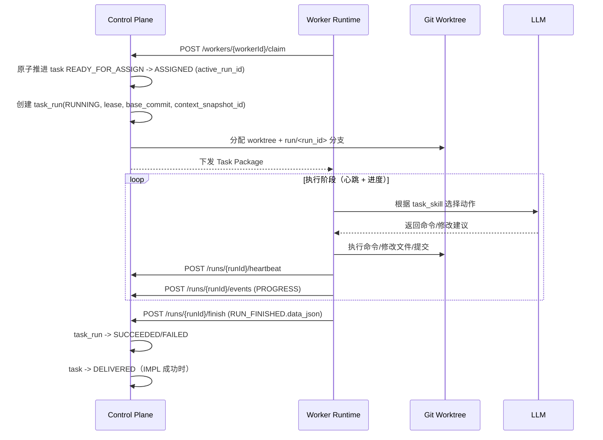
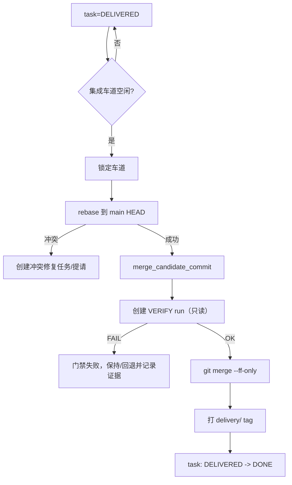

# AgentX - 沙箱隔离与 Worker 动态调度（简历亮点 2）

> **简历原文**：沙箱隔离与 Worker 动态调度：通过 Docker 构建高可靠 Worker 池并设计 Toolpack（工具包）机制限制技术栈与命令权限；引入心跳检测与强租约管理规避队列阻塞；利用 Git Worktree 实现任务级独立工作区隔离，并依托 Merge Gate 串行门禁保障“验证基线”与主干严格一致。

面试里这篇建议一句话定调：**“LLM 只给方案，真正的执行必须在可隔离、可回收、可审计的沙箱里跑；调度用租约/心跳保证可恢复；交付用门禁保证验证过的就是合入的。”**

## 对齐项目原始设计的关键约束

1. **Worker 状态最小化**：`workers.status` 只保留 `PROVISIONING | READY | DISABLED`；`BUSY/UNHEALTHY` 等是运行视图（由租约/心跳派生），不写进表。
2. **租约属于 run，不属于 task**：`task_runs.lease_until + last_heartbeat_at` 负责“执行占用与回收”；`work_tasks` 只用 `active_run_id` 指向当前尝试。
3. **每次执行必须绑定不可变基线**：`task_runs.base_commit` 是本次 run 的唯一代码事实锚点，run 期间禁止“追最新”。
4. **VERIFY 只读硬约束**：`run_kind=VERIFY` 时 `write_scope` 必须为空；验证结束若有任何 diff，直接判失败。
5. **`DELIVERED != DONE`**：IMPL 成功只是交付候选（DELIVERED），必须经过门禁 rebase→VERIFY merge candidate→FF merge 才算 DONE。

---

## 1. 沙箱隔离与安全管控（Q1–Q5）

### Q1. 为什么 AgentX 必须用 Docker（或等价容器）作为 Worker 宿主环境？
- **背景**：
  - LLM 生成的命令与脚本具有不确定性，最怕“误删/越权/污染宿主机环境”，一旦发生就不是任务失败，而是平台事故。
  - 多任务并发时，不同技术栈版本会互相污染（Java/Python/Node 的依赖冲突是常态）。
- **解决方案**：
  - 用容器把 Worker 变成“可创建、可回收的执行槽位”：
    - 文件系统隔离：只挂载允许的 worktree 路径；
    - 资源隔离：CPU/内存/IO 限额；
    - 生命周期隔离：任务结束即销毁，避免状态漂移。
- **效果**：
  - **安全性提升**：高风险命令最多破坏一次性容器与该 run 的 worktree，不会蔓延。
  - **可复现性**：镜像指纹稳定，能保证“同样的 Toolpack = 同样的环境事实”。
- **追问（面试官可能继续问）**：
  - 如果需要访问内网依赖（私服/Nexus/Git），网络隔离怎么做？
    - 简答：默认“最小出网”，按任务/`run_kind` 配置 egress allowlist：只放行必要的内网依赖（如制品库、Git、包代理），其余一律拒绝；敏感凭据不写进镜像与容器环境，改用短时 token/代理转发，确保容器即使被诱导外联也拿不到可用通路。
  - 你怎么防止容器逃逸/宿主机敏感目录被挂载？
    - 简答：运行策略上禁止 privileged、禁止挂载宿主敏感目录/`docker.sock`，只允许挂载 worktree 路径；安全加固上用非 root 用户、capabilities drop、seccomp/AppArmor（或等价沙箱配置）、只读 rootfs（必要时），把“逃逸/横向移动”的攻击面压到最低。

### Q2. Toolpack（工具包）机制如何限制技术栈与命令权限？
- **背景**：
  - 只靠 Prompt 约束“你应该用 Maven，不要用 pip”很脆弱；模型一旦漂移就会执行越权操作。
- **解决方案**：
  - 把“能不能做”硬编码到执行能力边界：
    - 任务标注 `required_toolpacks_json`（最小集合）；
    - Worker 只有绑定对应 toolpacks 才能 claim；
    - run 创建时把 worker 当下 toolpacks 以 `toolpacks_snapshot_json` 固化进 run（审计）。
  - Toolpack 的“命令 allowlist/策略”可以作为 toolpack 定义的一部分（配置/镜像元数据/运行时策略），不要求在 v0 schema 里加一堆列。
- **效果**：
  - **越权硬拦截**：没能力就不能接单；接了单也只能在允许命令范围内执行。

### Q3. Toolpack 和 Skill 有什么本质区别？为什么不能只靠 Skill（提示词）？
- **背景**：
  - Skill 是“知识与做法”，但不能保证机器上真的有对应环境；更无法对恶意/误操作做物理拦截。
- **解决方案**：
  - 明确分工：
    - Toolpack：环境与权限边界（能不能做、用什么做）。
    - Skill：执行指导（怎么做才符合本项目规范）。
- **效果**：
  - **事实一致**：Skill 说“用 Java21”，Toolpack 保证“真的装了 Java21”。
  - **安全可控**：Skill 无法阻止 `rm -rf`，Toolpack/沙箱可以。

### Q4. 针对大模型可能发起的恶性网络行为，沙箱怎么防御？
- **背景**：
  - 数据泄露与内网扫描是企业最敏感风险之一；执行层需要“最小网络权限”。
- **解决方案**：
  - 网络能力做成运行策略（按 `run_kind`/任务类型分级）：
    - VERIFY 类任务可配置为无外网或只访问白名单域名；
    - 只允许访问受控代理/制品库等必要基础设施；
    - 关键凭据不下发到容器环境（或通过短时 token）。
- **效果**：
  - **降风险面**：即使 prompt 被诱导，容器也拿不到可用的外联通路/凭据。

### Q5. 如果模型尝试修改系统配置（cron、/etc），沙箱如何感知并重置？
- **背景**：
  - 任何“持久化污染”都会导致后续任务不可复现，甚至出现隐蔽安全后门。
- **解决方案**：
  - 采用一次性执行环境（ephemeral worker runtime）：
    - 容器可写层随 run 结束销毁；
    - 只允许在 worktree 挂载目录内写入（再结合 `write_scope` 进一步收敛）。
- **效果**：
  - **无状态漂移**：下一次 run 是干净起点，平台更像 CI Runner，而不是长期在线的“黑盒机器”。

---

## 2. 任务调度、心跳与强租约管理（Q6–Q10）

### Q6. 什么是“强租约（Lease）”？它解决了什么问题？
- **背景**：
  - Worker 可能 OOM/宕机/网络断开；如果没有租约，任务会永久占用，系统无法自愈。
- **解决方案**：
  - 租约绑定在 `task_runs`：
    - run 创建时写入 `lease_until`；
    - 心跳续租时延长 `lease_until` 并更新 `last_heartbeat_at`；
    - lease 到期允许回收：创建新 run 重试，并把 `work_tasks.status` 从 `ASSIGNED` 回收到 `READY_FOR_ASSIGN`（清空 `active_run_id`）。
- **效果**：
  - **可恢复**：Worker 死掉不会把系统拖死。
  - **防脑裂**：同一任务同一时刻只允许一个 active run（其余尝试必须失败或等待）。
- **追问（面试官可能继续问）**：
  - lease TTL 怎么选？太短会误杀，太长会拖慢恢复。
    - 简答：TTL 不是“总时长”，而是滑动窗口：心跳每 N 秒续租一次；TTL 取 `heartbeat_interval * k + grace`（例如 30s 心跳、TTL 5min），并做成可配置。太短的误杀用“续租 + 宽限”兜底；太长的恢复慢用“更密心跳 + 更短 TTL”调整即可。
  - “重试”为什么必须是新 run_id？老 run 为什么不能复用？
    - 简答：run 是一次不可变执行尝试，事件链（`task_run_events`）与基线（`base_commit`）都要可回放；复用 run_id 会把两次尝试的证据混在一起，审计与幂等都变难。并且用户决策/需求变化后往往需要新 `context_snapshot_id`，这本质上就是新 run。

### Q7. 心跳（Heartbeat）怎么实现？
- **背景**：
  - lease 需要一个“活着证明”，否则无法区分“慢”与“死”。
- **解决方案**：
  - Worker 执行期间周期性调用 `POST /api/v0/runs/{runId}/heartbeat`：
    - 后端延长 `lease_until`；
    - 更新 `last_heartbeat_at`；
    - Worker 可同时写 `PROGRESS` 事件（可观测）。
  - “不健康”不写入 `workers.status`，而是由监控与 lease/心跳派生（运行视图）。
- **效果**：
  - **可观测**：知道 run 是否在推进、卡在哪一步。
  - **可回收**：心跳超时后自动触发回收与重试。

### Q8. lease 过期回收时，正在运行的进程怎么处理？
- **背景**：
  - 控制面不一定能立刻物理杀掉 Worker（尤其是分布式/异机场景），但必须能让其“写不进事实账本”。
- **解决方案**：
  - 控制面以 run_id 为准：run 失效后，后续事件/续租请求拒绝；
  - Docker 模式下由维护任务清理“无有效租约”的容器与 worktree（避免游离资源泄露）。
- **效果**：
  - **软硬结合**：协议层先断权，运行环境再清理，确保一致性与资源回收。

### Q9. 并发抢任务时，如何保证不出现重复分配？
- **背景**：
  - Worker Pull 模式下多个 Worker 同时 claim，必须做到“只有一个成功”，否则会写同一分支/同一 worktree。
- **解决方案**：
  - 在 DB 层做原子状态推进：
    - 以 `status=READY_FOR_ASSIGN` 为条件把任务推进到 `ASSIGNED`，并同时写入 `active_run_id`；
    - 只有更新成功的 Worker 获得任务包（其余返回 204 无任务）。
- **效果**：
  - **一致性简单**：利用关系型数据库行锁保证原子性，不引入分布式锁复杂度。

### Q10. 初始化独占（Bootstrap INIT）阶段，调度器有什么特殊限制？
- **背景**：
  - `git worktree` 并发隔离依赖“仓库至少有一个 commit”；INIT 负责把仓库推进到可治理基线。
- **解决方案**：
  - Session 刚创建时只允许一个 INIT 任务（`task_template_id=tmpl.init.v0`）进入 `ASSIGNED`：
    - 全局最多 1 个 active run；
    - INIT 允许一次性 `write_scope=/` 写根目录；
    - 解锁点写死为 INIT 任务 `DONE`（而不是 `DELIVERED`）。
- **效果**：
  - **把基线做实**：后续每个 run 的 `base_commit` 都有意义。

---

## 3. Git Worktree 隔离与基线治理（Q11–Q15）

### Q11. 为什么选择 Git Worktree 而不是每个任务 `git clone`？
- **背景**：
  - clone 大仓库是分钟级，且 N 份 clone 是 N 份对象库，磁盘与 IO 会炸。
- **解决方案**：
  - `git worktree` 共享同一份 `.git` 对象库：
    - 每个 run 独立目录与分支；
    - 创建/回收成本低；
    - 并发改文件互不覆盖。
- **效果**：
  - **启动快、占用低**：更适合大量短生命周期 run。

### Q12. 描述一次 Task Run 的 Git 生命周期
- **背景**：
  - 需要把“代码事实”变成可审计对象：run 从哪来、改到哪、最终候选是哪一个 commit。
- **解决方案**：
  - 固定链路：
    1. 选择 `base_commit`（不可变事实锚点）；
    2. 创建分支 `run/<run_id>`；
    3. 分配 worktree 路径 `worktrees/<session_id>/<run_id>/`；
    4. Worker 在该目录提交；
    5. run 结束写 `RUN_FINISHED.data_json`（含 work_report/delivery_commit 等）。
- **效果**：
  - **证据闭环**：任何一次产出都能定位到 commit 与对应 run。

### Q13. 什么是“严格快照制”？它如何防止基线漂移？
- **背景**：
  - 如果 Worker 一边写代码一边 pull 最新 main，会出现“你以为你改的是 A 版本，但实际改的是 B 版本”，不可复现。
- **解决方案**：
  - run 事实写死为 `base_commit`：
    - Worker 禁止在 run 过程中追最新；
    - 只有 Merge Gate 在合并门禁点做 rebase/刷新基线，并对 merge candidate 做 VERIFY。
- **效果**：
  - **可复现**：同一 run 的输入事实可重放。

### Q14. 两个任务修改同一文件，Git Worktree 如何处理冲突？
- **背景**：
  - 并发执行期如果不隔离，冲突会在写文件时爆炸；但隔离后冲突会被推迟到合并期。
- **解决方案**：
  - 执行期：worktree 物理隔离，不互相覆盖；
  - 合并期：Merge Gate 串行 rebase 到 `main`，冲突显式暴露；
  - 冲突处理：创建冲突修复任务（例如 `tmpl.bugfix.v0`），完成后再挑战门禁。
- **效果**：
  - **执行并发、合并串行**：吞吐量与正确性兼得。

### Q15. 如何实现 INIT 对根目录的特殊写权限？
- **背景**：
  - INIT 需要生成 `pom.xml/.gitignore` 等根文件，但后续任务如果也能写根目录就会变成“越权地狱”。
- **解决方案**：
  - 只允许 `tmpl.init.v0` 设置 `write_scope=/`；
  - INIT DONE 后默认收敛 write_scope；若后续确需扩大，必须 `NEED_DECISION` 走决策面授权。
- **效果**：
  - **一次性特权**：把危险权限限制在可审计的唯一阶段。

---

## 4. Merge Gate 与集成验证（Q16–Q20）

### Q16. 串行集成车道（Integration Lane）的设计初衷是什么？
- **背景**：
  - 并发合并即使“文件不冲突”，也可能出现语义冲突；更关键的是必须保证“验证过的就是合入的”。
- **解决方案**：
  - 对 `DELIVERED` 队列做串行门禁：
    1. rebase 任务交付分支到当前 `main` HEAD，生成 `merge_candidate_commit`；
    2. 创建 `run_kind=VERIFY` 的只读 run 验证 merge candidate；
    3. VERIFY 通过后执行 `--ff-only` 快进合并并打 `delivery/<YYYYMMDD-HHmm>` tag；
    4. 任务 `DELIVERED -> DONE`。
- **效果**：
  - **证据链闭环**：避免“验证通过但最终合入不是那份代码”的漏洞。
- **追问（面试官可能继续问）**：
  - 为什么 VERIFY 不复用 IMPL 的自检结果？为什么要独立跑？
    - 简答：IMPL 自检验证的是“交付候选”而不是“最终可合入候选”。门禁会 rebase 到最新 `main` 生成 `merge_candidate_commit`，必须对这个候选做只读 VERIFY 才能保证“验证过的就是合入的”。独立 VERIFY 还能强制只读与证据标准化，打破 Worker 自证完成的闭环。

### Q17. 为什么强制 Fast-forward 合并，而不允许生成 Merge Commit？
- **背景**：
  - Merge Commit 会生成一个“新的未验证快照”；这会直接破坏 DoD 的证据语义。
- **解决方案**：
  - rebase 后对 `merge_candidate_commit` 做 VERIFY；
  - VERIFY 通过后 `git merge --ff-only`，保证最终进入 main 的 commit 就是刚验证过的那个。
- **效果**：
  - **commit ID 不变**：审计时可以严格对齐“验证目标 = 合入目标”。

### Q18. VERIFY 如何确保“只读”不被穿透？
- **背景**：
  - 允许 VERIFY 修改文件会导致“验证阶段带副作用”，从而污染主线候选。
- **解决方案**：
  - 权限层：`write_scope` 为空；
  - 审计层：验证结束强制检查 diff（如 `git diff --name-only`），有输出直接 FAILED；
  - 流程层：FAILED 不允许进入 DONE。
- **效果**：
  - **验证即验证**：VERIFY 永远不会“顺手修一下”。

### Q19. 门禁阶段 rebase 冲突，系统如何处理？
- **背景**：
  - 冲突无法靠门禁线程“猜一下修掉”，否则是不可控修改。
- **解决方案**：
  - 冲突转化为确定性工作流：
    - 生成冲突修复任务（bugfix 模板），并把原任务挂依赖；
    - 或升级为 DECISION/CLARIFICATION（当冲突涉及取舍）。
- **效果**：
  - **冲突不被吞掉**：修复路径可追溯、可审计。

### Q20. `.agentx/` 证据目录包含什么？架构意义是什么？
- **背景**：
  - 交付给用户的不是“若干 commit”，而是一份可维护、可复盘的工程产物。
- **解决方案**：
  - `.agentx/` 作为过程证据与审计产物聚合点：
    - 确认版需求导出（`.agentx/requirements/`）；
    - 上下文快照正文/引用（`.agentx/context/`）；
    - 工作报告、VERIFY 结论等通过 artifact_ref 链接或落在 `.agentx/`。
- **效果**：
  - **可溯源、可交接**：用户 clone 仓库就能看见“做了什么、为什么这么做、怎么验证”。

---

## 5. 流程图（Q21–Q22）

### Q21. Worker 从接单到交付的生命周期（简图）

### Q22. Merge Gate 验证逻辑（只保留硬门禁）

