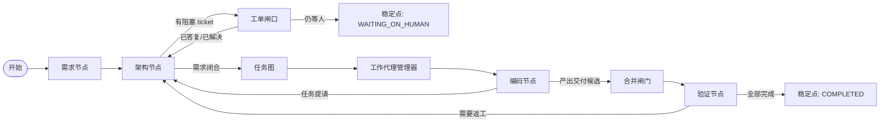

# Runtime V1 实现说明

本文只描述当前已经落地的 Runtime V1，不写未来设想。

## 1. 本轮实现范围

当前已经用固定 LangGraph 顶层图跑通如下主链：

`requirement -> architect -> ticket-gate -> task-graph -> worker-manager -> coding -> merge-gate -> verify`

本轮同时覆盖了 1 条人工介入恢复链：

`coding -> architect -> ticket-gate(waiting human) -> answerTicket -> architect -> worker-manager -> coding -> merge-gate -> verify`

## 2. 设计边界

1. 数据库是真相源，LangGraph 只负责编排节点执行顺序。
2. 节点必须幂等，重复执行不能重复创建 requirement version、task、ticket、task run。
3. 运行恢复依赖数据库真相重算，不依赖 LangGraph saver。
4. 本轮只做固定流程，不做自由工作流编辑。
5. 本轮只做本地 fake runtime，不接真实 LLM、Docker、Git worktree。

## 3. 应用入口

当前固定工作流应用服务位于：

`runtime.application.workflow.FixedCodingWorkflowUseCase`

对外暴露 4 个入口：

1. `start(StartCodingWorkflowCommand)`
   - 创建 `workflow_runs`
   - 按模板写入 `workflow_run_node_bindings`
   - 创建确认态 `requirement_docs` 与首版 `requirement_doc_versions`
   - 写入 `WORKFLOW_STARTED`
2. `runUntilStable(String workflowRunId)`
   - 从数据库读取当前真相
   - 调用 LangGraph 跑到稳定点
   - 只允许停在 `COMPLETED / WAITING_ON_HUMAN / FAILED / CANCELED`
3. `answerTicket(AnswerTicketCommand)`
   - 写入人工答复
   - 将 ticket 标记为 `ANSWERED`
   - 如果当前 workflow 正在 `WAITING_ON_HUMAN`，则把 workflow 恢复到 `ACTIVE`
4. `getRuntimeSnapshot(String workflowRunId)`
   - 聚合 workflow、requirement、ticket、task、snapshot、run、workspace、node run
   - 仅用于测试断言和运行快照查看

## 4. LangGraph 顶层图

## 5. 节点职责

### requirement

1. 读取已创建好的需求文档。
2. 确认 requirement 已处于 `CONFIRMED`。
3. 将 workflow 推进为可进入架构阶段的活动态。

### architect

1. 处理人类已答复 ticket。
2. 评估编码阶段上抛的 clarification ticket。
3. 能内部消化则直接 resolve 并解除 task 阻塞。
4. 无法内部消化则转交人类。

### ticket-gate

1. 检查是否存在 `assignee = HUMAN` 且仍未答复的 open ticket。
2. 若存在，则将 workflow 标记为 `WAITING_ON_HUMAN`。
3. 若不存在，则允许流程返回 architect 继续推进。

### task-graph

1. 首次执行时创建固定模块与固定单任务 DAG。
2. 保存 capability requirement。
3. 将任务从 `PLANNED` 推进到 `READY`。
4. 重复执行时只读取现状，不重复造数据。

### worker-manager

1. 查找 `READY` task。
2. 为 task 选择或补齐本地 fake agent instance。
3. 生成 `TaskContextSnapshot`。
4. 生成 `TaskRun`。
5. 分配 synthetic workspace。
6. 将 task 推进到 `IN_PROGRESS`。

### coding

1. 执行本地 fake 编码代理。
2. 成功时：
   - `TaskRun -> SUCCEEDED`
   - workspace 写入 head commit
   - `WorkTask -> DELIVERED`
3. 缺失事实时：
   - 当前 `TaskRun -> CANCELED`
   - 追加 `NEED_CLARIFICATION`
   - `WorkTask -> BLOCKED`
   - 创建 `TASK_BLOCKING` clarification ticket 给 architect

### merge-gate

1. 处理 `DELIVERED` task。
2. 用 synthetic merge 逻辑把 workspace 推到 `MERGED`。
3. 不跑真实 git，只模拟 merge candidate 已形成。

### verify

1. 验证 `DELIVERED` task 对应的 workspace。
2. 通过时：
   - `WorkTask -> DONE`
   - workspace -> `CLEANED`
3. 失败时：
   - `WorkTask -> READY`
   - 交回 architect 重新进入主链
4. 所有 task 都 `DONE` 时：
   - `WorkflowRun -> COMPLETED`

## 6. Fake 运行时边界

当前 fake adapter 位于 `runtime.agentruntime.local`：

1. `LocalRequirementAgent`
   - 直接把启动输入写成 `CONFIRMED` requirement
2. `LocalArchitectAgent`
   - 生成固定 DAG
   - 对 clarification 做“内部解决 / 转交人类”二选一分流
3. `LocalCodingAgent`
   - 不写真实代码
   - 只返回确定性的成功结果或 clarification 结果
4. `LocalVerifyAgent`
   - 不跑真实验证命令
   - 只按场景开关返回“通过 / 返工”

workspace 适配位于 `runtime.workspace.git.SyntheticWorkspaceService`：

1. 在 `target/runtime-workspaces/<workflowRunId>/...` 下创建临时目录
2. 生成 synthetic `base/head/merge` commit
3. 用于支撑 merge-gate 和 verify 的闭环断言

## 7. 主要数据库写入点

### workflow 启动

1. `workflow_runs`
2. `workflow_run_node_bindings`
3. `workflow_run_events`
4. `requirement_docs`
5. `requirement_doc_versions`

### 顶层节点执行审计

每个节点都会写：

1. `workflow_node_runs`
2. `workflow_node_run_events`

workflow 阶段变化会写：

1. `workflow_runs`
2. `workflow_run_events`

### planning / execution

1. `work_modules`
2. `work_tasks`
3. `work_task_capability_requirements`
4. `agent_pool_instances`
5. `task_context_snapshots`
6. `task_runs`
7. `task_run_events`
8. `git_workspaces`

### human-in-the-loop

1. `tickets`
2. `ticket_events`

## 8. 关键状态约束

1. `DELIVERED != DONE`
2. `TaskRun.SUCCEEDED != WorkTask.DONE`
3. `GitWorkspace.MERGED != WorkTask.DONE`
4. clarification 中断时，不给 `TaskRun` 新增额外状态，直接结束当前 attempt 为 `CANCELED`
5. 恢复执行时必须新建 `TaskContextSnapshot` 和新 `TaskRun`

## 9. 当前集成测试覆盖

测试文件：

`src/test/java/com/agentx/platform/FixedCodingWorkflowIntegrationTests.java`

已覆盖：

1. happy path
   - workflow 最终 `COMPLETED`
   - requirement `CONFIRMED`
   - 至少 1 个 task 经过 `DELIVERED -> DONE`
   - 至少 1 个 run `SUCCEEDED`
   - workspace 最终 `MERGED` 或 `CLEANED`
2. clarification resume
   - 首次执行停在 `WAITING_ON_HUMAN`
   - blocking ticket 已创建
   - task 被阻塞
   - 首次 run 为 `CANCELED`
   - `answerTicket` 后二次执行恢复并完成
3. idempotency
   - 已完成 workflow 重复执行不会重复创建 requirement version、task、ticket、task run、node run

## 10. 当前实现结论

Runtime V1 已经具备“固定主链 + 一次人工澄清恢复”的最小可运行闭环。

它现在是一个可测试的内核，不是完整平台。后续接真实 LLM、Docker、Git、RAG、监督器时，应替换适配边界，而不是重写主链状态语义。
