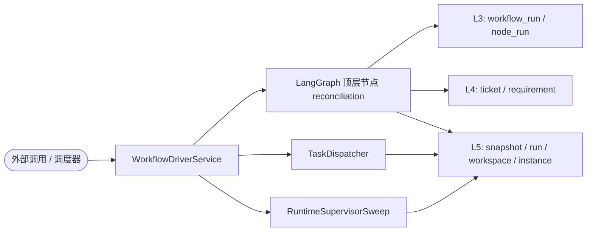

# Runtime V1 实现说明

本文只描述当前已经落地的 Runtime V1，不写未来设想。

## 1. 当前实现范围

当前 Runtime V1 已经从“固定主链 + local fake 执行”升级为“异步内核 + 真实基础设施执行”：

`requirement -> architect -> ticket-gate -> task-graph -> worker-manager -> coding -> merge-gate -> verify`

本轮已经落地：

1. LangGraph 顶层固定图
2. 真实中央派发器
3. 真实 Git worktree 分配与清理
4. 真实 Docker CLI task runtime
5. 进程内 runtime driver scheduler
6. 进程内 supervisor scheduler
7. 真实 merge candidate 与 verify contract
8. `clarification -> human answer -> resume` 闭环
9. requirement / architect / coding / verify 四个 agent 的基础版内核
10. 独立 `ContextCompilationCenter`
11. 本地 lexical / symbol RAG 与 repo / overlay index 基线
12. 统一 `ToolCall` 主链协议与标准化工具执行证据
13. `tickets.task_id` 显式 task blocker 真相与 runtime readiness preflight

本轮仍然不做：

1. embeddings / vector store
2. 更高质量的任务拆分与复杂 DAG 优化
3. prompt 效果调优与评测体系
4. K8s
5. controlplane API / UI

## 2. 设计边界

1. 数据库仍然是真相源，LangGraph 只负责顶层节点执行顺序。
2. 顶层 graph 只做 reconciliation，不在图里同步跑完整个 task 生命周期。
3. `DELIVERED != DONE`
4. `TaskRun.SUCCEEDED != WorkTask.DONE`
5. `GitWorkspace.MERGED != WorkTask.DONE`
6. L4/L5 才承载任务、run、workspace、lease、heartbeat 的真相。
7. worker 不直接抢任务，也不直接找人；人工介入统一走 `tickets`。

## 3. 应用入口

当前固定工作流应用服务位于：

`runtime.application.workflow.FixedCodingWorkflowUseCase`

对外暴露 6 个入口：

1. `start(StartCodingWorkflowCommand)`
   - 创建 `workflow_runs`
   - 写入 `workflow_run_node_bindings`
   - 不再直接创建 `requirement_docs`
   - 只把 requirement seed 和 scenario 写入 `WORKFLOW_STARTED`
2. `runUntilStable(String workflowRunId)`
   - 作为阻塞 facade 连续驱动多个 runtime tick
   - 在启用后台 driver 时，允许停在 `WAITING_ON_HUMAN / EXECUTING_TASKS / VERIFYING / COMPLETED / FAILED / CANCELED`
   - 在测试关闭后台 driver 时，会继续驱动到当前用例需要的更稳定状态
3. `answerTicket(AnswerTicketCommand)`
   - 写入人工答复
   - 将 ticket 标记为 `ANSWERED`
   - 如当前 workflow 处于 `WAITING_ON_HUMAN`，恢复为 `ACTIVE`
4. `confirmRequirementDoc(ConfirmRequirementDocCommand)`
   - 显式确认当前 requirement 最新版本
   - 关闭当前 requirement confirmation ticket
   - 将 workflow 从 `WAITING_ON_HUMAN` 恢复到 `ACTIVE`
5. `editRequirementDoc(EditRequirementDocCommand)`
   - 直接追加一版完整 requirement 文档
   - 清空 `confirmedVersion`
   - 关闭旧 requirement ticket，等待 requirement 节点重新审阅
6. `getRuntimeSnapshot(String workflowRunId)`
   - 聚合 workflow、requirement、ticket、task、snapshot、run、workspace、node run
   - 仅用于测试断言和运行快照查看

## 4. 异步内核结构

关键点：

1. graph 节点不再直接执行 fake coding agent。
2. `worker-manager` 只触发中央 dispatcher。
3. `coding` 节点只看 L4/L5 真相决定“继续等待、回 architect、还是进入 merge-gate”。
4. `RuntimeSupervisorSweep` 负责容器续租、退出归档、失败恢复和升级。
5. `WorkflowDriverScheduler` 周期性挑选活动 workflow 执行一次顶层 graph tick。

## 5. 顶层节点职责

### requirement

1. 读取启动时保存的 requirement seed、历史 ticket 问答和当前 requirement 版本。
2. 通过真实 requirement agent 判断当前是继续补洞，还是进入文档确认。
3. 信息不足时只创建 `GLOBAL_BLOCKING` clarification ticket，不写空 requirement doc。
4. 信息足够时才创建或修订 `requirement_docs / requirement_doc_versions`。
5. requirement 未确认时路由回 `ticket-gate`，确认后才允许进入 `architect`。

### architect

1. 处理已答复的人工 ticket。
2. 通过 architect context pack 读取 requirement、ticket、task 图和 repo 轻量检索片段。
3. 输出 `NEED_INPUT / PLAN_READY / REPLAN_READY / NO_CHANGES`。
4. `task-graph` 节点再把 `PlanningGraphSpec` 物化到任务真相表。
5. 不能内部消化就转交人类。

### ticket-gate

1. 识别 `assignee = HUMAN` 且尚未答复的阻塞 ticket。
2. 有则 `WorkflowRun -> WAITING_ON_HUMAN`。
3. 无则返回 architect 继续推进。

### task-graph

1. 读取 architect 最新结构化结论。
2. 将 `PlanningGraphSpec` 物化为 module / task / dependency。
3. 使用稳定逻辑键保证 repeated tick 与 repeated replan 幂等。
4. 只允许在剩余可变任务上做有限 replan，不覆盖已执行事实。

### worker-manager

1. 不再同步执行任务。
2. 只调用中央 dispatcher 消费全局 `READY` task。
3. 成功派发后将 workflow 停驻在 `EXECUTING_TASKS`。

### coding

1. 顶层 `coding` 节点本身仍然不执行具体编码动作。
2. 真正的多轮编码由 `CodingSessionService` 在 graph 外推进。
3. coding session 每轮会先编译 coding context pack，再让 coding agent 输出单步动作。
4. coding agent 的正式输出协议固定为 `CodingAgentDecision`：
   - `TOOL_CALL`
   - `ASK_BLOCKER`
   - `DELIVER`
5. `TOOL_CALL` 的正式载荷固定为 `ToolCall(callId, toolId, operation, arguments, summary)`，当前只允许调用 contract 中已经注册的 tool catalog。
6. `tool-filesystem.list_directory` 是目录探索的唯一推荐语义；`read_file(path=\"\")` 只作为兼容写法，由 `ToolCallNormalizer` 自动折叠成 `list_directory(path=\".\")`。
7. 同一 `runId` 内，相同 `callId` 的 tool call 一旦已有执行证据，重复 tick 只复用证据，不再重复执行副作用。
8. 如果出现 `BLOCKED` task，返回 architect。
9. 如果出现 `DELIVERED` task，进入 merge-gate。

### merge-gate

1. 对 `DELIVERED` task 执行真实 Git merge candidate。
2. 成功则 `GitWorkspace -> MERGED`，并把 workflow 推到 `VERIFYING`。
3. 冲突或基础设施失败则 `WorkTask -> BLOCKED`，并创建 runtime alert ticket。

### verify

1. 在只读 checkout 上执行确定性 verify contract。
2. 然后编译 verify context pack，再让 verify agent 输出 `PASS / REWORK / ESCALATE`。
3. `PASS` 后才允许 `WorkTask -> DONE`。
4. `REWORK` 时，`WorkTask -> READY`。
5. `ESCALATE` 时，`WorkTask -> BLOCKED + architect ticket`。

## 6. Dispatcher / Supervisor / Workspace 写库点

### TaskDispatcher

顺序固定为：

1. claim `READY` task
2. 读取依赖、blocker、能力要求、workflow 场景
3. 写 `task_context_snapshots`
4. 分配 `git_workspaces`
5. 创建 `agent_pool_instances(PROVISIONING)`
6. 创建 `task_runs(QUEUED)`
7. 启动 Docker 容器
8. 更新 `agent_pool_instances(READY)`
9. 更新 `task_runs(RUNNING)`
10. 更新 `work_tasks(IN_PROGRESS)`
11. 追加 `task_run_events`

### RuntimeSupervisorSweep

负责扫描：

1. 活动 `task_runs`
2. 活动 `agent_pool_instances`
3. `cleanup_status != DONE` 的 `git_workspaces`

归档规则：

1. 容器仍在运行：续租 `task_runs / agent_pool_instances`
2. 容器成功退出：`TaskRun -> SUCCEEDED`，`WorkTask -> DELIVERED`
3. 容器失败/失联/超时：`TaskRun -> FAILED`
4. 未超重试上限：`WorkTask -> READY`
5. 超过重试上限：`WorkTask -> BLOCKED` 并创建 `TASK_BLOCKING` alert ticket

### GitWorktreeWorkspaceService

1. 为每个 `TaskRun` 分配独立 worktree
2. 写回 `base_commit / branch_name / worktree_path`
3. merge-gate 创建临时 merge worktree 并产出 `merge_commit`
4. verify 采用只读 checkout
5. cleanup 删除 worktree 和临时分支，并回写 `cleanup_status`

## 7. 稳定点定义

Runtime V1 现在不再要求“一次 graph invoke 就同步跑完所有低层任务”。

当前允许的宏观稳定点是：

1. `WAITING_ON_HUMAN`
2. `EXECUTING_TASKS`
3. `VERIFYING`
4. `COMPLETED`
5. `FAILED`
6. `CANCELED`

其中：

1. `WAITING_ON_HUMAN / COMPLETED / FAILED / CANCELED` 是业务上稳定。
2. `EXECUTING_TASKS / VERIFYING` 是异步内核下的“顶层可停驻状态”，后续依赖后台 driver/supervisor 继续推进。

## 8. 当前测试覆盖

测试文件：

1. `src/test/java/com/agentx/platform/DeterministicTaskExecutionContractBuilderTests.java`
2. `src/test/java/com/agentx/platform/DockerTaskRuntimeTests.java`
3. `src/test/java/com/agentx/platform/GitWorktreeWorkspaceServiceTests.java`
4. `src/test/java/com/agentx/platform/TaskDispatcherTests.java`
5. `src/test/java/com/agentx/platform/RuntimeSupervisorSweepTests.java`
6. `src/test/java/com/agentx/platform/ToolCallNormalizerTests.java`
7. `src/test/java/com/agentx/platform/ToolExecutorTests.java`
8. `src/test/java/com/agentx/platform/CodingSessionServiceTests.java`
9. `src/test/java/com/agentx/platform/RuntimeReadinessServiceTests.java`
10. `src/test/java/com/agentx/platform/AgentKernelEvalBaselineTests.java`
11. `src/test/java/com/agentx/platform/FixedCodingWorkflowRuntimeIT.java`
12. `src/test/java/com/agentx/platform/DeepSeekRequirementAgentSmokeIT.java`
13. `src/test/java/com/agentx/platform/DeepSeekFullFlowSmokeIT.java`

覆盖内容：

1. 执行契约生成
2. Docker CLI 命令构造、观察与一次性执行
3. 真实 Git worktree 分配、merge、cleanup
4. dispatcher 的中心派发与 blocker 守卫
5. supervisor 的重试/阻塞决策
6. `ToolCall` 归一化、`callId` 稳定生成、`list_directory` 兼容折叠
7. 工具执行的统一证据形状与 coding run 内幂等复用
8. `tickets.task_id` 的 task blocker 写入、读取与上下文编译
9. runtime readiness / preflight 的只读检查
10. 基于 Testcontainers MySQL 的 workflow happy path 与 clarification resume
11. context compilation center / retrieval / architect / coding / verify 的基础版主链接线
12. 离线 agent eval 基线与真实 DeepSeek smoke 的结构合法性验证

说明：

1. `FixedCodingWorkflowRuntimeIT` 使用 `@Testcontainers(disabledWithoutDocker = true)`。
2. 如果当前机器没有可用 Docker daemon，集成测试会被跳过，但 `verify` 仍然可以成功完成。
3. 默认测试继续全部走 stub agent，不要求外网或真实 LLM。
4. 真实 LLM smoke 独立通过 `DeepSeekRequirementAgentSmokeIT` 与 `DeepSeekFullFlowSmokeIT` 执行，不进入默认 `mvn verify` 主链。

## 9. 当前结论

Runtime V1 现在已经不是 fake 证明链路，而是一个可异步推进、可真实执行、可监督恢复的内核。

后续接真实 LLM、RAG、K8s 或控制面时，应该继续沿：

1. `TaskExecutionContractBuilder`
2. `AgentRuntime`
3. `WorkspaceProvisioner`
4. `TaskDispatcher`
5. `RuntimeSupervisorSweep`

这些边界替换适配器，而不是重写主链状态语义。
