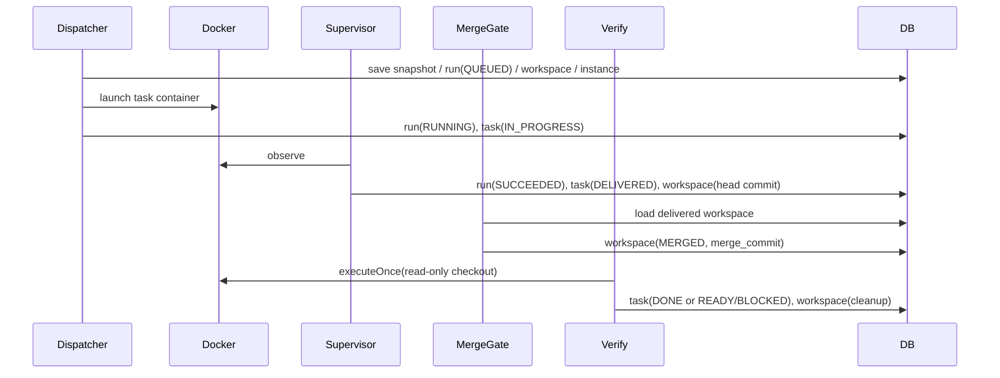

# Runtime V1 基础设施设计

本文专门说明 Runtime V1 已经落地的基础设施层，不讨论 LLM 推理、RAG、复杂任务拆分。

## 1. 目标

本轮基础设施的目标是把 runtime 收口成：

1. 顶层 graph 只做 reconciliation
2. 任务执行走真实 Docker 容器
3. 工作区走真实 Git worktree
4. 派发采用中心 claim
5. 恢复采用 supervisor sweep
6. merge / verify 证据链写回现有 L4/L5 真相

## 2. 运行配置

当前统一使用前缀：

`agentx.platform.runtime.*`

关键配置包括：

1. `repo-root`
2. `base-branch`
3. `workspace-root`
4. `docker.binary`
5. `docker.network-mode`
6. `image-mapping`
7. `dispatch-batch-size`
8. `lease-ttl`
9. `heartbeat-interval`
10. `supervisor-scan-interval`
11. `driver-scan-interval`
12. `blocking-poll-interval`
13. `blocking-timeout`
14. `max-run-attempts`
15. `driver-enabled`
16. `supervisor-enabled`

## 3. 能力包装配与执行契约

### 3.1 装配入口

当前运行契约不再由某个 agent 自由拼命令，而是由 runtime 装配：

1. `CapabilityRuntimeAssembler`
2. `CapabilityToolCatalogBuilder`
3. `RuntimeImageResolver`
4. `TaskExecutionContractBuilder`

输入仍然是真相表里的 capability / tool / runtime pack 绑定，输出固定进入：

1. `TaskExecutionContract.image`
2. `TaskExecutionContract.toolCatalog`
3. `TaskExecutionContract.runtimePacks`
4. `TaskExecutionContract.toolEnvironment`
5. `TaskExecutionContract.allowedCommandCatalog`
6. `TaskExecutionContract.httpEndpointCatalog`

### 3.2 当前 baseline 工具与环境

当前已经正式注册的基础工具有：

1. `tool-filesystem`
   - `read_file`
   - `list_directory`
   - `search_text`
   - `write_file`
   - `delete_file`
2. `tool-shell`
   - `run_command`
3. `tool-git`
   - `git_status`
   - `git_diff_stat`
   - `git_head`
4. `tool-http-client`
   - `http_request`

当前 baseline 运行环境按 capability pack 解析为少量标准镜像：

1. `cap-java-backend-coding`
2. `cap-api-test`
3. `cap-verify`

### 3.3 正式 tool-call 协议

coding 主链现在只接受统一 `ToolCall`：

1. `callId`
2. `toolId`
3. `operation`
4. `arguments`
5. `summary`

`ToolCallNormalizer` 负责：

1. 统一大小写和路径分隔符
2. 给缺失 `callId` 的调用生成稳定 ID
3. 把空 path 的 `read_file` 折叠成 `list_directory(path=\".\")`

这使得重复 tick 可以按 `runId + callId` 复用证据，而不是重放副作用。

## 4. Docker 运行时

### 4.1 运行模型

第一版采用：

1. Docker CLI
2. 每个 `TaskRun` 一个临时容器
3. `agent_pool_instances` 只记录一次运行实例，不做容器复用池

生命周期：

`PROVISIONING -> READY -> DISABLED`

### 4.2 外部接口

统一抽象为 `AgentRuntime`，当前实现是：

`runtime.agentruntime.docker.DockerTaskRuntime`

已经支持：

1. `launch(ContainerLaunchSpec)`
2. `observe(AgentPoolInstance)`
3. `terminate(AgentPoolInstance)`
4. `executeOnce(ContainerLaunchSpec)`

这保证后续替换成 Docker SDK 或 K8s adapter 时，不需要动主链。

### 4.3 运行证据

最少回写：

1. image
2. container name / id
3. started / finished
4. exit code
5. timeout 标记
6. stdout / stderr 摘要
7. failure reason

这些证据继续落在：

1. `agent_pool_instances.runtime_metadata_json`
2. `task_runs.execution_contract_json`
3. `task_run_events.data_json`

## 5. 工具执行证据

当前 `ToolExecutor` 已把 coding / verify / deterministic api-test 的执行证据统一成同一载荷形状。

固定字段包括：

1. `callId`
2. `toolId`
3. `operation`
4. `argumentsSummary`
5. `startedAt`
6. `finishedAt`
7. `succeeded`
8. `terminal`
9. `exitCode / statusCode / timedOut`（按工具类型填充）
10. `stdout / stderr / body / entries` 的截断摘要

同一 `runId` 内，如果相同 `callId` 已经成功或失败，`CodingSessionService` 会直接复用既有证据，不再隐式重试。

## 6. 单仓 Git worktree 方案

### 6.1 当前假设

本轮只支持单仓配置，不给 workflow 引入多仓路由真相字段。

运行所需仓库由：

1. `repo-root`
2. `base-branch`

共同决定。

### 6.2 worktree 分配策略

每个 `TaskRun` 拥有独立 worktree：

1. worktree 路径按 `workspace-root / workflowRunId / taskId / runId`
2. branch 名按 `task/<taskId>/<runId>`
3. `base_commit` 在分配时固定写入 `git_workspaces`
4. 容器只挂自己 task 的 worktree，不把整个仓库根目录作为可写卷

### 6.3 merge / verify 路径

1. merge-gate 在临时 merge worktree 上执行真实 `git merge`
2. 成功后写回 `merge_commit`
3. verify 在只读 checkout 上执行确定性命令
4. cleanup 删除 task worktree、merge worktree、verify checkout 和临时分支

## 7. 中央派发器

### 7.1 入口

`runtime.application.workflow.TaskDispatcher`

### 7.2 选择条件

dispatcher 只消费全局 `READY` task，并在 claim 后继续做守卫检查：

1. 依赖已满足
2. 无未解决 `TASK_BLOCKING` ticket
3. 无活动中的 `QUEUED / RUNNING` run
4. 存在 capability requirement
5. capability 对应镜像和执行契约可生成

### 7.3 claim 顺序

claim 采用数据库事务保护，当前 MyBatis SQL 使用：

`FOR UPDATE SKIP LOCKED`

固定顺序是：

1. claim task
2. 创建 snapshot
3. 分配 worktree
4. 创建 agent instance
5. 创建 task run
6. 启动容器
7. `WorkTask -> IN_PROGRESS`

### 7.4 显式 task blocker 真相

`tickets` 已经增加可空 `task_id`，作为 `TASK_BLOCKING` 的正式真相字段：

1. `GLOBAL_BLOCKING` 保持 `task_id = null`
2. `TASK_BLOCKING` 优先写入 `task_id`
3. `payload_json.taskId` 仅保留兼容期证据，不再作为主查询路径

当前 dispatcher、supervisor、context compilation 和 intake 查询都以 `tickets.task_id` 为准。

### 7.5 执行契约

执行契约由：

`TaskExecutionContractBuilder`

生成，当前实现是：

`DeterministicTaskExecutionContractBuilder`

至少包含：

1. image
2. working directory
3. command
4. timeout
5. environment variables
6. verify commands
7. write domains
8. marker / evidence file

## 8. Runtime Supervisor

### 8.1 入口

1. 定时器：`RuntimeSupervisorScheduler`
2. 纯应用服务：`RuntimeSupervisorSweep`

测试直接调 `sweepOnce()`，不依赖定时器。

### 8.2 扫描对象

1. 过期或活动中的 `task_runs`
2. 过期或活动中的 `agent_pool_instances`
3. `cleanup_status != DONE` 的 `git_workspaces`

### 8.3 恢复规则

1. 容器仍在运行：刷新 `last_heartbeat_at` 和 `lease_until`
2. 容器成功退出：`TaskRun -> SUCCEEDED`，`WorkTask -> DELIVERED`
3. 容器失败、失联或超时：终止容器并把 `TaskRun -> FAILED`
4. 未超重试上限：`WorkTask -> READY`
5. 超过重试上限：`WorkTask -> BLOCKED` 并创建 runtime alert ticket

关键边界：

1. supervisor 不直接改 `RequirementDoc`
2. supervisor 不替 architect 做规划
3. supervisor 只把“运行失败”升级为 runtime 侧 `TASK_BLOCKING` ticket

## 9. Readiness / Preflight

`RuntimeReadinessService` 是一个只读 preflight，不会拦截应用启动。它当前固定检查：

1. Docker CLI 是否可调用
2. Docker daemon 是否可达
3. `repo-root / workspace-root / base-branch` 是否有效
4. capability 对应镜像映射是否可解析
5. DeepSeek smoke 所需环境变量是否齐备

它的作用是把“环境没配好”和“runtime 主链有 bug”分开，而不是把 readiness 本身做成新的启动门槛。

## 10. Merge / Verify 证据链

结论：

1. `TaskRun.SUCCEEDED` 只表示一次容器执行完成
2. `GitWorkspace.MERGED` 只表示 merge candidate 成立
3. `WorkTask.DONE` 只能在 verify 通过后出现

## 11. 当前局限

当前基础设施已经真实化，但仍然保持 V1 范围收敛：

1. 不做多仓路由
2. 不做容器池复用
3. 不做复杂资源配额治理
4. 不做 K8s
5. 不做真实 LLM task decomposition
6. 不做 RAG

这些内容保留在 deferred，而不是重新混回主链。
