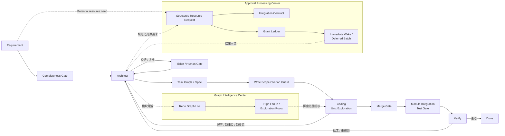

# Agent Capability Upgrade Design

本文整理 AgentX 下一阶段已经确认的能力升级方向。

状态说明：

1. 本文描述的是目标设计与对外讲解口径，不代表代码已经全部落地。
2. 当前代码真相仍以 `docs/runtime/01-07` 与 `progress.md` 为准。
3. 本文的作用是把后续升级项收敛成统一蓝图，避免面试口径、设计稿和真实主链再次分叉。

## 0. 总图

## 1. 目标

本轮升级不改变 AgentX 的固定主链，也不改变三层架构。

升级目标是：

1. 把 coding 主链切到结构化事实 + Unix 探索。
2. 把 requirement 阶段补成 production-grade completeness gate。
3. 把资源审批从“一次次打断用户”升级为审批处理中心，支持异步申请、grant 复用和结果分发。
4. 把第三方系统接入收敛成结构化 integration contract，并把它纳入审批处理中心统一治理。
5. 把 spec-first / verify-first 固化进 task 主链。
6. 为大仓库补一个 repo graph lite 视角。
7. 把并发冲突前移到 write scope overlap governance。

## 2. 固定边界

无论升级怎么做，都继续遵守这些边界：

1. `requirement -> architect -> ticket-gate -> task-graph -> worker-manager -> coding -> merge-gate -> integration-test-gate -> verify` 不改成自由工作流。
2. `ContextCompilationCenter` 仍然是上下文统一入口。
3. `TaskExecutionContract` 仍然是 coding / integration-test / verify 的运行边界。
4. worker 不直接向人要信息，人工介入继续沉淀为正式 ticket / blocker。
5. `TaskRun / GitWorkspace / Ticket` 继续作为运行与协作真相，不让 memory 漂移替代。

## 3. Requirement Completeness Gate

### 3.1 目标

当前 requirement 已经具备模板补洞和确认闭环，但还不够 production-grade。

升级后，requirement 阶段应在放行 architect 前完成完整度门禁。

### 3.2 必须补齐的内容

第一版 completeness checklist 至少覆盖：

1. 业务目标
2. in scope / out of scope
3. 用户角色
4. 主流程
5. 异常流程
6. 验收标准
7. 非功能要求
8. 外部依赖
9. 权限与数据约束

### 3.3 放行规则

如果 checklist 里存在关键缺口：

1. requirement 不直接放行 architect
2. 缺口转换为正式 clarification ticket
3. 人类回答沉淀回结构化真相，再继续 requirement -> architect 主链

## 4. Approval Processing Center

### 4.1 目标

当前平台已经有 blocker 与人工答复机制，但未来不能让 agent 因为同类资源问题反复打断用户，也不能把第三方系统接入停留在“自然语言描述 + 临时 skill”层面。

因此需要把资源申请、契约校验、异步审批、grant 复用和结果分发统一收口到审批处理中心。

### 4.2 为什么它不等于 grant ledger

grant ledger 很重要，但它只解决“什么已经被批准过”。

真正要解决的问题还包括：

1. requirement 阶段如何记录潜在资源需求
2. architect 如何发起规范化资源请求
3. 第三方系统信息如何校验并固化为 contract
4. 审批结果如何异步回流
5. 是否立即唤起 architect，还是延迟到下一次统一批量分发

所以审批处理中心里，grant ledger 只是持久化事实之一，不是全部能力。

### 4.3 核心闭环

第一版应至少跑通下面这条闭环：

1. requirement 阶段记录潜在资源需求和外部依赖假设
2. architect 把缺口转成规范化 ticket / resource request
3. 用户或企业审批流返回结构化材料
4. 中心先做契约校验与可用性检查
5. 校验通过后，再沉淀 integration contract 和 grant
6. 校验失败时，回写失败原因并重新提请 ticket
7. architect 在后续开发中发起资源申请时，可选择：
   - 申请结果一回来就立即唤起 architect
   - 暂不唤起，等下次 architect 被唤醒时批量补入

### 4.4 对固定主链的影响

1. coding / verify 不直接找人，也不直接走企业审批流
2. 需要新资源时，仍然先升级为 blocker，再交 architect 决定是否发起审批请求
3. context compilation 后续可自动补入最近有效的 grant / contract 摘要
4. architect 仍然是主链里的中心规划者；审批处理中心只是辅助能力，不是新的顶层 agent

详细设计见：

`docs/runtime/10-approval-processing-center-design.md`

## 5. External Integration Contract

### 5.1 定位

integration contract 不再是单独漂在外面的概念，而是审批处理中心里的契约事实。

它回答的是：

1. 这个第三方系统到底怎么接
2. 哪些 endpoint / auth / schema 是被允许的
3. 它与哪个 grant、哪个 owner 和哪个环境绑定

### 5.2 contract 内容

第一版 integration contract 至少包含：

1. integrationId
2. endpoint / method
3. auth mode
4. request schema
5. response schema
6. environment
7. owner
8. associated grant

### 5.3 在主链中的位置

1. requirement 发现外部依赖信息缺失时，创建澄清 ticket。
2. architect 需要外部系统方案时，引用已有 integration contract 或通过审批处理中心提出新的 contract 请求。
3. coding / verify 只通过 allowlisted endpoint 执行，不允许自由拼接 HTTP 请求。

## 6. Spec-First / Verify-First

### 6.1 目标

这里不追求引入重框架，而是把 SDD / TDD 有价值的部分内化进 AgentX 主链。

### 6.2 核心规则

architect 产出的不只是 task DAG，还应包括：

1. task objective
2. writeScopes
3. explorationRoots
4. acceptance criteria
5. verify expectations

### 6.3 verify-first 方式

对关键任务，可先由 architect 下发：

1. 测试脚本任务
2. API smoke 任务
3. 模块集成测试任务
4. 场景验收任务

再让 coding task 围绕这些验证要求实现。

### 6.4 verify agent 的启动边界

verify agent 不应在每个 task merge 成功后立即启动。

更合理的边界是：

1. task 先交付本地实现并进入 `DELIVERED`
2. merge gate 先把 task 改动并入模块集成候选，沉淀 merge evidence
3. 当 `WorkModule` 达到可集成状态时，模块集成测试闸门执行确定性集成测试
4. 只有在模块级集成测试证据已经产出之后，verify agent 才读取模块级 context 和 verify evidence 做 `PASS / REWORK / ESCALATE` 裁决

也就是说，verify agent 的职责是解释和裁决“模块级真实集成结果”，而不是对单个 task 的局部交付做过早判定。

## 7. Repo Graph Lite

### 7.1 目标

repo graph lite 是辅助视图，不是新的真相源。

它的作用是帮助 architect 理解老仓库结构，也帮助 coding 缩小 Unix 探索范围。

### 7.2 第一版范围

第一版不引入图数据库，只做轻量图视角：

1. path / directory relation
2. module relation
3. symbol definition / reference
4. import relation
5. 高扇入组件统计

### 7.3 产出方式

第一版 graph 应优先产出为：

1. exploration roots 推荐
2. 公共组件候选清单
3. 模块地图摘要
4. 架构代理视角下的仓库范围提示

详细设计见：

`docs/runtime/09-repo-graph-lite-design.md`

## 8. Write Scope Overlap Governance

### 8.1 目标

并发冲突不能只等 merge gate 才第一次发现。

### 8.2 前移治理

在 architect / dispatcher 阶段增加：

1. write scope overlap 检查
2. dependency-based 串行化建议
3. sibling task summary
4. workspace drift 检查

### 8.3 最终兜底

即使前面做了治理，最终仍然保留：

1. merge gate 暴露文本级冲突
2. 模块集成测试和 verify 暴露语义级冲突
3. architect 决定 replan、串行化或补修复任务

## 9. 对外讲解的统一口径

如果面试或项目介绍需要讲完整平台能力，建议按以下顺序表达：

1. 固定主链
2. 结构化上下文与 Unix 探索
3. requirement completeness gate
4. approval processing center
5. integration contract
6. spec-first / verify-first
7. repo graph lite
8. write scope overlap governance
9. module integration test gate + delayed verify agent

但必须补一句：

这些能力已经进入统一设计蓝图，代码按阶段落地中；当前运行真相仍以 runtime 真相文档为准。
