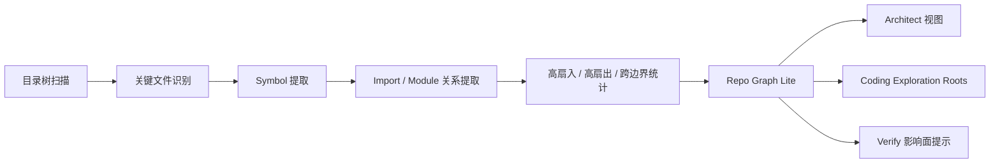

# Repo Graph Lite Design

本文描述 AgentX 在老仓库和增量开发场景下使用的 `repo graph lite` 目标方案。

状态说明：

1. 本文属于主线设计文档，用来说明下一阶段的仓库理解方案。
2. 面试和项目介绍可以把它作为平台能力来讲，但代码仍在分阶段落地。
3. 它是 Unix 探索主路径的辅助视图，不替代文件级探索，也不替代固定主链真相。

## 1. 为什么要做 Repo Graph Lite

在老仓库里，coding agent 面临的问题通常不是“看不到某个文件”，而是：

1. 不知道应该先看哪一块目录
2. 不知道哪些组件是公共基础能力
3. 不知道哪些模块边界比较核心
4. 不知道某次修改的影响面大概落在哪

如果直接把“仓库理解”全部交给 agent 在文件级自由探索，虽然可行，但大仓库下会有两个问题：

1. 探索成本高
2. 上下文容易散

因此需要一个轻量的图视角，帮助：

1. architect 更快理解仓库骨架
2. coding 更快拿到 exploration roots
3. runtime 更早识别高风险高耦合区域

## 2. 非目标

第一版明确不做这些事：

1. 不替代 Unix 探索主路径
2. 不把图数据库作为第一前提
3. 不做方法级全语义调用图
4. 不让 graph 成为新的业务真相源
5. 不直接把整张图全文注入给模型

## 3. 设计定位

repo graph lite 的定位只有一句话：

它是“仓库范围提示和公共能力发现”的辅助视图。

因此它的使用方式应该是：

1. architect 读 graph 摘要，理解模块结构和公共能力候选
2. coding 读 graph 提示，缩小 exploration roots
3. verify 读 graph 提示，补充影响面和高风险区域判断

而不是：

1. agent 把 graph 当成最终代码真相
2. graph 替代 read_file / grep / git_status

## 4. Graph 内容

第一版 graph 不追求“越细越好”，而追求“足够帮助仓库理解”。

推荐至少包含四类节点。

### 4.1 节点类型

1. `DirectoryNode`
   - 目录
   - 用于表达仓库结构和 exploration roots
2. `ModuleNode`
   - 逻辑模块或包边界
   - 例如 `apps/api`、`packages/shared`、`src/main/java/com/...`
3. `FileNode`
   - 关键文件
   - 例如入口文件、配置文件、adapter、repository、controller、shared contract
4. `SymbolNode`
   - 关键 symbol
   - 例如 class、interface、enum、type definition、关键 function

第一版并不要求所有文件和所有方法都进图。

### 4.2 边类型

1. `CONTAINS`
   - 目录包含文件
   - 模块包含目录/文件
2. `DEFINES`
   - 文件定义某个 symbol
3. `IMPORTS`
   - 文件 import 另一个文件或 symbol
4. `DEPENDS_ON`
   - 模块依赖另一个模块
5. `IMPLEMENTS_CONTRACT`
   - 某个模块/文件实现共享契约
6. `USED_BY`
   - 由统计过程反推的被依赖关系

## 5. 怎么构建

第一版应该做成“轻量离线构建 + 增量更新”，而不是重型图平台。

### 5.1 构建输入

输入来源分两层：

1. `base repo graph`
   - 基于当前仓库主线或 base commit
2. `workflow overlay graph`
   - 基于当前 workflow / task workspace 的增量改动

也就是说，graph 设计应与当前 retrieval 的 `base repo + workflow overlay` 思路保持一致。

### 5.2 构建步骤

建议按下面顺序构建：

1. 扫描目录树
   - 得到 directory / module 骨架
2. 识别关键文件
   - 入口、配置、测试、contract、adapter、controller、service、repository
3. 提取 symbol
   - class/interface/enum/type/function 等关键定义
4. 提取关系
   - import、module dependency、symbol reference
5. 计算统计量
   - 高扇入、高扇出、跨模块边界次数
6. 产出 graph 摘要和索引文件

### 5.3 语言与仓库适配

第一版不要求所有语言都做深解析。

可以分层处理：

1. Java / Kotlin
   - package、class、interface、imports
2. TypeScript / JavaScript
   - import/export、shared contract、route / api / page 入口
3. 通用文件
   - 路径层级、文件角色、配置归属

也就是说，第一版更像“路径 + symbol + import”的混合图，而不是编译器级语义图。

## 6. 高扇入统计是什么

这是 graph 上一个很重要的分析信号。

所谓高扇入，指的是：

一个节点被很多其他节点依赖。

例如：

1. 一个 shared contract 被 api 和 web 共同依赖
2. 一个 repository / client 被多个 service 引用
3. 一个公共 adapter 被多个业务模块使用

因此高扇入节点通常意味着：

1. 它可能是公共组件候选
2. 它的修改影响面可能较大
3. architect 需要更关注它的边界
4. coding 需要优先确认是否应该复用它

但要注意：

高扇入不是自动结论，只是候选信号。

因为它也可能意味着：

1. 真实的公共基础能力
2. 普通但被频繁 import 的工具类
3. 设计过于集中的坏味道中心点

所以正确做法是：

先用高扇入找候选，再回到文件级探索确认。

## 7. 输出什么给 Agent

graph 不是直接整包喂给 agent，而是转成更高价值的中间产物。

### 7.1 给 architect 的输出

1. 模块地图摘要
2. 公共组件候选清单
3. 高影响面节点清单
4. exploration roots 推荐

### 7.2 给 coding 的输出

1. 推荐先看的目录
2. 相关模块边界提示
3. 可能可复用的公共能力位置
4. 当前 task 附近的高风险依赖点

### 7.3 给 verify 的输出

1. 变更影响面提示
2. 高耦合区域提示
3. 共享契约波及范围提示

## 8. 与 Unix 探索怎么配合

repo graph lite 不能替代 Unix 探索。

正确配合方式应该是：

1. graph 先给范围提示
2. coding 再用 list/read/grep/git 确认具体代码
3. 写入前仍然要以文件级证据为准

也就是说：

graph 负责“告诉 agent 先去哪里看”；
Unix 工具负责“让 agent 真正看清楚那里有什么”。

## 9. 与并发任务怎么配合

在并发场景里，repo graph lite 也不应直接暴露其他 task 的原始未 merge 代码。

它更适合提供：

1. 当前 task 所在模块的结构摘要
2. sibling task writeScopes 相关的风险提示
3. 当前 task 所在区域的高影响面节点
4. 可能出现 merge / drift 风险的热点区域

## 10. 第一版推荐落地形态

我建议第一版先落地为本地 artifact，而不是服务化图数据库。

可以先产出：

1. `module-map.json`
2. `public-component-candidates.json`
3. `exploration-roots.json`
4. `high-impact-nodes.json`

后续再决定是否需要：

1. 图查询服务
2. 图数据库
3. 更细粒度的语言级解析

## 11. 一张图看明白

## 12. 当前结论

repo graph lite 不是为了把仓库变成“图数据库项目”，而是为了：

1. 给大仓库提供一个轻量结构视图
2. 让 architect 更快理解模块边界
3. 让 coding 更快缩小 Unix 探索范围
4. 让 verify 更早识别高风险影响面

它和高扇入统计的关系是：

1. graph 是底座
2. 高扇入是图上的分析结果
3. 两者一起服务于范围提示、公共能力发现和高风险区域识别
