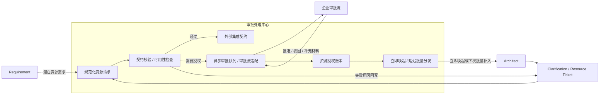

# Approval Processing Center Design

本文描述 AgentX 下一阶段的 `approval processing center` 目标方案。

状态说明：

1. 本文属于主线设计文档，用于统一项目设计口径和面试表达。
2. 当前代码尚未完整落地该能力，运行真相仍以 `docs/runtime/01-07` 与 `progress.md` 为准。
3. 本文强调的是“审批处理中心”整体，而不是只讲 `grant ledger` 一个点。

## 1. 为什么要做审批处理中心

如果平台只做“遇到资源缺口就同步问人”，会有几个问题：

1. 同类资源问题会反复打断用户
2. 外部系统接入信息容易停留在自然语言里，无法稳定复用
3. 资源申请结果难以在不同 workflow / task 间复用
4. 审批结果回来之后，不知道该立刻唤起 architect，还是延迟到下一次统一处理

所以真正需要的，不只是“记住批准过什么”，而是一个统一的审批处理中心：

1. 负责接住规范化资源请求
2. 负责校验外部集成信息
3. 负责对接异步审批流
4. 负责沉淀 grant 和 contract
5. 负责把结果按策略回流给 architect

## 2. 设计定位

审批处理中心是固定主链旁边的辅助系统能力，不是新的顶层 agent，也不替代 architect。

它的定位应该固定为：

1. architect 仍然负责判断是否需要申请资源
2. coding / verify 发现缺资源时，仍然先回 blocker，而不是直接去找人或直接调审批流
3. 审批处理中心负责“请求如何被规范化、校验、排队、审批、回流和复用”
4. `外部集成契约` 和 `资源授权账本` 都是审批处理中心里的持久化事实

## 3. 一张图看明白

## 4. 核心闭环

### 4.1 需求阶段

requirement 阶段不直接去跑审批，但要允许记录：

1. 这次项目可能需要哪些外部资源
2. 哪些第三方系统大概率会接入
3. 哪些依赖目前信息不完整，只是一个假设

这样 architect 接手时，不是从零开始发现资源问题。

### 4.2 架构阶段

architect 是审批处理中心的主要请求发起方。

它需要把“要什么资源、为什么要、怎么用”收敛成规范化请求，而不是自由文本追问。

第一版建议至少支持两类 ticket：

1. `clarification ticket`
   - 补外部系统事实、环境信息、owner、认证方式
2. `resource request ticket`
   - 补资源范围、用途、有效期、是否允许复用、是否需要立刻唤起 architect

### 4.3 校验与契约沉淀

用户或审批流返回结果后，不能直接当成可用事实。

审批处理中心需要先做两类校验：

1. 契约校验
   - endpoint、method、auth、schema、environment 是否完整
2. 可用性检查
   - 当前资源是否真能在指定环境里使用

校验通过后，才沉淀：

1. `外部集成契约`
   - 回答“怎么接”
2. `资源授权账本`
   - 回答“能不能用、在哪个范围内用”

如果校验失败：

1. 不把失败材料直接塞给 coding
2. 回写失败原因
3. 重新提请 ticket，让 architect 或人类补正

### 4.4 异步审批与结果回流

审批处理中心不能只是一个同步阻塞点。

它需要支持：

1. architect 提交请求后先继续推进其他可做任务
2. 请求进入异步队列，走企业审批流
3. 审批结果回来后，根据请求里的策略决定：
   - 立即唤起 architect
   - 暂不唤起，等下次 architect 因其他原因被唤醒时批量补入

这意味着“审批结果”本身也要被当成可分发的运行事实，而不是只存在某次对话回复里。

## 5. 它包含哪些核心部件

为了避免过度设计，第一版建议只收敛成五块：

1. `资源请求定义与入口`
   - 接收 architect 侧的规范化资源请求
2. `契约校验与可用性检查`
   - 判断第三方系统材料是否完整、是否可用
3. `异步审批队列 / 审批流适配`
   - 把请求送进真实审批流，再收回结果
4. `资源授权账本`
   - 记录什么资源已被批准、适用范围是什么
5. `唤起与批量分发器`
   - 决定何时把批准结果送回 architect

其中：

1. `外部集成契约` 是契约事实
2. `资源授权账本` 是授权事实
3. 这两者都不等于整个审批处理中心

## 6. 它怎么使用消息队列

### 6.1 为什么这里一定要有队列

审批处理中心如果不用队列，而是同步直连审批流，会有三个明显问题：

1. architect 会被长审批链路直接卡住，主链停在一次慢调用上
2. 同一个请求的校验、提交、回执、补材料、批准结果很难形成可恢复的状态机
3. 一旦审批系统临时不可用，平台很容易把“外部系统抖动”放大成 workflow 失败

所以这里的队列不是为了追求高吞吐，而是为了把：

1. 资源请求提交
2. 审批流投递
3. 结果回执
4. 补材料重试
5. architect 唤起 / 批量分发

这些异步动作从主链里解耦出来，变成可追踪、可恢复、可重试的后台处理。

### 6.2 队列放在闭环的哪个位置

审批处理中心的队列不在 requirement / coding / verify 内部，而是在：

1. architect 发起规范化资源请求之后
2. 契约校验 / 可用性检查之后
3. 企业审批流和结果回流之间

更准确地说，顺序应该是：

1. architect 创建规范化 `resource request`
2. 审批处理中心先做本地契约校验
3. 需要外部审批的请求进入异步审批队列
4. 后台 worker 再把它投递到企业审批流
5. 审批结果回写后，再进入唤起 / 批量分发队列
6. 最后把结果回流给 architect、grant ledger 和 integration contract

也就是说，队列负责的是“异步审批处理”和“异步结果分发”，而不是替代主链里的 architect 判断。

### 6.3 第一版选择哪一种

第一版我建议明确选择：

`RocketMQ + 审批真相落 MySQL`

也就是：

1. 请求真相先落 MySQL
2. 审批处理中心把“待审批请求”“审批结果回流”“architect 唤起事件”投到 RocketMQ
3. 由审批处理中心自己的 consumer 负责处理投递、重试、回执、分发
4. 不在第一版同时维护多套 MQ 方案

这里的边界要很清楚：

1. MySQL 继续保存审批请求、grant、contract 和状态机真相
2. RocketMQ 负责异步消息流转
3. MQ 不是新的真相源，只是审批处理中心的异步传输层

### 6.4 为什么第一版选这种

这个选择主要是四个原因。

第一，和 AgentX 的“结构化真相优先”一致。  
审批请求、审批回执、grant、contract、唤起策略本来就都要落数据库。RocketMQ 在这里不是替代数据库，而是承接“异步处理”和“结果分发”。这样可以保持：

1. 业务真相落 MySQL
2. 异步分发走 RocketMQ
3. 两者边界清楚，不会把消息日志误当业务真相

第二，审批处理中心的核心矛盾不是吞吐，而是可靠性和可恢复。  
这一层面对的是资源授权、第三方系统接入、人工补材料这类慢事务。它的关键不是每秒处理多少条，而是：

1. 状态能不能追踪
2. 失败能不能重试
3. worker 挂了能不能恢复
4. architect 会不会被重复唤起

RocketMQ 在这里更适合作为稳定的异步分发层，因为它天然支持：

1. 可靠投递
2. 消费重试
3. 延迟消息
4. 死信治理

这些能力都很贴近审批处理中心“长事务 + 慢回执 + 要补材料 + 可能延迟唤起”的问题形态。

第三，RocketMQ 比 Kafka 更贴近“业务事件驱动 + 延迟/重试 + 消费编排”这个场景。  
Kafka 更强在高吞吐事件流、日志式回放和跨服务订阅，但审批处理中心当前不是要做大规模事件分析，而是要做：

1. 请求投递
2. 审批回执
3. 补材料重提
4. architect 唤起

这些更像典型业务消息，而不是日志流。

第四，RocketMQ 比 RabbitMQ 更适合后续扩成组织级审批编排。  
RabbitMQ 当然也能做，但如果后面审批处理中心需要承接：

1. 多类审批主题
2. 更强的延迟投递
3. 按资源类型或组织域拆 topic
4. 更明显的业务事件沉淀

RocketMQ 的 topic / tag / retry / delay 这一套会更顺手，更容易从“当前审批中心”平滑扩到“组织级资源编排总线”。

### 6.5 为什么不先选 Kafka 或 RabbitMQ

面试里我会这样讲。

1. 不先选 Kafka，是因为审批处理中心不是高吞吐日志流问题，而是业务审批状态机问题。
2. 不先选 RabbitMQ，是因为我们希望第一版就在延迟、重试、死信和业务主题拆分上留出更自然的演进空间。
3. 选 RocketMQ，是因为它更适合承接“审批请求投递 + 审批结果回流 + architect 唤起”这一类业务消息闭环。

所以第一版的结论应该很明确：

1. 审批真相继续落 MySQL
2. 异步审批消息先选 RocketMQ
3. RocketMQ 负责异步处理，不替代 grant / contract / request 的数据库真相

### 6.6 队列表至少需要哪些状态

为了让后台处理和重试可追踪，第一版建议至少有这些状态：

1. `PENDING_VALIDATION`
2. `VALIDATED`
3. `ENQUEUED_FOR_APPROVAL`
4. `SENT_TO_APPROVAL_PROVIDER`
5. `WAITING_PROVIDER_RESULT`
6. `APPROVED`
7. `REJECTED`
8. `MORE_INFO_REQUIRED`
9. `READY_TO_WAKE_ARCHITECT`
10. `DISTRIBUTED`
11. `FAILED`

这样可以把“本地校验失败”“外部审批未返回”“审批要补材料”“批准后待分发”这些阶段明确区分开。

### 6.7 对 worker 的要求

这里的 worker 不是 coding worker，而是审批处理中心自己的后台 worker。

它只负责：

1. 消费 RocketMQ 中的审批请求消息
2. 调企业审批流适配器
3. 回写审批结果
4. 推进 grant / contract 沉淀
5. 触发 architect 唤起或延迟分发

它不负责：

1. 重定义审批语义
2. 直接修改 requirement / WorkTask 业务状态
3. 跳过 architect 直接把资源塞给 coding

## 7. 和固定主链怎么衔接

审批处理中心接回固定主链时，要保持下面几个边界：

1. requirement 可以记录潜在资源需求，但不直接走审批
2. architect 决定是否发起资源请求
3. coding / verify 只负责把“资源缺口”显式升级成 blocker
4. worker 仍然不能直接找人
5. context compilation 只回填已经通过审批、已经校验通过的 grant / contract 摘要

也就是说，审批处理中心不会把固定主链改成新的自由工作流，它只是在：

1. requirement 与 architect 之间补足资源事实收集
2. architect 与外部审批流之间补足异步处理与复用
3. coding / verify 与 architect 之间补足资源类 blocker 的标准回流

## 7. 对 blocker 语义的影响

这套设计落地后，资源相关 blocker 至少应区分三种情况：

1. `RESOURCE_GRANT_REQUIRED`
   - 当前没有可复用授权，architect 还没发起审批
2. `RESOURCE_APPROVAL_PENDING`
   - 请求已进入审批处理中心，正在等待结果
3. `INTEGRATION_CONTRACT_REQUIRED`
   - 外部系统接入信息不完整、校验失败或需要重提

这样 architect 才能区分：

1. 是还没提申请
2. 还是已经在审批中
3. 还是 contract 本身就有问题

## 8. 对上下文编译的影响

审批处理中心落地后，`ContextCompilationCenter` 在 architect / coding / verify pack 里至少可以补入：

1. 最近有效的 grant 摘要
2. 当前 task 允许直接使用的外部集成契约摘要
3. 正在审批中的资源请求摘要
4. 哪些结果会在下一次 architect 被唤醒时批量补入

但要注意：

1. 这里只补结构化摘要，不补敏感明文
2. coding pack 只知道“能不能用、怎么用、何时要升级 blocker”
3. 不让 worker 直接掌握超出当前任务边界的审批事实

## 9. 第一版推荐落地顺序

为了避免把审批处理中心一次做太大，第一版建议按下面顺序落：

1. 先补规范化 `resource request` 真相与状态机
2. 再补 RocketMQ topic、producer、consumer 和消息协议
3. 再补企业审批流适配器端口
4. 然后补 grant / integration contract 的沉淀
5. 最后补 architect 的立即唤起 / 批量分发策略

这样做能保证每一步都围绕当前固定主链推进，不会长出新的胶水系统。

## 10. 当前结论

审批处理中心的核心不是再造一个审批系统，而是把 AgentX 里原本分散的几件事统一起来：

1. 规范化资源请求
2. 第三方系统契约校验
3. 异步审批结果回流
4. grant 复用
5. architect 的立即唤起 / 延迟批量推进
6. RocketMQ 上的可靠异步处理

从设计口径上说，后续应该统一讲：

1. `资源授权账本` 是审批处理中心里的授权事实
2. `外部集成契约` 是审批处理中心里的契约事实
3. 真正的系统能力名称是 `审批处理中心`
4. 第一版消息队列选择是 `RocketMQ`，但审批请求、grant、contract 的真相仍然落 MySQL
